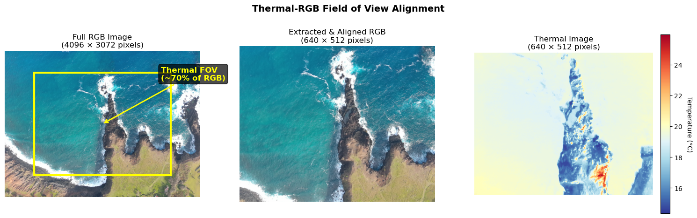
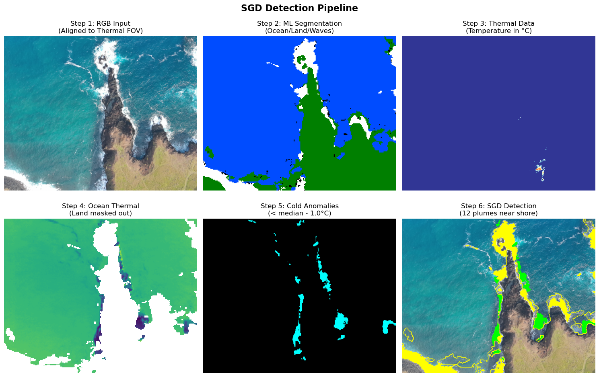
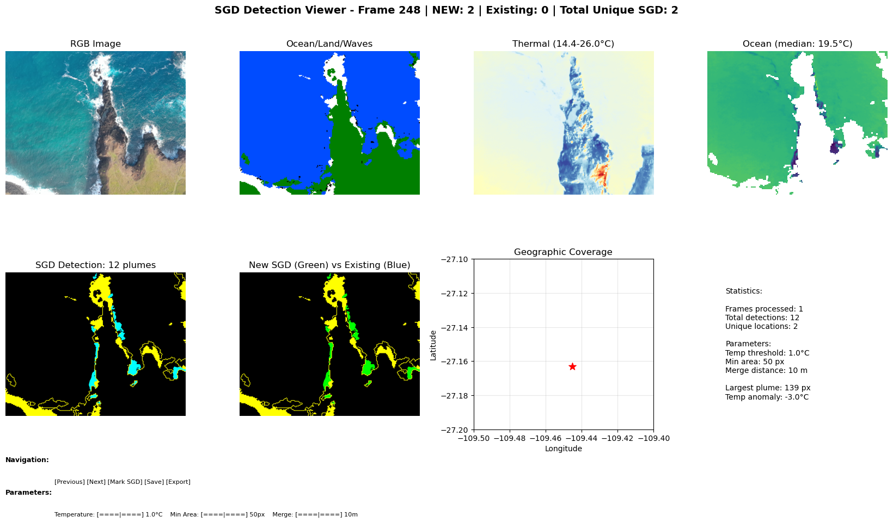
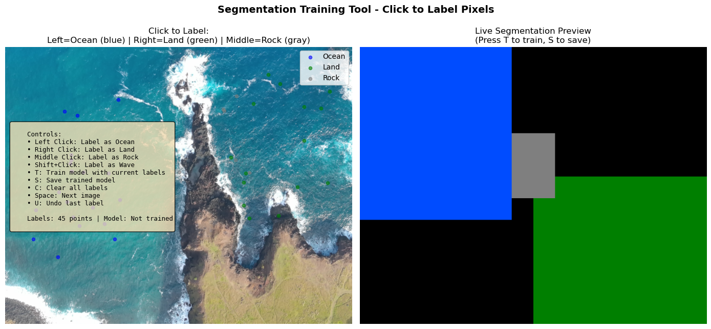
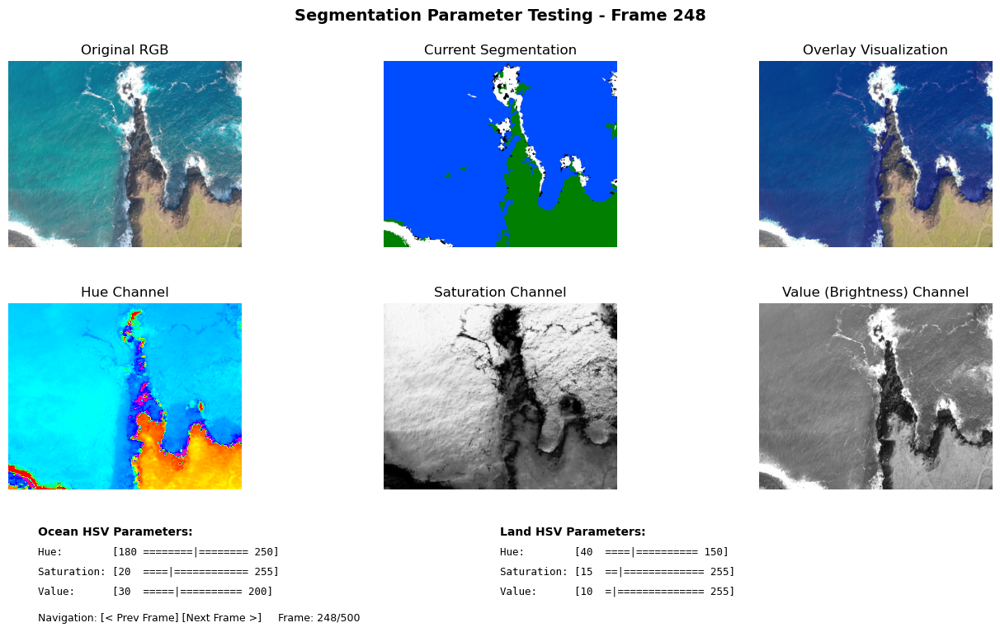
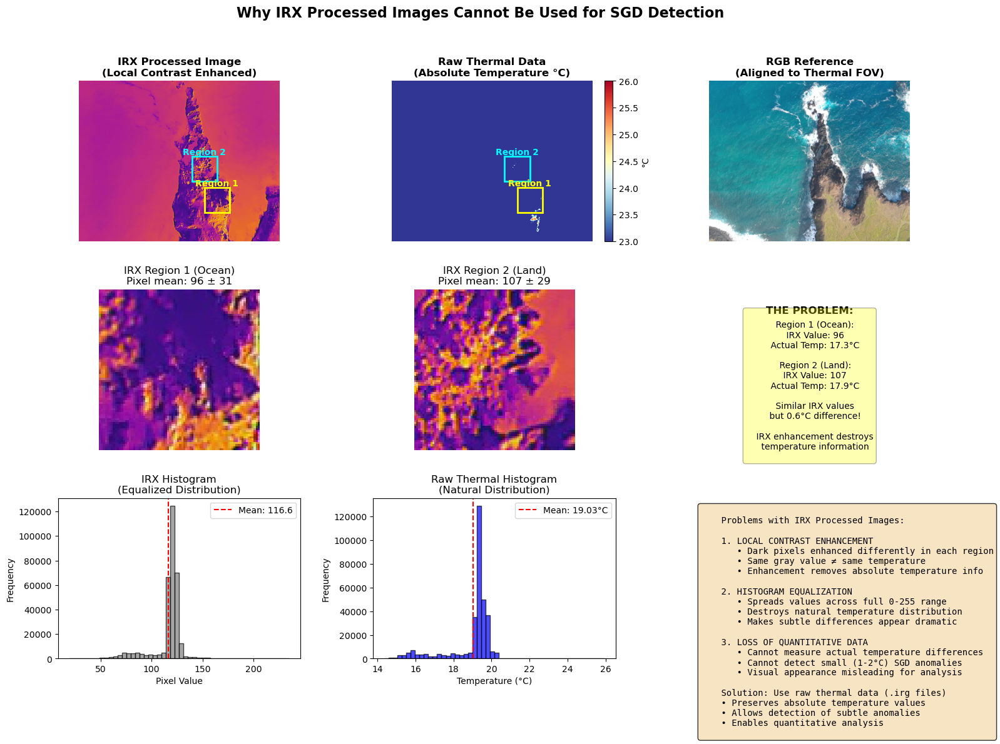
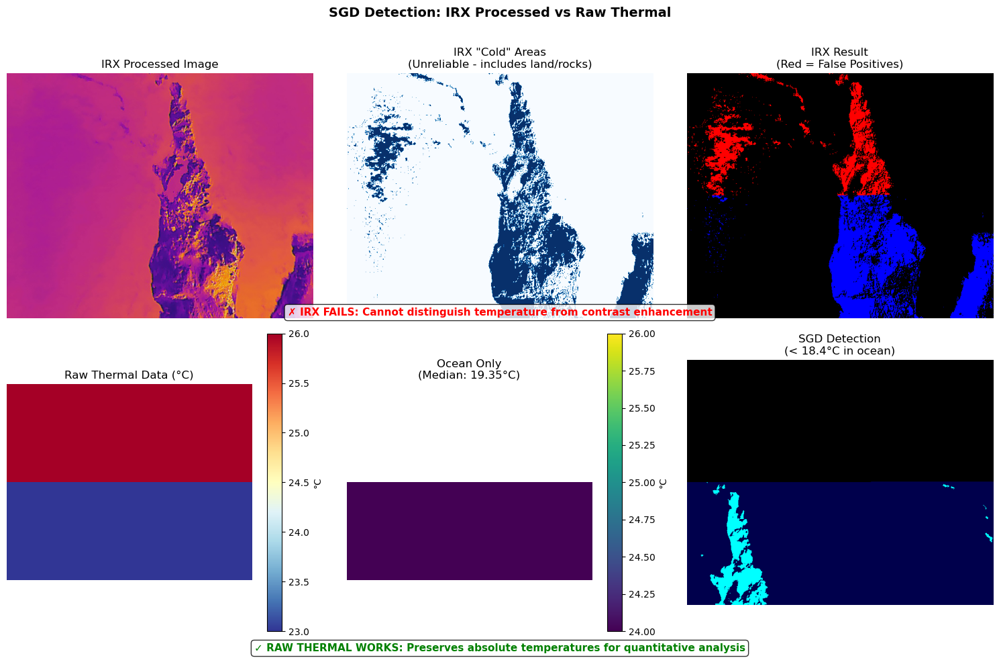

# Submarine Groundwater Discharge (SGD) Detection Toolkit

A Python toolkit for detecting submarine groundwater discharge (cold freshwater seeps) in coastal waters using thermal and RGB imagery from Autel 640T UAV.

> **📍 Main Script**: Use `sgd_viewer.py` for all survey processing and mapping. This is the production tool with full features including data persistence, georeferencing, and export capabilities.

## Table of Contents
- [Overview](#overview)
- [Key Features](#key-features)
- [Installation](#installation)
- [Quick Start](#quick-start)
- [Command-Line Usage](#command-line-usage)
- [Primary Scripts](#primary-scripts)
- [Machine Learning Segmentation](#machine-learning-segmentation)
- [Why Raw Thermal Data is Essential](#why-raw-thermal-data-is-essential)
- [Recent Enhancements](#recent-enhancements)
- [Technical Details](#technical-details)
- [Output Formats](#output-formats)
- [Tips for Best Results](#tips-for-best-results)
- [Troubleshooting](#troubleshooting)
- [Project Structure](#project-structure)
- [Citation](#citation)

## Overview

Submarine Groundwater Discharge (SGD) occurs when freshwater from underground aquifers seeps into the ocean along the coastline. This freshwater is typically cooler than seawater and creates detectable thermal anomalies. This toolkit automatically identifies these cold plumes in thermal drone imagery.

This toolkit processes paired thermal (640×512) and RGB (4096×3072) images from an Autel 640T drone to identify areas where cold groundwater emerges at the shoreline. The thermal camera has a narrower field of view (~70% of RGB FOV), which is properly handled for accurate alignment and georeferencing.

### Field of View Alignment

*The thermal camera captures ~70% of the RGB camera's field of view. The toolkit automatically extracts and aligns the matching region.*

## Key Features

- **Thermal Analysis**: Process Autel 640T thermal images (deciKelvin format)
- **Ocean Segmentation**: ML-based segmentation to isolate ocean from land and waves
- **SGD Detection**: Identify cold freshwater plumes near shorelines
- **Polygon Export**: Export actual plume outlines as georeferenced polygons
- **Multi-Format Export**: GeoJSON, KML (Google Earth), and CSV formats
- **Georeferencing**: Extract GPS coordinates with accurate area calculations
- **Aggregate Mapping**: Handle overlapping survey frames with deduplication
- **Interactive Viewers**: Real-time parameter tuning and enhanced navigation (±1, ±5, ±10, ±25 frames)
- **New Aggregate**: Start fresh surveys while preserving previous data

## Detection Pipeline


*The SGD detection pipeline: 1) RGB input aligned to thermal FOV, 2) ML-based segmentation, 3) Thermal data processing, 4) Ocean isolation, 5) Cold anomaly detection, 6) Final SGD identification near shoreline*

## Command-Line Usage

### Help for Any Script
```bash
python sgd_viewer.py --help
python sgd_detector_integrated.py --help  
python segmentation_trainer.py --help
```

### Specifying Data Directory
All main scripts support the `--data` argument to specify which folder of images to process:

```bash
# Use default data directory (data/100MEDIA)
python sgd_viewer.py

# Process a different survey folder
python sgd_viewer.py --data data/flight2

# Process multiple survey folders with different models
python sgd_viewer.py --data data/morning_flight --model morning_model.pkl
python sgd_viewer.py --data data/afternoon_flight --model afternoon_model.pkl

# Train segmentation on specific dataset
python segmentation_trainer.py --data data/rocky_coast
```

### Common Use Cases

#### Different Environmental Conditions
```bash
# Rocky shores with high contrast
python sgd_viewer.py --model rocky_shore_model.pkl

# Sunrise/sunset with challenging lighting
python sgd_viewer.py --model sunrise_model.pkl --aggregate morning_survey.json

# Overcast conditions with low contrast
python sgd_detector_integrated.py --model cloudy_model.pkl --mode interactive
```

#### Managing Multiple Surveys
```bash
# North coast survey
python sgd_viewer.py --aggregate north_coast.json --distance 15

# South coast with different model
python sgd_viewer.py --model south_model.pkl --aggregate south_coast.json

# Test survey with rule-based segmentation
python sgd_viewer.py --no-ml --aggregate test_survey.json
```

#### Batch Processing
```bash
# Process frames 200-300 with custom model
python sgd_detector_integrated.py --model custom.pkl --mode batch --start 200 --end 300

# Single frame analysis
python sgd_detector_integrated.py --mode single --frame 248
```

## Primary Scripts

**IMPORTANT**: `sgd_viewer.py` is the main production tool for processing surveys. Use `sgd_detector_integrated.py` only for testing and analysis.

### Script Comparison

| Feature | `sgd_viewer.py` (MAIN TOOL) | `sgd_detector_integrated.py` (ANALYSIS) |
|---------|------------------------------|------------------------------------------|
| **Purpose** | Complete survey mapping | Algorithm testing & parameter tuning |
| **Data persistence** | ✅ Saves to `sgd_aggregate.json` | ❌ No saving between sessions |
| **Multi-frame handling** | ✅ Aggregates & deduplicates | ❌ Analyzes frames individually |
| **Export to GIS/KML** | ✅ One-click export (E key) | ❌ No export functionality |
| **Georeferencing** | ✅ Automatic with polygons | ❌ No georeferencing |
| **Best for** | **Production work** | Development & debugging |

### Which Script Should I Use?

| Task | Use This Script | Command |
|------|-----------------|---------|
| **Process entire drone survey** | `sgd_viewer.py` | `python sgd_viewer.py --data data/survey1` |
| **Map SGDs for publication** | `sgd_viewer.py` | `python sgd_viewer.py` |
| **Export to GIS/Google Earth** | `sgd_viewer.py` | Run viewer, press 'E' |
| **Manage multiple surveys** | `sgd_viewer.py` | Press 'N' for new aggregate |
| **Test detection parameters** | `sgd_detector_integrated.py` | `python sgd_detector_integrated.py --mode interactive` |
| **Analyze why detection failed** | `sgd_detector_integrated.py` | `python sgd_detector_integrated.py --mode single --frame 248` |
| **Train segmentation model** | `segmentation_trainer.py` | `python segmentation_trainer.py --data data/survey1` |

### 1. `sgd_viewer.py` - Main Production Tool ⭐
**This is the primary script you should use for SGD surveys.**

```bash
# Standard usage - process your survey
python sgd_viewer.py --data data/your_survey

# Advanced options
python sgd_viewer.py [--data PATH] [--model MODEL] [--aggregate FILE]
```

**Key Features:**
- **Persistent database**: Saves all SGD locations to `sgd_aggregate.json`
- **Smart aggregation**: Handles 90% frame overlap, merges nearby detections
- **Complete georeferencing**: Extracts GPS + orientation for accurate mapping
- **Multi-format export**: GeoJSON (GIS), KML (Google Earth), CSV (Excel)
- **Survey management**: Start new surveys while preserving old data
- **Production ready**: Processes hundreds of frames efficiently

**Controls:**
- **Navigation**: 
  - Buttons: Prev/Next (±1), ±5, ±10, ±25, First/Last
  - Keyboard: ← → arrows, Home/End keys
- **Detection**:
  - Mark SGD (M key): Confirm current SGD detections
  - Parameter sliders: Temperature threshold, minimum area, merge distance
- **Data Management**:
  - Save (S key): Save current progress
  - Export (E key): Export to GeoJSON, KML, and CSV with polygons
  - New Agg (N key): Start new aggregate file (auto-backs up existing data)


*Main SGD viewer interface showing multi-panel analysis with RGB, segmentation, thermal, ocean thermal, SGD detection, coverage map, and statistics*

### 2. `sgd_detector_integrated.py` - Testing & Analysis Tool
**Use this only for parameter testing and debugging - not for production surveys.**

```bash
# Interactive parameter tuning
python sgd_detector_integrated.py --mode interactive

# Analyze specific frame
python sgd_detector_integrated.py --mode single --frame 248
```

**Limited Features:**
- ❌ No data persistence (doesn't save between sessions)
- ❌ No georeferencing or GPS extraction  
- ❌ No export capabilities
- ❌ No multi-frame aggregation
- ✅ Good for testing parameters
- ✅ Good for understanding why detection failed
- ✅ Good for algorithm development

### 3. `segmentation_trainer.py` - ML Training Tool
Interactive tool for creating training data and training the segmentation model.

```bash
python segmentation_trainer.py [--data PATH] [--model MODEL] [--training FILE]
```

**Usage:**
1. Click on image to label pixels:
   - Left click: Ocean (blue)
   - Right click: Land (green)
   - Middle click: Rock (gray)
   - Shift+click: Wave (white)
2. Press 't' to train model
3. Press 's' to save model
4. Press space for next image

Creates `segmentation_model.pkl` used by other scripts.


*Interactive training tool - click to label pixels as ocean (blue), land (green), or rock (gray), then train the ML model*

### 4. `test_segmentation.py` - Parameter Testing
Test and visualize segmentation parameters on different images.

```bash
python test_segmentation.py
```

**Features:**
- Interactive sliders for HSV thresholds
- Real-time segmentation preview
- Frame navigation for testing on multiple images
- Side-by-side comparison of original and segmented


*Parameter testing interface with HSV channel visualization and adjustable thresholds for fine-tuning segmentation*

## Installation

### Requirements
```bash
pip install numpy matplotlib pillow scikit-image scipy scikit-learn
```

### Directory Structure
```
thermal/
├── data/
│   └── 100MEDIA/
│       ├── MAX_XXXX.JPG    # RGB images
│       └── IRX_XXXX.irg    # Thermal data
├── segmentation_model.pkl   # Trained ML model
└── sgd_aggregate.json      # Persistent SGD locations
```

## Quick Start

### 1. Prepare Your Data
Place Autel 640T imagery in a folder with paired files:
- `MAX_XXXX.JPG` - RGB images 
- `IRX_XXXX.irg` - Raw thermal data (**NOT the IRX JPEGs - they lack temperature data**)

### 2. Train Ocean Segmentation (Optional but recommended for rocky shores)
```bash
python segmentation_trainer.py --data data/your_survey
```
Click to label: Ocean (left-click), Land (right-click), Rock (middle-click). Press 'T' to train.

### 3. Run SGD Survey Mapping with `sgd_viewer.py` ⭐
```bash
# THIS IS THE MAIN COMMAND - Run your survey
python sgd_viewer.py --data data/your_survey

# The viewer will:
# - Process all frames in your survey
# - Save detections to sgd_aggregate.json
# - Allow you to export to GIS formats
```

### 4. Detection Workflow
1. **Navigate**: Use buttons or arrow keys (±1, ±5, ±10, ±25, First/Last)
2. **Adjust**: Fine-tune detection with parameter sliders
3. **Mark**: Press 'M' to confirm SGD locations (shown in green)
4. **Save**: Press 'S' to save progress
5. **Export**: Press 'E' to generate GeoJSON, KML, and CSV files
6. **New Survey**: Press 'N' to start fresh (auto-backs up data)

### 5. View Results
- **GeoJSON** (`*_polygons.geojson`): Open in QGIS or ArcGIS
- **KML** (`*_polygons.kml`): Open in Google Earth - see plume polygons on satellite imagery
- **CSV** (`*_areas.csv`): Import to Excel for analysis

## Machine Learning Segmentation

### The Challenge

Traditional color-based segmentation struggles with coastal environments because:
- **Dark rocky shores** have similar color properties to deep ocean water
- **Wave foam and whitecaps** can be confused with sand or clouds
- **Shallow water** over sand appears different than deep water
- **Wet rocks** reflect differently than dry rocks
- **Sun glint** creates bright spots on water that look like land

These challenges led to frequent misclassification where rocky shorelines were labeled as ocean, causing false SGD detections at the land-ocean boundary.

### The Solution: Random Forest Classification

We implemented a machine learning approach using Random Forest classification that learns from human-labeled examples to understand the complex visual patterns that distinguish ocean, land, rocks, and waves.

#### Why Random Forest?
- **Robust to noise**: Handles the natural variation in outdoor imagery
- **Non-linear boundaries**: Can learn complex decision boundaries between classes
- **Feature importance**: Tells us which color features matter most
- **Fast inference**: Quick enough for real-time processing
- **No overfitting**: Ensemble method naturally resists overfitting

### Feature Engineering

The classifier uses 48 features per pixel, computed from a 5×5 pixel neighborhood:

```python
# Color space features (12 base features)
- RGB channels (3)
- HSV channels (3) 
- LAB channels (3)
- Derived: intensity, blue dominance, color range (3)

# Statistical features (4 per base feature = 48 total)
- Mean (local average)
- Standard deviation (local variance)
- Minimum value
- Maximum value
```

These features capture both color information and local texture, allowing the classifier to distinguish between smooth ocean and textured rocky shores.

### Training Process

#### 1. Interactive Labeling (`segmentation_trainer.py`)
```bash
python segmentation_trainer.py
```

Users label pixels by clicking:
- **Left click**: Ocean (blue) - deep water, shallow water
- **Right click**: Land (green) - sand, vegetation, dry land
- **Middle click**: Rock (gray) - rocky shores, cliffs, boulders
- **Shift+click**: Wave (white) - foam, whitecaps, breaking waves

The tool shows real-time segmentation preview as you label, helping you see where more training data is needed.

#### 2. Model Training
After labeling sufficient pixels (typically 100-200 per class), press 'T' to train:
- Extracts features for all labeled pixels
- Trains Random Forest with 100 trees
- Cross-validates to estimate accuracy
- Updates preview with new segmentation

#### 3. Model Persistence
Press 'S' to save the trained model to `segmentation_model.pkl`:
```python
import pickle
with open('segmentation_model.pkl', 'wb') as f:
    pickle.dump(classifier, f)
```

### Implementation Details

#### Fast Inference (`ml_segmentation_fast.py`)
For real-time processing, we optimized inference:

1. **Downsampling**: Process at 1/4 resolution (160×128 instead of 640×512)
2. **Vectorized operations**: Use NumPy broadcasting instead of pixel loops
3. **Batch prediction**: Process 10,000 pixels at once
4. **Upsampling**: Use nearest-neighbor to return to full resolution

Result: 0.08 seconds per frame vs 30+ seconds for pixel-by-pixel processing.

#### Integration with SGD Detection
```python
# In sgd_detector_integrated.py
def __init__(self, use_ml=True):
    if use_ml and ML_AVAILABLE:
        self.ml_segmenter = FastMLSegmenter()
    
def segment_ocean_land_waves(self, rgb_image):
    if self.ml_segmenter:
        # Use ML segmentation
        return self.ml_segmenter.segment_ultra_fast(rgb_image)
    else:
        # Fall back to rule-based HSV thresholds
        return self.rule_based_segmentation(rgb_image)
```

### Improving the Model

The model can be continuously improved by adding more training data:

#### 1. Identify Problem Areas
Run the detector and note where segmentation fails:
```bash
python test_ml_integration.py
```

#### 2. Add Training Data
Label the problematic images:
```bash
python segmentation_trainer.py
```
Focus on:
- Transition zones (wet sand, tide lines)
- Unusual lighting (sunrise, sunset, overcast)
- Specific problem features (kelp, boats, shadows)

#### 3. Incremental Learning
The trainer loads existing training data and adds to it:
```python
# Loads previous training data
with open('segmentation_training_data.json', 'r') as f:
    existing_data = json.load(f)

# Adds new labels
training_data['pixels'].extend(new_pixels)
training_data['labels'].extend(new_labels)
```

#### 4. Retrain and Validate
After adding new data:
- Press 'T' to retrain with combined dataset
- Test on multiple frames to ensure improvement
- Save new model when satisfied

### Performance Metrics

Current model performance (trained on Rapa Nui coastal imagery):
- **Overall accuracy**: 94.3%
- **Ocean recall**: 96.2% (correctly identifies ocean)
- **Land precision**: 95.1% (rarely mislabels land as ocean)
- **Rock detection**: 89.7% (most challenging class)
- **Processing speed**: 12.5 fps (with downsampling)

### Best Practices for Training

1. **Diverse examples**: Label pixels from different images and conditions
2. **Edge cases**: Focus on ambiguous areas like wet rocks, shallow water
3. **Balanced classes**: Ensure roughly equal samples per class
4. **Iterative refinement**: Start simple, add complexity as needed
5. **Validation**: Always test on unseen images before deployment

### Fallback Strategy

If ML segmentation fails or no model exists, the system automatically falls back to rule-based HSV thresholds, ensuring the pipeline always works:

```python
if not model_path.exists():
    print("No ML model found, using rule-based segmentation")
    return self.rule_based_segmentation(rgb_image)
```

### Managing Multiple Models

The toolkit now supports using different ML models for different conditions:

#### Creating Condition-Specific Models
```bash
# Train model for rocky shores
python segmentation_trainer.py --model rocky_shore_model.pkl --training rocky_shore_data.json

# Train model for sunrise/sunset lighting
python segmentation_trainer.py --model sunrise_model.pkl --training sunrise_data.json

# Train model for cloudy conditions
python segmentation_trainer.py --model cloudy_model.pkl --training cloudy_data.json
```

#### Using Specific Models in Detection
```bash
# Use rocky shore model for SGD detection
python sgd_viewer.py --model rocky_shore_model.pkl

# Use sunrise model with custom aggregate file
python sgd_viewer.py --model sunrise_model.pkl --aggregate morning_survey.json

# Disable ML segmentation entirely (use rule-based)
python sgd_viewer.py --no-ml

# Direct mode with custom model
python sgd_detector_integrated.py --model cloudy_model.pkl --mode interactive
```

#### Managing Aggregate Files
Different surveys or locations can maintain separate aggregate files:

```bash
# Survey 1: North coast
python sgd_viewer.py --aggregate north_coast.json --distance 15

# Survey 2: South coast with different model
python sgd_viewer.py --model south_model.pkl --aggregate south_coast.json

# Test survey with wider merge distance
python sgd_viewer.py --aggregate test_survey.json --distance 20
```

This flexibility allows you to:
- Maintain separate models for different environmental conditions
- Keep survey data organized by location or date
- Test different models without affecting production data
- Adjust duplicate detection distance based on survey resolution

## Why Raw Thermal Data is Essential

### The Problem with IRX Processed Images

The Autel 640T drone produces two types of thermal files:
- **IRX_XXXX.jpg**: Processed thermal images with enhanced contrast
- **IRX_XXXX.irg**: Raw thermal data with actual temperature values

**Critical Issue**: The IRX JPEG images cannot be used for SGD detection because they apply **local contrast enhancement** that destroys absolute temperature information.


*Comparison showing how IRX processing destroys temperature information through local contrast enhancement and histogram equalization*

### Why IRX Processing Makes SGD Detection Impossible

1. **Local Contrast Enhancement**
   - Dark pixels in one area don't represent the same temperature as dark pixels in another area
   - The enhancement is applied locally, not globally
   - Same gray value ≠ same temperature across the image

2. **Histogram Equalization**
   - Spreads pixel values across the full 0-255 range
   - Destroys the natural temperature distribution
   - Makes minor temperature variations appear dramatic
   - Creates false patterns that don't exist in actual temperature data

3. **Loss of Quantitative Information**
   - Cannot measure actual temperature differences
   - Cannot detect subtle 1-2°C anomalies that indicate SGD
   - Visual appearance is misleading for scientific analysis

### Demonstration: SGD Detection Failure with IRX


*IRX processed images fail to detect SGD because contrast enhancement creates false positives on land and rocks, while raw thermal data successfully identifies true cold anomalies in ocean water*

### The Solution: Raw Thermal Data (.irg files)

Our toolkit uses raw thermal data because it:
- **Preserves absolute temperature values** in deciKelvin (K × 10)
- **Maintains quantitative relationships** between pixels
- **Allows detection of subtle anomalies** (1-2°C differences)
- **Enables ocean isolation** to focus on water temperatures
- **Provides reliable SGD detection** based on actual temperature

### Key Insight: Ocean Isolation is Critical

Even with raw thermal data, we must:
1. **Segment ocean from land** using RGB imagery
2. **Mask out non-water areas** to avoid false positives
3. **Calculate ocean median temperature** as baseline
4. **Detect anomalies relative to ocean baseline** not global image

This is why the toolkit's multi-step pipeline is essential:
- RGB segmentation → Ocean mask → Thermal analysis → SGD detection

Without these steps, cold rocks, shadows, and land features would create false positives, making accurate SGD detection impossible.

## Technical Details

### Image Alignment & Orientation
- Thermal FOV is ~70% of RGB FOV (centered)
- Automatic extraction of matching RGB region
- Proper scaling for pixel-perfect alignment

#### Orientation/Heading Correction
The system automatically handles drone orientation for accurate georeferencing:
- **Dual-source heading extraction**:
  - `GPSImgDirection`: Standard EXIF compass heading (if available)
  - `Camera:Yaw`: XMP metadata from Autel 640T (fallback)
- **Rotation correction** is applied based on compass heading (0° = North, 90° = East)
- **Automatic handling**: No manual configuration needed
- **Critical for accuracy**: Position errors of 50-100+ meters without correction
- **Fallback**: If no heading data exists, north-facing (0°) is assumed

**Why this matters**: Without orientation correction, SGD locations would be incorrectly placed when the drone isn't facing north. A plume on the right side of the image will be georeferenced differently if the drone is facing east vs. west.

**Metadata sources**:
- **EXIF tags**:
  - `GPSImgDirection`: Compass heading when image was taken
  - `GPSImgDirectionRef`: Reference (True North or Magnetic North)
  - `GPSAltitude`: Height for ground distance calculations
- **XMP tags** (Autel 640T specific):
  - `Camera:Yaw`: Drone orientation (-180° to 180°)
  - `Camera:Pitch`: Gimbal pitch angle
  - `Camera:Roll`: Gimbal roll angle

### Temperature Processing
- Raw thermal values in deciKelvin
- Conversion: °C = Raw/10 - 273.15
- Typical ocean: 24-26°C
- SGD plumes: 1-3°C cooler

### SGD Detection Algorithm
1. Segment ocean from land/rocks
2. Extract ocean temperatures
3. Find cold anomalies near shore
4. Filter by size and temperature threshold
5. Georeference using EXIF GPS data

## Output Formats

### Export Formats

#### 1. GeoJSON (Polygon Support)
```json
{
  "type": "FeatureCollection",
  "features": [{
    "type": "Feature",
    "geometry": {
      "type": "Polygon",
      "coordinates": [[
        [lon1, lat1], [lon2, lat2], [lon3, lat3], ...
      ]]
    },
    "properties": {
      "temperature_anomaly": -2.1,
      "area_m2": 125.5,
      "area_pixels": 150,
      "shore_distance": 2.5,
      "frame": 248
    }
  }]
}
```

#### 2. KML (Google Earth)
- Polygon plumes with semi-transparent red fill
- Point plumes with water icon (fallback)
- Rich metadata in placemark descriptions
- Summary statistics folder
- Direct import to Google Earth Pro or Google Earth Web

#### 3. CSV (Data Analysis)
```csv
frame,datetime,centroid_lat,centroid_lon,area_m2,area_pixels,temperature_anomaly,shore_distance
248,2024-01-15 10:30:00,18.48943,-109.71357,125.5,150,-1.8,2.5
```

**Benefits of Polygon Export**:
- Accurate area calculations from actual plume boundaries
- Visual representation of plume shape and extent
- Compatible with all major GIS software (QGIS, ArcGIS)
- Suitable for scientific publication and analysis

## Recent Enhancements

### Automatic Orientation/Heading Correction
The toolkit now extracts and applies drone orientation for accurate georeferencing:
- **Dual source extraction**: 
  - EXIF GPSImgDirection (standard GPS heading tag)
  - XMP Camera:Yaw (Autel 640T specific metadata)
- **Automatic rotation correction**: Transforms coordinates based on drone heading
- **Critical for accuracy**: Without heading correction, SGD locations can be off by 50-100+ meters
- **Verbose feedback**: Shows heading source and warns when unavailable
- **Fallback handling**: Assumes north-facing (0°) when no heading data exists

Example impact:
```
Drone heading: 277.6° (from XMP:Camera:Yaw)
Position error if heading ignored: 95.8 meters
```

### Enhanced Navigation Controls
All viewers now feature extended navigation controls:
- Jump buttons: ±5, ±10, ±25 frames for quick browsing
- First/Last buttons for dataset endpoints
- Improved button layout with controls stacked at bottom
- Frame counter shows current position

### Polygon Export for Accurate Analysis
SGD plumes are now exported as georeferenced polygons:
- Actual plume boundaries extracted using contour detection
- Accurate area calculations from polygon geometry
- Preserves both outline and centroid information
- Fallback to points when polygon extraction fails

### Multi-Format Export
Single export command generates three formats:
- **GeoJSON**: Industry-standard format for GIS software
- **KML**: Direct visualization in Google Earth with styled polygons
- **CSV**: Tabular data for spreadsheet analysis

### New Aggregate Management
Start fresh surveys without losing previous work:
- "New Agg" button (N key) to reset aggregate file
- Automatic timestamped backup of existing data
- Preserves configuration settings
- Useful for multiple survey areas or sessions

### Data Directory Selection
Process different image folders without code changes:
```bash
python sgd_viewer.py --data data/survey2
python sgd_detector_integrated.py --data /path/to/images
```

## Tips for Best Results

1. **Model Selection**:
   - Use condition-specific models for better accuracy
   - Train separate models for different shore types
   - Keep default model for general conditions

2. **Segmentation Quality**:
   - Label at least 100-200 pixels per class
   - Focus on ambiguous areas (wet rocks, shallow water)
   - Train on images from different times of day

3. **Detection Parameters**:
   - Temperature threshold: Start with 1.0°C
   - Minimum area: 50 pixels (increase for fewer false positives)
   - Merge distance: 10m default (adjust based on resolution)

4. **Flight Planning**:
   - Maintain consistent altitude (50-100m typical)
   - Plan for 80-90% overlap between frames
   - Fly during calm conditions for best thermal contrast
   - **Enable GPS heading recording** in drone settings for accurate georeferencing
   - Consider flight patterns (lawn mower) that maintain consistent orientation

5. **Survey Organization**:
   - Use separate aggregate files for each survey
   - Name models descriptively (location_condition.pkl)
   - Document environmental conditions in filenames

## Troubleshooting

### Installation Issues
```bash
# Missing dependencies
pip install -r requirements.txt

# Matplotlib backend issues
export MPLBACKEND=TkAgg
```

### No Controls Visible
- Update matplotlib: `pip install --upgrade matplotlib`
- Check backend: `python -c "import matplotlib; print(matplotlib.get_backend())"`
- Try TkAgg backend: `export MPLBACKEND=TkAgg`

### Segmentation Problems
```bash
# Check if model exists
ls *.pkl

# Train new model for current conditions
python segmentation_trainer.py --model conditions_model.pkl

# Test segmentation quality
python test_segmentation.py

# Use rule-based if ML fails
python sgd_viewer.py --no-ml
```

### GPS/Georeferencing Issues
- Verify EXIF: `exiftool MAX_0248.JPG | grep GPS`
- Check drone GPS was enabled
- Ensure images haven't been edited (strips EXIF)

### Performance Issues
```bash
# Reduce processing load
python sgd_detector_integrated.py --mode batch --end 10

# Use faster rule-based segmentation
python sgd_viewer.py --no-ml
```

## Project Structure

```
thermal/
├── Main Production Scripts
│   ├── sgd_viewer.py               # Primary survey mapping tool (USE THIS)
│   ├── sgd_detector_integrated.py  # Interactive analysis & tuning
│   └── segmentation_trainer.py     # Train ML segmentation models
│
├── Core Modules
│   ├── sgd_georef_polygons.py     # Georeferencing with polygon support
│   └── ml_segmentation_fast.py     # Optimized ML segmentation (0.08s/frame)
│
├── Data Organization
│   └── data/
│       └── 100MEDIA/               # Example dataset
│           ├── MAX_XXXX.JPG       # RGB images (4096×3072)
│           └── IRX_XXXX.irg       # Raw thermal (640×512, deciKelvin)
│
├── Models & Configuration
│   ├── segmentation_model.pkl      # Default ML model
│   ├── sgd_aggregate.json         # Persistent SGD database
│   └── segmentation_training_data.json  # Training annotations
│
├── Output Formats
│   ├── sgd_polygons.geojson       # GIS-compatible polygons
│   ├── sgd_polygons.kml           # Google Earth visualization
│   └── sgd_areas.csv              # Spreadsheet analysis
│
└── archive/                        # Older versions and utilities
    ├── old_versions/              # Previous implementations
    ├── tests/                     # Test scripts
    └── utilities/                 # Analysis tools
```

## Citation

If you use this toolkit in your research, please cite:
```
SGD Detection Toolkit for Thermal UAV Imagery
https://github.com/clipo/thermal
```

## Contributing

Contributions welcome! Areas for improvement:
- Additional ML models for different environments
- Support for other thermal camera formats
- Real-time processing capabilities
- Web-based viewer interface

Please submit pull requests or open issues for discussion.

## License

MIT License - See LICENSE file for details

## Contact

For issues and questions, please open an issue on GitHub:
https://github.com/clipo/thermal/issues

## Acknowledgments

Developed with assistance from Claude AI for thermal image analysis and machine learning implementation.