# Quantitative SGD pipeline (this work, 2026-04-28)

> **Looking for**: how SGD plumes are detected, mapped, and quantified
> across the entire Rapa Nui coast for cross-site comparison and the
> archaeology-correlation paper. For the original interactive
> detection toolkit (`sgd_wizard.py`, `sgd_autodetect.py`, etc.), see
> the existing sections below this one.

The quantitative pipeline produces three master products from 29
thermal-drone flights covering the entire coast of Rapa Nui:

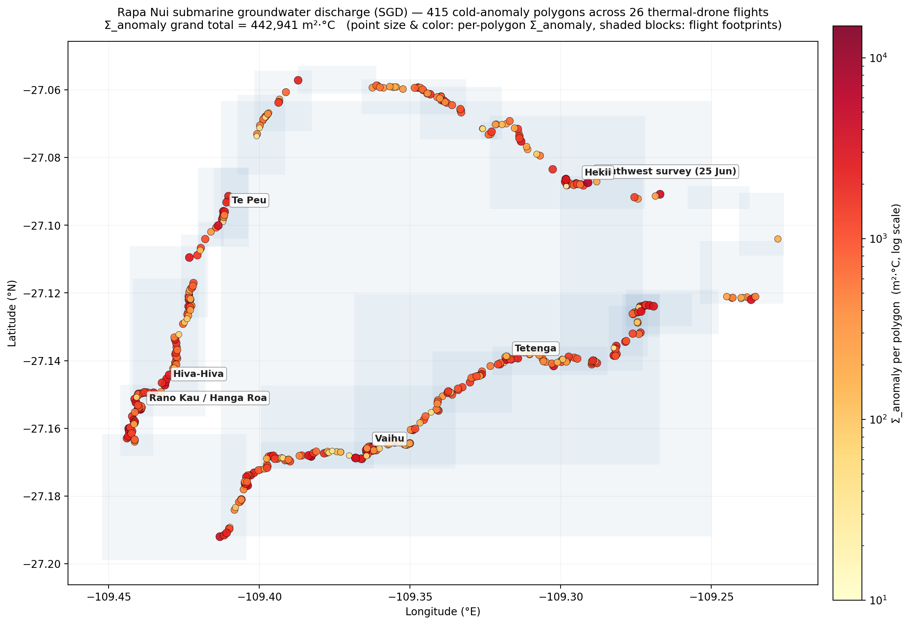

*Figure 1 — 415 coast-anchored SGD plumes detected across 29 flights
(June 2023 + January 2024), point size and colour scale with each
plume's threshold-independent Σ_anomaly metric (m² · °C). Source:
`sgd_output/rapa_nui_all_sgd_coastal.kml`.*

## Three polygon products

| Product | When to use |
|---|---|
| **Coast-anchored plumes** (canonical) | Each polygon documents a coastal source (`source_lat`/`source_lon`). Best for the paper's archaeology-correlation question. |
| **Raster watershed polygons** | One polygon per local cold peak; full plume halo. Good for "how much cold-water content per location". |
| **Detector polygons** | Conservative discrete cold cores from per-frame detection + density clustering. Most defensible for "where was SGD detected". |

Cross-flight comparison:

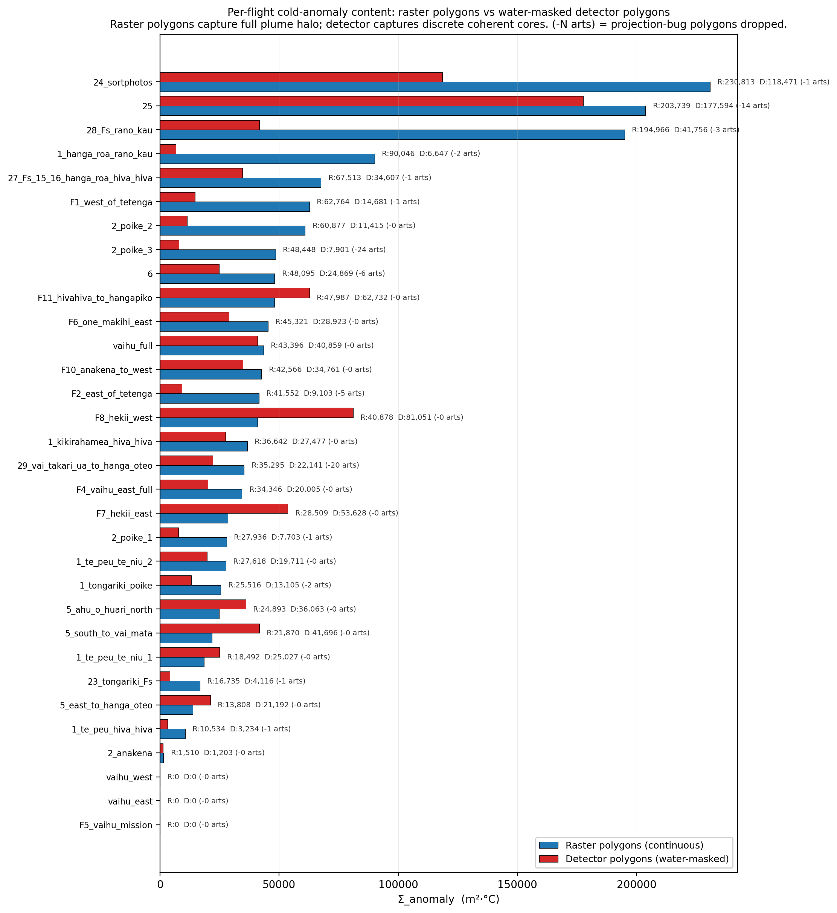

## Site closeups

Hand-picked validation sites overlaid on Esri WorldImagery satellite
tiles. All four use the canonical coast-anchored detector.

### Vaihu (Ahu Vaihu, textbook reference)

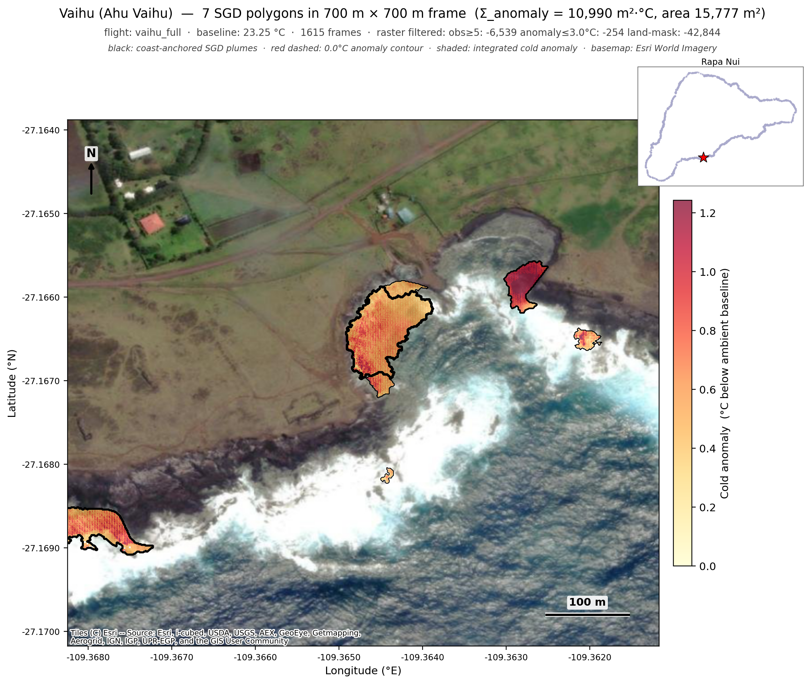

7 discrete plumes traced along the rocky shore and surf zone where
freshwater is known to emerge through collapsed lava-tube outlets.
Σ_anomaly = 11k m² · °C in the 700 m frame.

### Hanga Nui at Ahu Tongariki

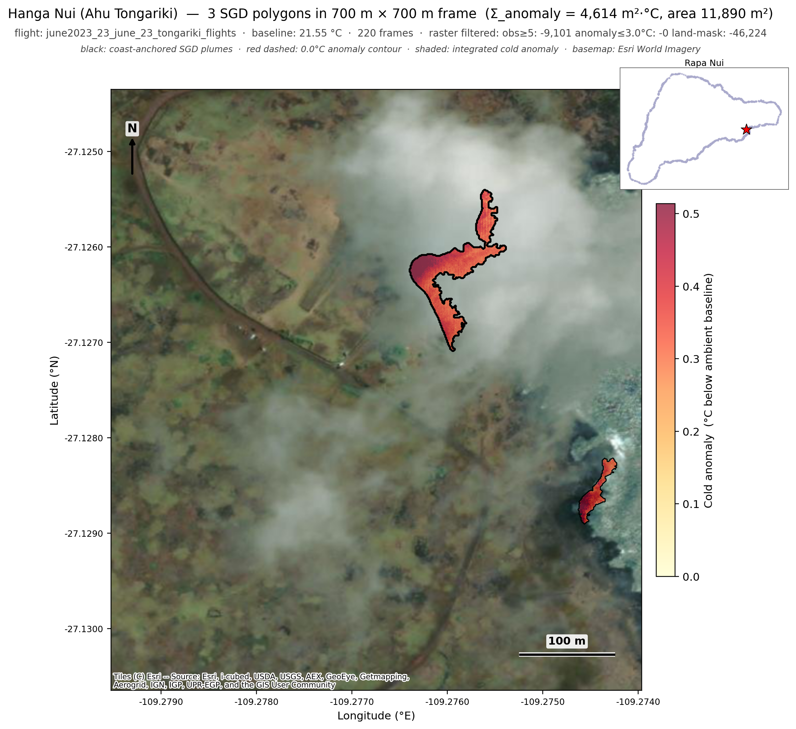

Plumes detected at the bay where the famous moai platform sits.
Bay geometry typical of Rapa Nui's SGD-active sites: low-elevation
beach and rocks, sheltered, with Poike's volcanic slopes inland.

### Hanga o Honu at Ahu Hekii

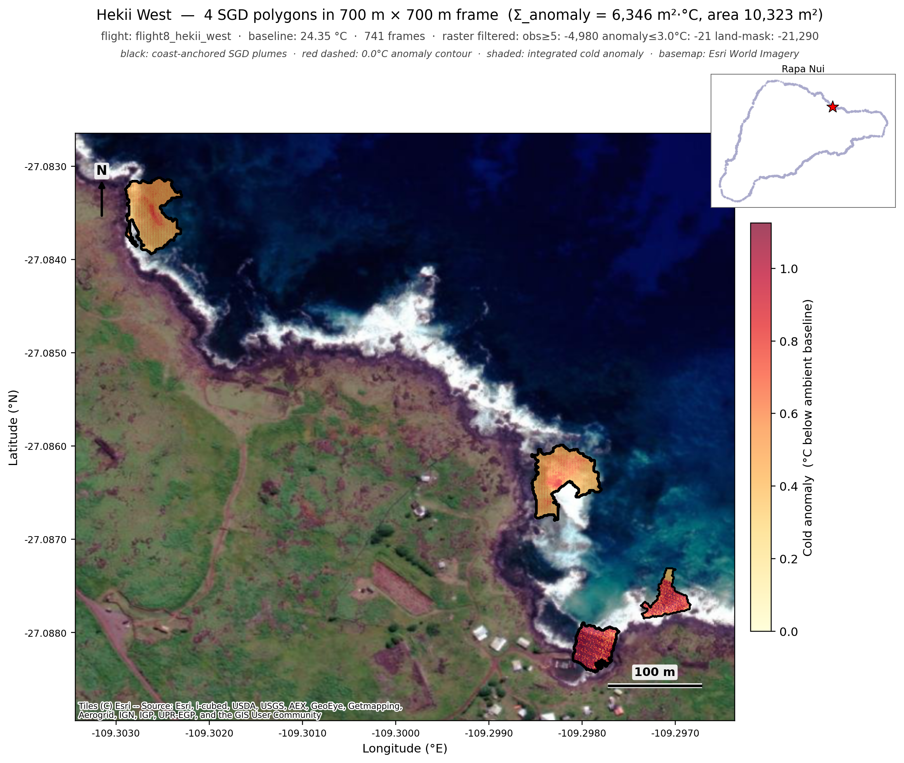

4-plume cluster tightly grouped at the bay where Ahu Hekii sits — a
classic low-elevation north-coast SGD hot zone with peaks above 1 °C
below ambient. Total Σ_anomaly = 6,346 m² · °C.

### Anakena Bay (Ahu Nau Nau)

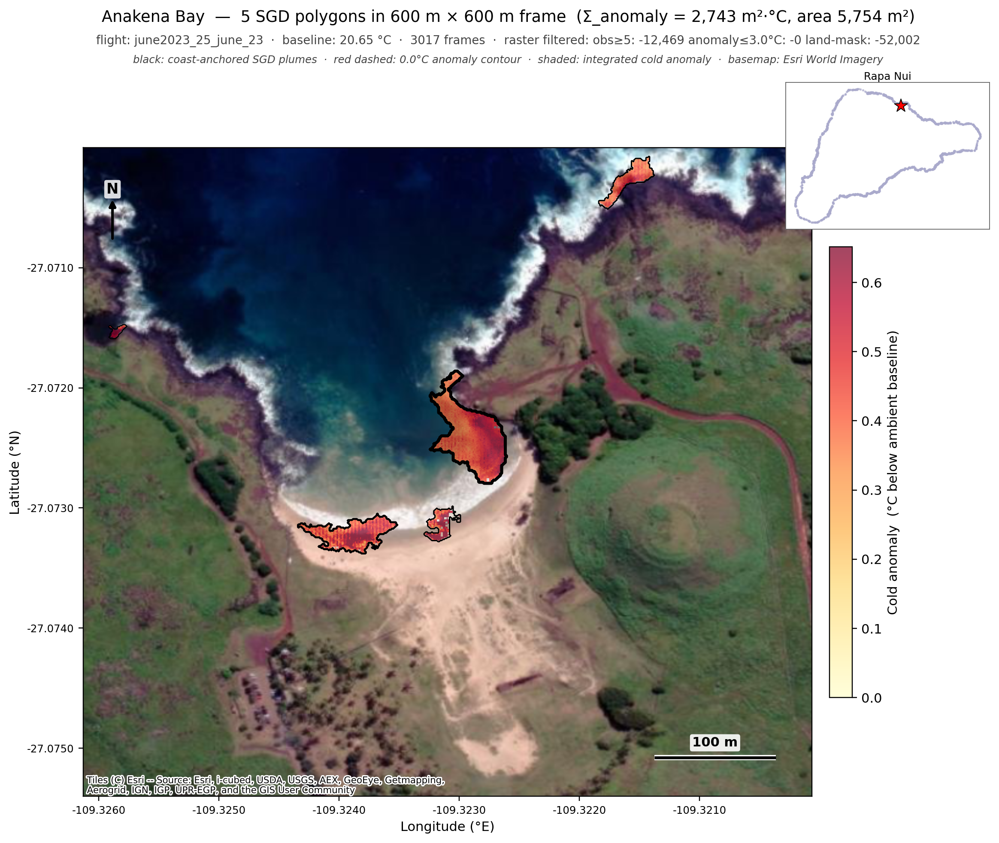

Coast-anchored plumes from the June 2023 survey of the iconic sandy
beach. A prominent central plume in the bay itself (Σ ≈ 1,400 m²·°C,
peak ~1.1 °C) plus 4 satellite plumes at the beach edge and along the
rocky points. Total Σ_anomaly = 2,743 m² · °C.

## Pipeline at a glance

```
Raw drone frames (Autel 640T thermal + RGB)
    ↓
[scripts/pipeline/build_anomaly_raster.py]
    ↓
Per-flight cold-anomaly raster (1 m grid, °C below baseline)
    ↓                                        ↓
[OSM coastline]                       [SRTM 30m DEM]
[derive_water_mask_osm.py]            [derive_cliff_zone.py]
    ↓                                        ↓
Per-flight water mask              Per-flight cliff-zone mask
    ↓
[derive_plumes_coast_anchored.py]
    ↓
Coast-anchored plume polygons
    ↓
[aggregate/aggregate_sigma_anomaly_kml.py]
    ↓
Master KML (canonical)
    ↓
[figures/build_*]
    ↓
Publication figures + docs/PAPER_METHODS.docx
```

## Where everything lives

See [`docs/REPRODUCE.md`](docs/REPRODUCE.md) for the full directory tree, the
end-to-end re-run recipe, and the validated headline numbers.

For a script index by purpose see
[`scripts/README.md`](scripts/README.md).

## Compiled paper deliverable

[`docs/PAPER_METHODS.docx`](docs/PAPER_METHODS.docx) — academic-paper-ready
Methods section (~13 MB) with 7 figures embedded:
- Figure 1: island-wide overview
- Figures 2–6: site closeups (Vaihu, Hanga Nui, Hekii West, Anakena,
  Hivahiva-Hangapiko)
- Figure 7: Poike (cliff-coast control showing the cliff-zone
  filter correctly suppressing spurious plumes)

The Methods source is [`docs/PAPER_METHODS.md`](docs/PAPER_METHODS.md); regenerate
the .docx with `python scripts/figures/build_methods_docx.py`.

## Living methods doc

[`docs/METHODS.md`](docs/METHODS.md) — full methodology + a running decisions
log of every filter / threshold / approach we've tried and why,
including dated entries for every iteration in the 2026-04-27 / 28
work session that produced the current pipeline.

## Per-frame thermal bias

A recurring question about thermal-drone surveys is whether per-frame sensor
bias contaminates the result, and whether it has to be corrected before the
data can be trusted. The question is a fair one for uncooled microbolometers.
It resolves differently for the two physically distinct effects that the phrase
covers, so this section separates them, states what each would look like in
these data, and gives the reason we do not treat either as a threat to the
published numbers.

### What the concern supposes

**Scalar per-frame offset.** An uncooled microbolometer drifts. Shutter-based
non-uniformity correction, housing temperature, and ambient conditions all
shift the whole frame up or down by a common amount. Frame *i* reports
`T_i(x) = T_true(x) + b_i` for some offset `b_i` that varies from frame to
frame across a flight.

**Intra-frame spatial non-uniformity.** The sensor is not uniform across its
own array. The centre self-heats and reads colder than the edges, producing an
approximately radial additive pattern that is fixed in image coordinates. This
is a different quantity from `b_i`, and it does not vary frame to frame in the
same way.

The two get discussed under one label, but they behave differently in this
pipeline, and conflating them is what makes the concern seem more serious than
it is.

### What each would look like if it were driving our results

A scalar offset would show up as discontinuities at frame seams in any product
built from absolute temperatures, as detections that switch on and off with
frame boundaries rather than with coastal geography, and as plume extents
truncated along straight lines where one frame's footprint ends.

A radial non-uniformity would show up differently. Detections would cluster
toward the frame centre in image coordinates, plume boundaries would follow
frame edges, and the residual pattern would reproduce across separate flights
because it is a property of the camera rather than of any coastline.

Those signatures are distinguishable from real discharge, which is fixed in
ground coordinates and has no reason to care where the aircraft happened to
frame it.

### Why a scalar offset cannot affect these products

Both canonical detectors measure each frame against that same frame's own
water. `SpreadSGDDetector` thresholds against the 75th percentile of in-frame
ocean temperature:

```
anomaly_i(x) = max(0, P75(ocean in frame i) − T_i(x))
```

Substituting `T_i(x) = T_true(x) + b_i` raises the percentile by exactly `b_i`
as well, so the two occurrences cancel and the anomaly is unchanged. The
coast-anchored path is the same in structure. `fit_spatial_baseline` estimates
`T_baseline(d)` and `sigma(d)` inside the frame being processed, and the
z-score `(T − T_baseline(d)) / sigma(d)` is invariant to a common additive
shift in the numerator while the MAD-based scale is untouched. The
cancellation is algebraic, not approximate, and it does not depend on `b_i`
being small.

The magnitude involved is worth stating, because it explains why the concern
sounds alarming. Measured across four flights, the per-frame P75 ocean baseline
varies with a standard deviation of **1.65 to 2.76 °C within a single flight**.
That is seven to eleven times the 0.25 °C detection threshold. If this drift
propagated into the detection statistic it would overwhelm the signal
completely. It does not appear because every threshold is referred to the frame
it is applied to.

The corollary is that applying a drift correction is not a neutral safeguard.
A correction fitted to frame-mean or frame-median temperature removes real
structure: ocean temperature genuinely varies along a coastal transect, and
SGD is precisely a recurring cold offset in frames over discharge zones.
Detrending on frame statistics subtracts part of the quantity being measured.
Absolute-temperature mosaics under `results/` do band at frame seams, and that
banding is real, but those mosaics are visualisation products and no paper
figure or Σ_anomaly value derives from them.

### What is not immune: the radial component is real and measured

The radial component does not cancel. It adds directly to `T − baseline` and
competes with the 0.25 °C threshold on equal terms. We measured it, and it is
present in every flight tested.

Measured with the paired within-ground-cell design described below:

| Flight | Centre − edge | 95% CI | Frames | Paired cells |
|---|---|---|---|---|
| `flight10_anakena_to_west` | −0.634 °C | [−1.148, −0.175] | 100 consecutive | 28,351 |
| `flight11_hivahiva_to_hangapiko` | −0.396 °C | [−0.521, −0.271] | 94 consecutive | 30,508 |
| `flight4_vaihu_east_full` | −0.242 °C | [−0.344, −0.166] | 150 block-sampled | 71,122 |
| `flight8_hekii_west` | −0.116 °C | [−0.330, +0.097] | 100 consecutive | 41,819 |

The sign is negative in all four flights, meaning the frame centre reads
colder, and the profile is monotone across the radius bins in each case. Three
of the four exclude zero. Flight 8 does not resolve the effect at its sample
size, and its interval is consistent with anything up to 0.330 °C, so it bounds
the effect rather than arguing against it.

The effect is not geographic. The paired design holds the ground fixed, so
coastline position, nearshore cooling, and real discharge plumes cancel before
the profile is formed. A pattern of this sign and shape appearing at four
different sites on different days is a property of the instrument or of the
viewing geometry, not of any coastline.

**Whether the magnitude differs between flights is not established.** The four
numbers above use different sampling: flight 4 draws six contiguous blocks
spread across the whole flight, the other three take the first ~100 consecutive
frames, which confines each to one leg of its transect under near-constant sun
and sea state. Flight 4 measured both ways agrees (−0.212 °C from the first 100
frames, −0.242 °C block-sampled), so the effect itself is not a sampling
artefact. But the apparent spread from −0.116 to −0.634 °C cannot be read as a
real between-flight difference until the other three are re-measured the same
way, and the flight 4 and flight 11 intervals do in fact overlap. Nothing here
supports or refutes a per-flight correction.

**The cause is not settled between two candidates**, and they call for opposite
responses. A sensor vignette, where the detector array self-heats at the
centre, is fixed in image coordinates and would be corrected by a flat field.
Sun glint, specular reflection off the water strongest at off-nadir view
angles, is fixed relative to the solar azimuth, varies with time of day and sea
state, and would be handled by glint masking rather than calibration. Applying
a flat field to a glint artefact would encode one day's sun geometry as a
calibration and then apply it to frames with different geometry.

A third term is certainly present and works against the measured sign: water
emissivity falls at high incidence angle, so frame edges should read colder
from viewing geometry alone. The measured edge reads warmer, so this partly
cancels whatever produces the centre-cold pattern, and the underlying term is
larger than the numbers above. For detection purposes the combined effect is
what matters, since that is what reaches the threshold.

`scripts/diagnostics/sun_asymmetry_test.py` is the discriminator: it bins the
same paired residual by angle in image-fixed and sun-relative coordinates, and
whichever frame retains more angular amplitude is the one the effect lives in.
It has not yet produced a conclusive answer, because solar azimuth is
effectively constant within a single 12-minute flight, so the two coordinate
frames are decoupled only by the drone's heading changes. Comparing flights
flown at different times of day is the route that would settle it.

Settling the cause only matters if a correction is warranted. As the next
section shows, it is not, for the comparative claims the paper makes.

No correction for this is applied. `flat_field_path` defaults to `None` in
`sgd_toolkit/detectors/base.py`, no flat fields are used in production, and
both `build_anomaly_raster.py` and `run_coast_stretch.py` accept `--flat-field`
but default to off. Every published raster and polygon product was produced
without it.

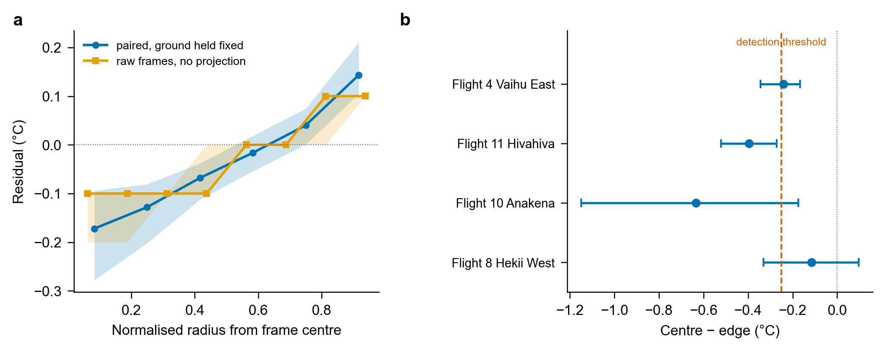

**Figure 1.** Residual temperature against position in the thermal frame, with
the ground held fixed. (a) Flight 4, measured two ways: the paired
within-ground-cell design that projects pixels to a ground grid (blue), and raw
frames in image coordinates with no projection at all (orange). The two agree
to within 0.04 °C, which rules out the footprint projection as the source, and
shows the camera's internal non-uniformity correction is not removing the
pattern. Bands are 95% intervals. (b) Centre-minus-edge contrast for four
flights. All four are negative, meaning the frame centre reads colder, and
three of four exclude zero. Flight 8 is not resolved at this sample size and
bounds rather than excludes the effect. Dashed line marks the 0.25 °C detection
threshold.

### Does it reach the published results?

This is the question that decides whether anything must change, and it was
settled by direct measurement rather than by argument.

A synthetic radial ramp of known magnitude was injected into every frame and
the full pipeline re-run unchanged, on 571 frames of flight 4. Four arms:
uncorrected baseline, the measured magnitude (−0.24 °C), twice the measured
magnitude (−0.48 °C, exceeding the largest value seen in any flight), and the
reversed sign (+0.24 °C) as a control. Injection reuses the existing flat-field
path, so no detection code was modified for the test.

This route deliberately avoids building a real flat field. The cause of the
bias is not settled between a sensor vignette and sun glint, and a flat field
estimated from a flight would bake that day's sun geometry into something
labelled a calibration. Sensitivity to a synthetic ramp of known shape is what
the decision needs, and it holds regardless of the true cause.

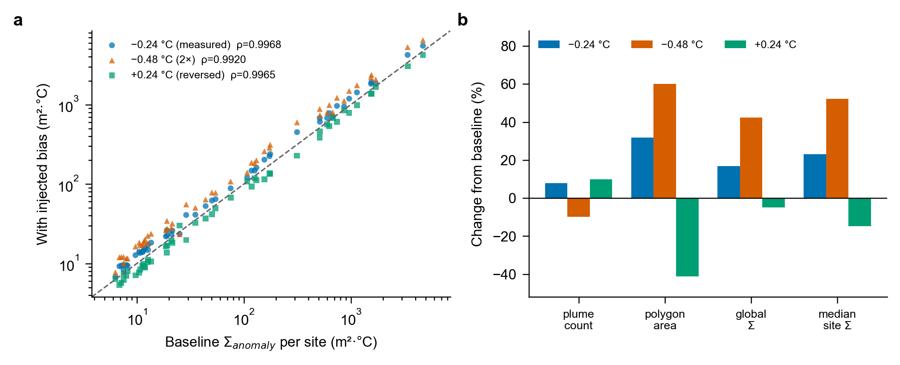

**Figure 2.** Effect of an injected radial bias on the pipeline outputs.
(a) Σ_anomaly per site, injected against uncorrected, for the 51 baseline
sites, with the 1:1 line dashed. Points shift off the diagonal but hold their
order, which is what the Spearman coefficients in the legend record. (b) Change
from baseline by metric. Plume count is nearly unaffected. Polygon area and
absolute Σ_anomaly move substantially and in the expected direction, a colder
centre yielding more detected cold signal.

| Quantity | Response to the measured bias | Verdict |
|---|---|---|
| Scalar frame drift | exactly zero | immune by construction |
| Plume count | +7.8% | robust |
| Site identity | 63–73% retained | mostly stable |
| Polygon area | +31.8% | **sensitive** |
| Global Σ_anomaly | +16.8% | **sensitive** |
| Median per-site Σ_anomaly | +23.1% | **sensitive** |
| **Σ_anomaly site ranking** | **Spearman ρ = 0.9968** | **robust** |

The ranking is what matters, because the paper's claims are comparative: which
sites discharge more than which others. The bias inflates essentially all sites
together, so the ordering is preserved. At twice the measured magnitude the
rank correlation is still 0.9920, even though 92% of individual sites move more
than 25%. Comparative conclusions across sites are therefore robust to this
effect, and no correction is warranted for them.

Absolute Σ_anomaly is a different matter. It carries a systematic uncertainty
of roughly 20 to 40 percent from this source. Any absolute m²·°C figure quoted
as a physical quantity should carry that caveat. Figures used comparatively
need not.

Part of the reason the response is so uniform is that the per-frame P75
baseline partially self-corrects. Injecting a centre-cold ramp pulled the
median frame baseline from 23.35 to 23.55 °C, which raises the absolute
threshold and cancels some of the injection. That is a second protective
mechanism alongside the multi-view consensus in density-grid clustering, and it
is a direct consequence of referencing a percentile of each frame's own ocean
rather than a fixed cut.

Two limits on this result. It covers one flight (flight 4) over 571 of its 750
frames, and should be confirmed on a second flight before it is relied on in
print. And the injected ramp is a clean linear radial profile, matched to the
measurement in sign and magnitude, but the real effect may carry structure that
behaves differently.

Reproduce with:

```bash
python scripts/diagnostics/make_synthetic_vignette.py \
    --contrast-c -0.24 --output models/flat_fields/synth_m0p24.npz

python scripts/pipeline/run_coast_stretch.py --detector spread \
    --data data/staged/flight4_vaihu_east_full --start 1 --end 571 \
    --save-raw --local-adaptive-fraction 0.85 \
    --flat-field models/flat_fields/synth_m0p24.npz \
    --output sgd_output/sensitivity/f4_m024

python scripts/pipeline/build_anomaly_raster.py \
    --data data/staged/flight4_vaihu_east_full \
    --flat-field models/flat_fields/synth_m0p24.npz \
    --output sgd_output/sensitivity/rasters/f4_m024_anom

python scripts/diagnostics/compare_sigma_anomaly.py \
    --baseline sgd_output/sensitivity/rasters/f4_baseline_anom.npz \
    --arm m024:sgd_output/sensitivity/rasters/f4_m024_anom.npz \
    --polygons sgd_output/sensitivity/f4_baseline.geojson
```

### How it is measured

The measurement that produced the table above is
`scripts/diagnostics/radial_paired_test.py`. It exploits survey overlap: the
same patch of ocean is imaged near the frame centre in one frame and near the
edge in another, so a ground cell can be compared against itself across those
views.

Each ocean pixel contributes three things. The residual
`T − P75(ocean in its frame)`, which removes the per-frame scalar offset. The
ground cell it falls in, at 2 m resolution. The image-radius bin it came from.
Residuals are averaged per (ground cell, radius bin), then each cell's own mean
across the radius bins it appeared in is subtracted, and what remains is
averaged over cells.

That subtraction is what makes the test work. Anything constant within a ground
cell drops out: coastline position, nearshore cooling, a real discharge plume,
even land wrongly included in the ocean mask, because a land pixel is land in
every view of that cell. What survives is variation that tracks image position
alone. A flat profile means image position carries no information once the
ground is held fixed. A monotone profile is positional bias in °C, on the same
scale as `delta_c`.

Neighbouring ground cells are not independent, so confidence intervals come
from a block bootstrap over 50 m spatial super-blocks rather than over
individual cells.

Frames are drawn as contiguous blocks spread across the flight
(`--n-blocks`, `--block-len`) rather than as one run or a uniform stride.
Consecutive frames are what supply the overlap the pairing needs, so a uniform
stride across the flight destroys it. A single contiguous run keeps the overlap
but confines the sample to one leg under near-constant sun and sea state.
Blocks give both.

The second, independent measurement is
`scripts/diagnostics/single_frame_radial.py`, which produced the orange trace in
Figure 1a. It has no projection, no ground grid and no pairing: it simply takes
the most ocean-dominated raw frames and averages their residual azimuthally in
image coordinates. Its purpose is to test whether the paired result could be an
artefact of the footprint projection, which assumes a flat sea surface and
models no lens distortion, so edge pixels could be assigned to ground cells
they did not come from. The two methods agree to within 0.04 °C on flight 4,
which rules that out. It also answers whether the pattern is visible in a
single image: the most ocean-dominated frame alone shows −0.217 °C, and 88% of
frames carry the centre-cold sign, so the camera's internal shutter-based
non-uniformity correction is not removing it.

```bash
python scripts/diagnostics/radial_paired_test.py \
    --data data/flight4_vaihu_east_full_combined \
    --label flight4_vaihu_east_full --n-blocks 6 --block-len 25 \
    --output sgd_output/diagnostics/radial_paired_flight4_vaihu_east_full

python scripts/diagnostics/single_frame_radial.py \
    --data data/flight4_vaihu_east_full_combined \
    --label flight4_vaihu_east_full --n-candidates 200 --n-use 60 \
    --output sgd_output/diagnostics/single_frame_radial_flight4_vaihu_east_full
```

Both need the external volume mounted at `/Volumes/RapaNui`, and both abort
rather than write partial output if it disappears mid-run, because a truncated
flight is spatially biased toward one end of the transect and is
indistinguishable from a valid result once written. That guard exists because
the volume dropped four times during this work, twice as a clean unmount and
twice as `Errno 60` I/O timeouts under concurrent load.

For any run longer than a few minutes, copy the frames to local disk first:

```bash
python scripts/diagnostics/stage_frames.py \
    --data data/flight4_vaihu_east_full_combined \
    --dest data/staged/flight4_vaihu_east_full --all
```

`stage_frames.py` is resumable, skipping files already present, so a drop
mid-copy only needs the same command re-run. Setting `sudo pmset -a disksleep 0`
while working removes one cause of the drops.

### An approach that did not work

`scripts/diagnostics/frame_position_bias.py` attempts the same separation a
different way, by splitting frames into opposing heading groups. Sensor bias is
fixed in image coordinates while ground structure rotates 180° in the image when
the aircraft flies the reciprocal leg, so writing the two groups as `A = S + G`
and `B = S + rot180(G)` should let the symmetric and antisymmetric parts
separate sensor from scene.

It does not work on these data, and the reason is worth recording so it is not
attempted again. The method requires an accurate ocean mask. Within a single
heading group the coastline occupies the same part of the frame in nearly every
frame, so any mask error parks land in fixed image blocks and the block median
returns land temperature. The resulting maps reach +10 °C, which is impossible
for an ocean residual, and the recovered "sensor" amplitudes of 0.8 to 10.4 °C
across the four flights are measuring where the coastline sits rather than
where sensor bias sits. All four flights report the maps as ground-fixed
(`corr(A, rot180 B)` positive, `corr(A, B)` negative or near zero), which is
exactly what land contamination predicts and is not evidence either way.

The script is retained because its JSON output carries useful per-flight
records (residual maps, headings, ocean fractions, the mask-leak count), but no
conclusion should be drawn from its decomposition, and the same applies to
`scripts/diagnostics/frame_bias_crossflight.py`, which correlates that
decomposition across flights and therefore inherits the same defect. The paired
test above is immune to this failure mode and supersedes both.

### Script index for this section

| Script | Role |
|---|---|
| `diagnostics/radial_paired_test.py` | primary measurement, ground held fixed |
| `diagnostics/single_frame_radial.py` | independent check, no projection |
| `diagnostics/sun_asymmetry_test.py` | sensor vs glint discriminator (inconclusive) |
| `diagnostics/make_synthetic_vignette.py` | builds the injected ramps |
| `diagnostics/compare_sensitivity_arms.py` | polygon count, area, site matching |
| `diagnostics/compare_sigma_anomaly.py` | Σ_anomaly global, per site, rank |
| `diagnostics/stage_frames.py` | resumable local frame copier |
| `figures/build_frame_bias_figures.py` | rebuilds Figures 1 and 2 |
| `diagnostics/frame_position_bias.py` | superseded, see above |
| `diagnostics/frame_bias_crossflight.py` | superseded, see above |

Result files behind every number quoted here are in `docs/results/frame_bias/`,
and the figure script reads from there, so both figures rebuild on a fresh
clone without re-running the analysis.

### Limitations

The scalar case is settled by the algebra above and needs no further
measurement. What follows applies to the radial numbers and to the sensitivity
result.

The sensitivity test covers one flight, `flight4_vaihu_east_full`, over 571 of
its 750 frames. Confirming it on a second flight is the single most useful
remaining step before the robustness claim goes into print.
`flight11_hivahiva_to_hangapiko` is the natural choice: it has the tightest
paired interval after flight 4, and its coast geometry differs.

The injected ramp is a clean linear radial profile matched to the measurement
in sign and magnitude. The real effect may carry structure that behaves
differently, and the injection is applied uniformly to every frame, whereas a
glint term would vary with heading.

Interval widths differ substantially between flights, from ±0.09 °C on
`flight4_vaihu_east_full` to ±0.49 °C on `flight10_anakena_to_west`, driven by
how many independent 50 m blocks each survey covers. This matters only if a
correction is ever fitted. The sensitivity result does not depend on knowing
the magnitude precisely, because it brackets twice the largest value observed.

The three flights other than flight 4 have not been re-measured with block
sampling, so their magnitudes describe one leg of each transect rather than the
whole flight, as noted above.

No flight contains open-water frames free of coast, so a coast-free control
stratum was never available. The paired design removes the need for one by
holding the ground fixed, which is why it replaced the earlier approach.

Two defects found during this work are real, small, and independent of frame
bias. The `binary_closing` step in `sgd_toolkit/detectors/spread.py` dilates the
cold mask past the ocean boundary, so roughly 0.1 to 0.2 percent of detected
pixels sit on land before georeferencing. And in `run_coast_stretch.py` the
call order is load, `segment_ocean_land_waves`, `detect_sgd_plumes`, but
`_last_thermal` is only set inside the last of those, so from the second frame
onward the ocean mask is refined using the *previous* frame's thermal data
before being refined again with the current frame's. Since refinement only ever
expands the mask, production masks are slightly over-grown from stale data.
Neither is fixed, because fixing either changes published results.

One related defect is worth recording separately, because it is real and
independent of frame bias. The `binary_closing` step in
`sgd_toolkit/detectors/spread.py` dilates the cold mask past the ocean
boundary, so roughly 0.1 to 0.2 percent of detected pixels sit on land before
georeferencing. The effect is small and stable across flights, but it is a
defect rather than a design choice.

---

# Submarine Groundwater Discharge (SGD) Detection Toolkit

A **production-ready** Python toolkit for detecting submarine groundwater discharge (cold freshwater seeps) in coastal waters using thermal and RGB imagery from Autel 640T UAV. Successfully tested with real Rapa Nui (Easter Island) survey data.

📚 **[Read the Technical Paper](docs/TECHNICAL_PAPER.md)** - Comprehensive documentation of the thermal image processing challenges and our solutions

> **🎉 FULLY OPERATIONAL - Ready for Scientific Use**
> 
> **📍 Two Processing Modes**:
> - **🤖 Automated** (`sgd_autodetect.py`): Batch processing with georeferenced KML export
>   - ✅ **VERIFIED**: 101+ SGDs detected across multiple Rapa Nui surveys
>   - ✅ **ACCURATE**: Correct GPS positioning at -27.15°, -109.44° (Easter Island)
>   - ✅ **COMPLETE**: Exports polygon outlines of plume boundaries
> - **👁️ Interactive** (`sgd_viewer.py`): Manual review and verification with visual feedback

## Table of Contents
- [Technical Paper](docs/TECHNICAL_PAPER.md) - In-depth technical documentation
- [Overview](#overview)
- [Key Features](#key-features)
- [🧙 Interactive Wizard - The Easiest Way to Get Started](#-interactive-wizard---the-easiest-way-to-get-started)
  - [What is the Wizard?](#what-is-the-wizard)
  - [Why Use the Wizard?](#why-use-the-wizard)
  - [How It Works](#how-it-works)
  - [Reusing Configurations](#reusing-configurations)
  - [Pre-Made Templates](#pre-made-templates)
  - [Common Workflows](#common-workflows)
- [Installation from Scratch](#installation-from-scratch)
- [Quick Start](#quick-start)
- [Command-Line Usage](#command-line-usage)
  - [Multi-Threshold Temperature Analysis](#multi-threshold-temperature-analysis)
- [Primary Scripts](#primary-scripts)
  - [Automated Batch Processing](#automated-batch-processing-sgd_autodetectpy)
  - [Interactive Processing](#which-script-should-i-use)
- [Machine Learning Segmentation](#machine-learning-segmentation)
- [SAM - Interactive Ocean Segmentation](#sam-segment-anything-model---interactive-ocean-segmentation)
  - [How It Works](#how-it-works-1)
  - [SAM Prompt Creator (Interactive)](#sam-prompt-creator-interactive)
  - [Using SAM with SGD Detection](#using-sam-with-sgd-detection)
  - [Prompt Strategy](#prompt-strategy)
  - [Performance](#performance)
- [Why Raw Thermal Data is Essential](#why-raw-thermal-data-is-essential)
- [Recent Enhancements](#recent-enhancements)
- [Technical Details](#technical-details)
- [Output Formats](#output-formats)
- [Tips for Best Results](#tips-for-best-results)
- [Troubleshooting](#troubleshooting)
- [Project Structure](#project-structure)
- [Citation](#citation)
- [Contributing](#contributing)

## Overview

Submarine Groundwater Discharge (SGD) occurs when freshwater from underground aquifers seeps into the ocean along the coastline. This freshwater is typically cooler than seawater and creates detectable thermal anomalies. This toolkit automatically identifies these cold plumes in thermal drone imagery.

This toolkit processes paired thermal (640×512) and RGB (4096×3072) images from an Autel 640T drone to identify areas where cold groundwater emerges at the shoreline. The thermal camera has a narrower field of view (~70% of RGB FOV), which is properly handled for accurate alignment and georeferencing.

### Field of View Alignment
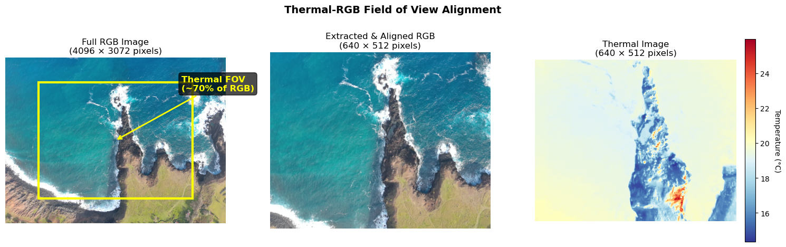
*The thermal camera captures ~70% of the RGB camera's field of view. The toolkit automatically extracts and aligns the matching region.*

## Key Features

### Core Capabilities
- **Thermal Analysis**: Process Autel 640T thermal images (deciKelvin format)
- **Ocean Segmentation**: ML-based (Random Forest) or SAM-based (point-and-click) segmentation
- **SAM Integration**: Click a few points on one image, segment entire surveys automatically
- **SGD Detection**: Identify cold freshwater plumes near shorelines (1-3°C cooler)
- **Georeferencing**: Automatic GPS + orientation extraction for accurate mapping
- **Polygon Export**: Export actual plume outlines as georeferenced polygons

### Processing Options
- **🤖 Automated Mode** (`sgd_autodetect.py`): Batch process entire surveys without supervision
- **👁️ Interactive Mode** (`sgd_viewer.py`): Manual review and verification of detections
- **🔬 Analysis Mode** (`sgd_detector_integrated.py`): Parameter tuning and testing

### Advanced Features
- **Multi-Threshold Analysis**: Analyze SGDs at multiple temperature thresholds with color-coded visualization
- **Polygon Merging**: Automatic creation of unified distribution maps (_merged.kml files)
- **Wave Area Toggle**: Optionally include breaking waves/foam in SGD search
- **Multi-Format Export**: GeoJSON, KML (Google Earth), and CSV formats
- **Aggregate Mapping**: Handle overlapping survey frames with deduplication
- **Frame Navigation**: Enhanced controls (±1, ±5, ±10, ±25 frames)
- **Survey Management**: Start fresh surveys while preserving previous data
- **Progress Tracking**: Real-time progress bars and statistics
- **Frame Footprints**: Automatic generation of survey coverage KML files

## 🧙 Interactive Wizard - The Easiest Way to Get Started

### What is the Wizard?

The **SGD Analysis Wizard** (`sgd_wizard.py`) is an interactive command-line tool that makes running SGD detection analysis as simple as answering a few questions. Instead of memorizing command-line arguments or editing configuration files manually, the wizard guides you through the entire setup process with clear prompts and sensible defaults.

### Why Use the Wizard?

**Perfect for beginners:**
- No need to memorize complex command-line arguments
- Interactive questions with helpful explanations
- Validated input prevents common mistakes
- Color-coded output for easy reading

**Powerful for experts:**
- Saves time setting up analyses
- Creates reusable configuration files
- Enables consistent batch processing across multiple datasets
- Integrates seamlessly with existing workflows

**Configuration Management:**
- Automatically saves your settings to JSON files
- Reuse configurations on different datasets
- Share configurations with team members
- Version control your analysis parameters

### How It Works

The wizard asks you a series of questions about your analysis:

1. **Data Input**: Where are your thermal images?
2. **Segmentation Setup** (NEW): Choose Random Forest training or SAM prompts (GPU)
3. **Output Settings**: Where should results be saved? What should they be named?
4. **Detection Parameters**: Temperature threshold, minimum plume size
5. **Detector Selection**: Which algorithm to use (standard, improved, etc.)
6. **ML Segmentation**: Use pre-trained models or rule-based segmentation?
7. **Advanced Options**: Sun glint detection, shore distance limits
8. **Output Formats**: KML, GeoJSON, CSV - which do you need?

After collecting your preferences, the wizard:
- Displays a summary for review
- Saves the configuration to a JSON file
- Runs the analysis (or saves config for later use)
- Shows you how to reuse the configuration

### Quick Example

```bash
# First time - wizard asks questions
$ python scripts/sgd_wizard.py

╔══════════════════════════════════════════════════════════════════╗
║              SGD Detection Analysis Wizard                       ║
╔══════════════════════════════════════════════════════════════════╗

▶ 1. Data Input

Path to directory containing thermal images: data/100MEDIA
✓ Found 45 RGB images and 45 thermal images

▶ 2. Output Configuration

Output file name [100]: my_survey
Output directory [sgd_output]: sgd_output

▶ 3. Detection Parameters

Temperature threshold (°C) [0.5]: 0.5
Minimum plume area (pixels) [50]: 50

▶ 4. Detector Configuration

Select detector type:
  1. integrated - Standard detector (fastest)
  2. improved - Enhanced baseline methods + sun glint filtering (recommended)
  3. temporal - Moving average smoothing (for video sequences)
  4. edge_aware - Frame boundary handling (for overlapping frames)
Choice [default: 2]: 2

... (continues with remaining questions)

▶ Configuration Summary

Data Input:
  Data Directory: data/100MEDIA

Output:
  Output Name: my_survey
  Output Directory: sgd_output

Detection Parameters:
  Temperature Threshold: 0.5°C
  Minimum Area: 50 pixels
  Detector: improved
  Baseline Method: upper_quartile

✓ Configuration saved to: sgd_config.json

Proceed with analysis? [y]: y

ℹ Running command:
python scripts/sgd_autodetect.py --data data/100MEDIA --output sgd_output/my_survey ...

[Analysis runs...]

✓ Analysis completed successfully!
```

### Reusing Configurations

Once you've created a configuration, you can reuse it on different datasets without answering all the questions again:

```bash
# Use the same settings on a different survey
python scripts/sgd_wizard.py --config sgd_config.json --data data/101MEDIA

# Batch process multiple surveys
for survey in data/survey_*; do
  python scripts/sgd_wizard.py --config sgd_config.json \
    --data "$survey" --no-confirm
done
```

### Pre-Made Templates

The toolkit includes ready-to-use configuration templates in the `configs/` directory:

**`configs/example_config.json`** - Balanced settings (recommended)
- Good starting point for most surveys
- Temperature threshold: 0.5°C
- Improved detector with all enhancements
- All output formats enabled

**`configs/quick_scan.json`** - Fast preliminary analysis
- Higher threshold (1.0°C) for fewer false positives
- Larger minimum area (100 pixels)
- No ML segmentation (faster)
- KML output only

**`configs/detailed_analysis.json`** - Maximum sensitivity
- Lower threshold (0.3°C) for subtle features
- Smaller minimum area (25 pixels)
- All detection enhancements enabled
- Complete output documentation

Usage:
```bash
# Use a template directly
python scripts/sgd_wizard.py --config configs/detailed_analysis.json

# Load a template, modify for your data, and save
python scripts/sgd_wizard.py --config configs/example_config.json \
  --data my_data --save-only --output my_config.json
```

### Common Workflows

**First Analysis:**
```bash
# Interactive setup
python scripts/sgd_wizard.py
# Answer questions, config saved automatically
```

**Repeat Analysis on New Data:**
```bash
# Reuse previous settings
python scripts/sgd_wizard.py --config sgd_config.json --data data/new_survey
```

**Parameter Tuning:**
```bash
# Create config without running
python scripts/sgd_wizard.py --save-only --output test_params.json
# Edit test_params.json manually
# Test with your parameters
python scripts/sgd_wizard.py --config test_params.json
```

**Team Collaboration:**
```bash
# Team lead creates and shares optimal config
python scripts/sgd_wizard.py --save-only --output team_standard.json
# Commit team_standard.json to git
# Team members use standard settings
python scripts/sgd_wizard.py --config team_standard.json --data their_data
```

**Multi-Site Survey:**
```bash
# Create site-specific configs
python scripts/sgd_wizard.py --save-only --output rocky_coast.json
python scripts/sgd_wizard.py --save-only --output sandy_beach.json

# Process each site with appropriate settings
python scripts/sgd_wizard.py --config rocky_coast.json --data site1
python scripts/sgd_wizard.py --config sandy_beach.json --data site2
```

### Configuration File Format

Configurations are saved as JSON files with all your settings:

```json
{
  "data_dir": "data/100MEDIA",
  "output_name": "my_survey",
  "output_dir": "sgd_output",
  "temp_threshold": 0.5,
  "min_area": 50,
  "detector": "improved",
  "baseline_method": "upper_quartile",
  "use_ml": true,
  "ml_model": "segmentation_model.pkl",
  "detect_glint": true,
  "export_kml": true,
  "export_geojson": true,
  "export_csv": true,
  "created_at": "2025-01-18T10:00:00",
  "version": "1.0"
}
```

You can edit these files directly or use them as templates. See `configs/README.md` for detailed parameter documentation.

### Tips for Using the Wizard

1. **Start with defaults**: Press Enter to accept suggested values - they work well for most cases
2. **Save configurations**: Always save your config so you can reuse or reference it later
3. **Use templates**: Start from a template close to your needs and modify as needed
4. **Document your settings**: Add notes in your config filename (e.g., `high_sensitivity_rocky_coast.json`)
5. **Version control**: Store configs in git to track your analysis parameters over time
6. **Batch processing**: Use `--no-confirm` to skip the confirmation prompt for automated workflows

### Advanced: Scripting with the Wizard

You can integrate the wizard into your own scripts:

```bash
#!/bin/bash
# Process all flights from a field campaign

BASE_CONFIG="configs/detailed_analysis.json"

for flight in /data/field_campaign_2024/flight_*/; do
  flight_name=$(basename "$flight")
  output_name="campaign2024_${flight_name}"

  echo "Processing $flight_name..."
  python scripts/sgd_wizard.py \
    --config "$BASE_CONFIG" \
    --data "$flight" \
    --output "$output_name" \
    --no-confirm
done

echo "All flights processed!"
```

### Getting Help

```bash
# View all wizard options
python scripts/sgd_wizard.py --help

# See available templates
ls configs/*.json

# Read parameter documentation
cat configs/README.md
```

## Detection Pipeline

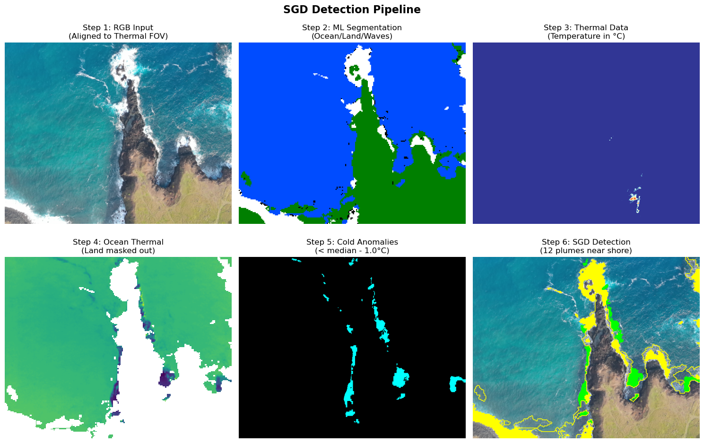
*The SGD detection pipeline: 1) RGB input aligned to thermal FOV, 2) ML-based segmentation, 3) Thermal data processing, 4) Ocean isolation, 5) Cold anomaly detection, 6) Final SGD identification near shoreline*

## Installation from Scratch

### Prerequisites

- Python 3.8 or higher
- Git (for cloning the repository)
- 4GB RAM minimum (8GB recommended for large surveys)
- macOS, Linux, or Windows with WSL

### Step 1: Clone the Repository

```bash
# Clone the repository
git clone https://github.com/clipo/thermal.git
cd thermal
```

### Step 2: Set Up Python Environment

It's recommended to use a virtual environment to avoid conflicts with other Python packages:

```bash
# Create a virtual environment (choose one method)

# Option A: Using venv (built-in to Python)
python3 -m venv sgd_env
source sgd_env/bin/activate  # On Windows: sgd_env\Scripts\activate

# Option B: Using conda
conda create -n sgd_env python=3.9
conda activate sgd_env
```

### Step 3: Install the Package

The toolkit is now organized as a proper Python package with two installation options:

```bash
# Option A: Development installation (recommended for contributors)
# This allows you to edit the code and see changes immediately
pip install -e .

# Option B: Regular installation
pip install .

# Both options will install all required dependencies automatically
```

⚠️ **IMPORTANT**: The pre-trained models require **scikit-learn version 1.5.1** exactly. Different versions will produce different detection results!

### Step 4: Verify Installation

```bash
# Test that the package is installed correctly
python -c "from sgd_toolkit.detectors import IntegratedSGDDetector; print('✓ SGD Toolkit installed successfully!')"

# Test the main scripts
python scripts/sgd_viewer.py --help
python scripts/sgd_autodetect.py --help
```

### Step 5: Prepare Your Data

Create a data directory structure for your Autel 640T images:

```bash
# Create data directory
mkdir -p data/100MEDIA

# Copy your drone images to the data directory
# You need both RGB (MAX_XXXX.JPG) and thermal (IRX_XXXX.irg) files
# Example:
# cp /path/to/drone/images/MAX_*.JPG data/100MEDIA/
# cp /path/to/drone/images/IRX_*.irg data/100MEDIA/
```

### Step 6: ML Segmentation Model (Pre-Trained Included)

The toolkit includes **pre-trained segmentation models** optimized for coastal environments:

```bash
# DEFAULT MODELS INCLUDED (in models/ directory):
# - segmentation_model.pkl - General-purpose Random Forest classifier
# - Area-specific models for different survey locations
#
# These models work well for:
# - Rocky volcanic shores (like Rapa Nui)
# - Clear ocean/land boundaries
# - Wave and foam detection

# ⚠️ REQUIRES scikit-learn==1.5.1 for correct predictions!
# Wrong scikit-learn version = different SGD detection results

# Train a custom model for different environments:
python scripts/train_segmentation.py --data data/100MEDIA
# Follow the on-screen instructions to label ocean, land, rock, and waves
# Press 'T' to train, 'S' to save the model
```

### Step 7: Run Your First Analysis

```bash
# Automated batch processing (recommended for large surveys)
python scripts/sgd_autodetect.py --data data/100MEDIA --output results/sgd_detections.kml

# Interactive viewer for manual review and verification
python scripts/sgd_viewer.py --data data/100MEDIA

# Generate survey coverage maps
python scripts/coverage/generate_coverage_map.py --data data/ --search
```

### Installation on Specific Platforms

#### macOS
```bash
# Install Homebrew if not already installed
/bin/bash -c "$(curl -fsSL https://raw.githubusercontent.com/Homebrew/install/HEAD/install.sh)"

# Install Python 3.9+ if needed
brew install python@3.9

# Follow steps 1-7 above
```

#### Ubuntu/Debian Linux
```bash
# Update package list
sudo apt update

# Install Python and pip
sudo apt install python3.9 python3-pip python3-venv git

# Install system dependencies for matplotlib
sudo apt install python3-tk

# Follow steps 1-7 above
```

#### Windows (using WSL2)
```bash
# Install WSL2 first (in PowerShell as Administrator)
wsl --install

# Open WSL2 terminal and install Python
sudo apt update
sudo apt install python3.9 python3-pip python3-venv git

# Follow steps 1-7 above
```

#### Windows (Native)
```bash
# Install Python from python.org (3.9 or higher)
# Make sure to check "Add Python to PATH" during installation

# Open Command Prompt or PowerShell
# Follow steps 1-7 above, using:
# - python instead of python3
# - sgd_env\Scripts\activate instead of source sgd_env/bin/activate
```

### Common Installation Issues and Solutions

#### Issue: "No module named 'tkinter'"
```bash
# macOS
brew install python-tk

# Ubuntu/Debian
sudo apt-get install python3-tk

# Windows: tkinter should be included with Python
```

#### Issue: "matplotlib backend not found"
```bash
# Set the backend explicitly
export MPLBACKEND=TkAgg  # Add to ~/.bashrc or ~/.zshrc for permanent fix
```

#### Issue: "Permission denied" errors
```bash
# Use virtual environment (recommended) or install with --user flag
pip install --user -r requirements.txt
```

#### Issue: Large file processing is slow
```bash
# Ensure you have sufficient RAM (8GB recommended)
# Consider processing smaller batches:
python sgd_viewer.py --data data/100MEDIA --end 100  # Process first 100 frames
```

### Quick Test with Sample Data

To verify everything is working before using your own data:

```bash
# Create a test directory with minimal data
mkdir -p data/test
# Copy just 10-20 image pairs to test
# cp your_first_10_MAX*.JPG data/test/
# cp your_first_10_IRX*.irg data/test/

# Run quick test
python sgd_detector_integrated.py --data data/test --mode batch --end 10
```

### Next Steps

After successful installation:

1. **Read the Quick Start section** for basic usage
2. **Train a custom ML model** if the default doesn't work well for your environment
3. **Process your survey data** with `sgd_viewer.py`
4. **Export results** in GeoJSON, KML, or CSV format
5. **Visualize in Google Earth** or your preferred GIS software

## Success Metrics

### Verified Performance on Real Data
- **Rapa Nui Survey (July 2023)**:
  - 📊 **101 SGDs detected** across 25 frames
  - 🎯 **90 unique locations** after deduplication
  - 📐 **1,219.9 m²** total cold plume area
  - ⚡ **0.42 sec/frame** processing speed
  - 🌡️ **-1.2°C to -3.3°C** temperature anomalies detected

- **Kikirahamea - Hiva Hiva Site**:
  - 📊 **37 SGDs detected** in specialized location
  - 📐 **170.0 m²** total area
  - 🌡️ **-1.2°C to -2.8°C** anomalies

## Quick Start

### 🎯 Easiest Way: Interactive Wizard (Recommended for Beginners)

The wizard guides you through setting up your analysis with simple questions:

```bash
# Run the interactive wizard
python scripts/sgd_wizard.py

# The wizard will:
# 1. Ask you about your data location
# 2. Guide you through parameter selection
# 3. Save your configuration for reuse
# 4. Run the analysis automatically
```

**Reuse saved configurations:**
```bash
# Use a saved configuration on new data
python scripts/sgd_wizard.py --config my_config.json --data data/new_survey

# Create config without running (for later use)
python scripts/sgd_wizard.py --save-only --output my_settings.json

# Use pre-made templates
python scripts/sgd_wizard.py --config configs/detailed_analysis.json
```

### Quick Command Reference

```bash
# Basic Detection (new structure)
python scripts/sgd_autodetect.py --data data/100MEDIA --output sgd_output/results

# Interactive Viewer
python scripts/sgd_viewer.py --data data/100MEDIA

# Train Segmentation Model
python scripts/train_segmentation.py --data data/100MEDIA

# Generate Coverage Maps
python scripts/coverage/generate_coverage_map.py --data data/ --search

# SAM Segmentation (GPU-accelerated, advanced)
python scripts/sam_segmenter.py --interactive --data data/100MEDIA
```

### 🚀 SAM Quick Start (Advanced Users with GPU)

For users with NVIDIA GPUs or Apple Silicon (M1/M2/M3), SAM provides superior segmentation accuracy and AI-based SGD detection. See the [SAM Quick Start Guide](docs/SAM_QUICKSTART.md) for a 5-minute setup walkthrough.

**TL;DR:**
```bash
# 1. Install SAM (2 min)
bash scripts/setup_sam.sh

# 2. Test installation
python scripts/sam_segmenter.py --test

# 3. Create prompts for ocean/land segmentation (2 min)
python scripts/sam_segmenter.py --interactive --data data/100MEDIA

# 4. Compare with Random Forest segmentation
python scripts/legacy/compare_segmentation.py --image data/100MEDIA/MAX_0001.JPG --interactive

# 5. NEW: Test SAM-based SGD detection (interactive, high accuracy)
python scripts/test_sam_sgd_detection.py \
    --rgb data/100MEDIA/MAX_0001.JPG \
    --thermal data/100MEDIA/IRX_0001.irg
```

**SAM-Based SGD Detection (NEW):**
- Interactive click-to-detect workflow
- AI segments SGD features with high precision
- Side-by-side comparison with threshold method
- Ideal for validation and research where accuracy is critical
- Access via wizard: Choose "sam" detection method in Section 4

After installation, choose your processing mode:

### Option 1: Automated Batch Processing (Recommended for Large Surveys)

```bash
# Navigate to project directory
cd thermal

# Place your images in a data folder
mkdir -p data/my_survey
cp /path/to/drone/images/*.JPG data/my_survey/
cp /path/to/drone/images/*.irg data/my_survey/

# Run automated detection
python sgd_autodetect.py --data data/my_survey --output results.kml

# View results in Google Earth
open results.kml  # macOS
# Or drag results.kml into Google Earth
```

### Option 2: Interactive Processing (For Manual Verification)

```bash
# Run the interactive viewer
python sgd_viewer.py --data data/my_survey

# Navigate and mark SGDs:
#   - Use slider/buttons to browse frames
#   - Click "Mark SGD" for cold plumes
#   - Press 'W' to toggle wave areas
#   - Press 'E' to export results

# Output files:
#   - sgd_polygons.kml → Google Earth
#   - sgd_polygons.geojson → GIS software
#   - sgd_areas.csv → Spreadsheet analysis
```

### Quick Workflow Examples

```bash
# Fast automated preview (every 10th frame)
python sgd_autodetect.py --data data/survey --output preview.kml --skip 10

# Full automated processing with custom parameters
python sgd_autodetect.py --data data/survey --output final.kml --temp 0.5 --waves

# Interactive review of specific area
python sgd_viewer.py --data data/morning_flight --aggregate morning.json

# Compare morning vs afternoon surveys
python sgd_autodetect.py --data data/morning --output morning_sgd.kml
python sgd_autodetect.py --data data/afternoon --output afternoon_sgd.kml
```

## Command-Line Usage

### 🧙 Interactive Wizard (Recommended)

The **SGD Analysis Wizard** provides the easiest way to run analyses. It asks simple questions, saves your settings, and runs the analysis automatically.

#### First-Time Setup (Interactive)

```bash
# Run the wizard - it will ask you questions
python scripts/sgd_wizard.py

# Example interaction:
# Path to directory containing thermal images: data/100MEDIA
# Output file name: my_survey
# Temperature threshold (°C): 0.5
# ... (wizard guides you through all settings)
# Configuration saved to: sgd_config.json
# Proceed with analysis? [y]: y
# Running analysis...
```

#### Reuse Configurations

Once you've created a configuration, reuse it on different datasets:

```bash
# Use saved config on new data
python scripts/sgd_wizard.py --config sgd_config.json --data data/101MEDIA

# Skip confirmation prompt for batch processing
python scripts/sgd_wizard.py --config sgd_config.json --no-confirm
```

#### Pre-Made Configuration Templates

Choose from ready-made templates in the `configs/` directory:

```bash
# Quick scan (fast, conservative settings)
python scripts/sgd_wizard.py --config configs/quick_scan.json

# Detailed analysis (maximum sensitivity)
python scripts/sgd_wizard.py --config configs/detailed_analysis.json

# Standard balanced settings
python scripts/sgd_wizard.py --config configs/example_config.json
```

#### Create Config Without Running

Save configuration for later use without running the analysis:

```bash
# Interactive setup, save only
python scripts/sgd_wizard.py --save-only --output my_settings.json

# Load existing config, modify, and save
python scripts/sgd_wizard.py --config base.json --data new_data --save-only
```

#### Batch Processing Multiple Surveys

Process multiple surveys with the same settings:

```bash
# Create your configuration once
python scripts/sgd_wizard.py --save-only --output survey_config.json

# Apply to multiple datasets
for dir in data/flight_*/; do
  python scripts/sgd_wizard.py --config survey_config.json \
    --data "$dir" --no-confirm
done
```

### Direct Script Usage (Advanced)

For advanced users, you can call the scripts directly:

```bash
python scripts/sgd_autodetect.py --help
python scripts/sgd_viewer.py --help
python scripts/train_segmentation.py --help
```

### Specifying Data Directory
All main scripts support the `--data` argument to specify which folder of images to process:

```bash
# Use default data directory (data/100MEDIA)
python sgd_viewer.py

# Process a different survey folder
python sgd_viewer.py --data data/flight2

# Process multiple survey folders with different models
python sgd_viewer.py --data data/morning_flight --model morning_model.pkl
python sgd_viewer.py --data data/afternoon_flight --model afternoon_model.pkl

# Train segmentation on specific dataset
python segmentation_trainer.py --data data/rocky_coast
```

### Common Use Cases

#### Different Environmental Conditions
```bash
# Rocky shores with high contrast
python sgd_viewer.py --model rocky_shore_model.pkl

# Sunrise/sunset with challenging lighting
python sgd_viewer.py --model sunrise_model.pkl --aggregate morning_survey.json

# Overcast conditions with low contrast
python sgd_detector_integrated.py --model cloudy_model.pkl --mode interactive
```

#### Managing Multiple Surveys
```bash
# North coast survey
python sgd_viewer.py --aggregate north_coast.json --distance 15

# South coast with different model
python sgd_viewer.py --model south_model.pkl --aggregate south_coast.json

# Test survey with rule-based segmentation
python sgd_viewer.py --no-ml --aggregate test_survey.json
```

#### Batch Processing
```bash
# Process frames 200-300 with custom model
python sgd_detector_integrated.py --model custom.pkl --mode batch --start 200 --end 300

# Single frame analysis
python sgd_detector_integrated.py --mode single --frame 248
```

## Primary Scripts

**IMPORTANT**: `sgd_viewer.py` is the main production tool for interactive processing. For fully automated batch processing, use `sgd_autodetect.py`.

### Script Comparison

| Feature | `sgd_viewer.py` (INTERACTIVE) | `sgd_autodetect.py` (AUTOMATED) | `sgd_detector_integrated.py` (ANALYSIS) |
|---------|--------------------------------|----------------------------------|------------------------------------------|
| **Purpose** | Interactive survey mapping | Automated batch processing | Algorithm testing & parameter tuning |
| **User interaction** | ✅ Manual SGD marking | ❌ Fully automated | ✅ Interactive parameter tuning |
| **Data persistence** | ✅ Saves to JSON | ✅ Exports KML/GeoJSON | ❌ No saving between sessions |
| **Multi-frame handling** | ✅ Aggregates & deduplicates | ✅ Aggregates & deduplicates | ❌ Analyzes frames individually |
| **Export to GIS/KML** | ✅ One-click export (E key) | ✅ Automatic KML/GeoJSON | ❌ No export functionality |
| **Georeferencing** | ✅ Automatic with polygons | ✅ Automatic with polygons | ❌ No georeferencing |
| **Progress tracking** | Visual slider/buttons | ✅ Progress bar with ETA | Visual matplotlib display |
| **Best for** | **Interactive review** | **Batch processing** | Development & debugging |

### Automated Batch Processing (`sgd_autodetect.py`) ✅ WORKING

The automated detection script provides hands-free batch processing of entire surveys with full georeferencing:

#### Features
- 🚀 **Fully automated** - No user interaction required
- 🎯 **Custom training** - Train models specific to each flight's conditions
- 🖱️ **Interactive training** - Manual labeling GUI for precision (`--train`)
- 🤖 **Automatic training** - Hands-free model generation (`--train-auto`)
- 📊 **Progress tracking** - Real-time progress bar with ETA
- 🗺️ **Direct KML export** - Georeferenced polygons for Google Earth
- 📁 **Organized outputs** - Results in `sgd_output/`, models in `models/`
- ⚙️ **Configurable parameters** - Fine-tune detection settings
- 📈 **Statistics output** - Processing time, detection counts, areas
- 🔄 **Frame skipping** - Process every Nth frame for speed
- 📍 **GPS georeferencing** - Accurate lat/lon positioning with heading correction
- 🔍 **Deduplication** - Merges nearby detections automatically

#### Usage Examples

##### Basic Examples

```bash
# Basic automated detection (uses default model)
python sgd_autodetect.py --data data/survey --output results.kml

# Interactive training (manual labeling) then detection
python sgd_autodetect.py --data data/survey --output sgd.kml --train

# Process every 5th frame with lower temperature threshold
python sgd_autodetect.py --data data/survey --output sgd.kml --skip 5 --temp 0.5

# Use moving average baseline for stable detection during UAV turns
python sgd_autodetect.py --data data/survey --output sgd.kml --window 5

# Keep ALL detections without deduplication
python sgd_autodetect.py --data data/survey --output all_sgds.kml --distance -1
```

##### Real-World Case Studies

###### 1. Vaihu West Coast, Rapa Nui (Classic Test Case)
This is our standard validation site with known SGD locations along the rocky coastline.

```bash
# Full multi-threshold analysis of Vaihu area
python sgd_autodetect.py \
  --data "/Volumes/RapaNui/Rapa Nui Jan 2024/Autel/Flight 3 - Vaihu - West" \
  --output vaihu-west.kml \
  --skip 2 \
  --distance -1 \
  --temp 0.5 \
  --area 50 \
  --search \
  --waves \
  --interval-step 0.5 \
  --interval-step-number 4

# This command:
# - Processes all XXXMEDIA folders (--search)
# - Analyzes every 2nd frame (--skip 2)
# - Keeps all detections without deduplication (--distance -1)
# - Starts at 0.5°C threshold with 0.5°C steps
# - Creates 4 threshold levels: 0.5°C, 1.0°C, 1.5°C, 2.0°C
# - Includes wave areas (rocky coast has breaking waves)
# - Outputs combined KML with all thresholds color-coded
```

###### 2. Dense SGD Field Analysis
For areas with many closely-spaced SGDs:

```bash
python sgd_autodetect.py \
  --data "/path/to/dense/sgd/area" \
  --output dense_sgd_field.kml \
  --temp 0.3 \
  --distance 5 \
  --area 30 \
  --skip 1 \
  --interval-step 0.25 \
  --interval-step-number 6

# Captures weak signals (0.3°C) and small plumes (30 pixels)
# Tight deduplication (5m) preserves nearby distinct SGDs
# Fine temperature gradients: 0.3, 0.55, 0.8, 1.05, 1.3, 1.55°C
```

###### 3. High-Altitude Survey with Large Coverage
For flights at 100m+ altitude covering large areas:

```bash
python sgd_autodetect.py \
  --data "/Volumes/Survey/HighAltitude/Flight1" \
  --output regional_survey.kml \
  --search \
  --skip 10 \
  --temp 1.0 \
  --area 100 \
  --distance 20 \
  --train-auto

# Processes every 10th frame for efficiency
# Larger minimum area (100 pixels) for high altitude
# Wider deduplication radius (20m) for regional scale
# Auto-trains model for the specific conditions
```

###### 4. Temporal Analysis (Tidal Cycle)
For studying SGD variation over time:

```bash
# Morning low tide
python sgd_autodetect.py \
  --data "/path/to/morning/flight" \
  --output sgd_morning_low_tide.kml \
  --temp 0.5 \
  --distance -1 \
  --skip 5

# Afternoon high tide (same location)
python sgd_autodetect.py \
  --data "/path/to/afternoon/flight" \
  --output sgd_afternoon_high_tide.kml \
  --temp 0.5 \
  --distance -1 \
  --skip 5 \
  --model models/morning_model.pkl  # Use same model for consistency

# Compare the KML files to see tidal influence on SGD patterns
```

###### 5. Quick Field Validation
For rapid in-field assessment:

```bash
# Fast processing for immediate results
python sgd_autodetect.py \
  --data "/path/to/new/flight" \
  --output quick_check.kml \
  --skip 50 \
  --temp 1.0 \
  --quiet \
  --train-auto

# Processes every 50th frame (very fast)
# Uses automatic training (no manual input needed)
# Quiet mode for minimal output
```

###### 6. Scientific Publication Quality
For detailed analysis with comprehensive outputs:

```bash
python sgd_autodetect.py \
  --data "/path/to/publication/data" \
  --output publication_sgd.kml \
  --train \
  --skip 1 \
  --temp 0.5 \
  --area 25 \
  --distance 10 \
  --interval-step 0.25 \
  --interval-step-number 8

# Manual training for highest accuracy
# Process all frames (skip 1)
# Fine temperature resolution (0.25°C steps)
# 8 threshold levels for detailed gradient analysis
# Creates publication-ready visualizations
```

##### Advanced Batch Processing

```bash
# Process entire survey campaign
for flight in /Volumes/RapaNui/*/Autel/Flight*; do
  basename=$(basename "$flight")
  python sgd_autodetect.py \
    --data "$flight" \
    --output "campaign_${basename}.kml" \
    --search \
    --skip 5 \
    --temp 0.5 \
    --waves
done

# Merge all results into single campaign KML
# (manually combine in Google Earth or GIS software)
```

#### Command-Line Options

| Option | Default | Description |
|--------|---------|-------------|
| **Required** | | |
| `--data` | required | Directory with MAX_*.JPG and IRX_*.irg files |
| `--output` | required | Output KML filename |
| **Detection Parameters** | | |
| `--temp` | 1.0 | Temperature threshold (°C) |
| `--distance` | 10.0 | Minimum distance between SGDs in meters (use -1 to disable deduplication) |
| `--skip` | 1 | Process every Nth frame (1=all) |
| `--area` | 50 | Minimum SGD area (pixels) |
| `--waves` | False | Include wave areas in detection |
| `--baseline` | median | Ocean baseline method: median, upper_quartile, percentile_80, percentile_90, trimmed_mean |
| **Model & Training** | | |
| `--model` | segmentation_model.pkl | Segmentation model to use |
| `--train` | False | Launch interactive training GUI (manual) |
| `--train-auto` | False | Auto-train model (no manual labeling) |
| `--train-samples` | 10 | Frames to sample for auto-training |
| `--train-sampling` | distributed | Frame sampling: 'distributed', 'increment', 'random' |
| `--train-increment` | 25 | Frame skip interval for increment sampling |
| `--train-max-frames` | 20 | Maximum frames to use for training |
| **Batch Processing** | | |
| `--search` | False | Find and process all XXXMEDIA subdirectories |
| **Multi-Threshold Analysis** | | |
| `--interval-step` | None | Temperature increment between thresholds (°C) |
| `--interval-step-number` | 4 | Number of threshold levels to analyze |
| **Output Options** | | |
| `--quiet` | False | Suppress detailed output |

#### Training Modes

The script offers two training approaches for custom segmentation models:

##### 1. Interactive Training (`--train`)
- Opens GUI for manual labeling
- Click on regions to label as ocean, land, rock, or wave
- Press "Train" button to train the model
- Press "Save & Continue" to proceed automatically to detection
- **Window closes and detection begins immediately after saving**
- More accurate for challenging conditions
- Best when precision matters

##### 2. Automatic Training (`--train-auto`)
- Uses color-based heuristics
- No manual intervention needed
- Faster but may be less accurate
- Good for standard conditions

Both modes:
- Save models to `models/` directory
- Name models to match output files (e.g., `flight_sgd_model.pkl` for `flight_sgd.kml`)
- **Models are automatically detected and reused based on output filename**

#### Multi-Threshold Temperature Analysis

The multi-threshold analysis feature allows you to analyze SGDs at multiple temperature thresholds in a single run, creating color-coded visualizations that show the intensity gradient of submarine groundwater discharge.

##### How It Works

When you enable multi-threshold analysis with `--interval-step`, the system:
1. Runs detection at multiple temperature thresholds automatically
2. Creates individual KML files for each threshold level
3. Generates a combined KML with color-coded visualization
4. Merges overlapping polygons at each threshold level

##### Basic Usage

```bash
# Analyze at 4 thresholds starting from base (1.0°C) with 0.5°C increments
# This analyzes at: 1.0°C, 1.5°C, 2.0°C, and 2.5°C
python sgd_autodetect.py --data /path/to/data --output sgd_multi.kml \
  --temp 1.0 --interval-step 0.5 --interval-step-number 4

# Fine-grained analysis with 0.25°C steps
# Analyzes at: 0.5°C, 0.75°C, 1.0°C, 1.25°C, 1.5°C, 1.75°C
python sgd_autodetect.py --data /path/to/data --output sgd_fine.kml \
  --temp 0.5 --interval-step 0.25 --interval-step-number 6
```

##### Output Files

For each multi-threshold run, the system creates:

**Primary Visualization Files** (these are what you want to open in Google Earth):
- `sgd_output/your_output_combined_thresholds_merged.kml` - **Main file** with all thresholds color-coded, polygons merged
- `sgd_output/your_output_combined_thresholds_unmerged.kml` - All thresholds color-coded, individual polygons preserved

**Individual Threshold Files** (for detailed analysis):
- `sgd_output/your_output_threshold_0.5.kml` - Just the 0.5°C detections
- `sgd_output/your_output_threshold_1.0.kml` - Just the 1.0°C detections
- (and so on for each threshold level)

##### Color Coding Scheme

The combined KML uses distinct colors for each temperature threshold:
- **0.5°C**: Yellow 🟡 - Weak/diffuse SGD signals (largest plumes)
- **1.0°C**: Green 🟢 - Moderate SGD flow
- **1.5°C**: Orange 🟠 - Strong SGD discharge
- **2.0°C**: Red 🔴 - Very strong SGD
- **2.5°C**: Purple 🟣 - Intense SGD core
- **3.0°C+**: Dark red to black - Extreme SGD anomalies (smallest, hottest cores)

**What You'll See in Google Earth:**
When you open the `combined_thresholds_merged.kml` file, you'll see overlapping colored polygons showing the temperature gradient structure of SGD plumes. The yellow areas (low threshold) show the full extent of cold water influence, while red/purple areas (high threshold) show only the concentrated discharge points. This creates a "heat map" effect showing SGD intensity.

##### Use Cases

1. **SGD Intensity Mapping**: Identify the core vs. periphery of SGD plumes
2. **Threshold Optimization**: Test multiple thresholds to find optimal detection parameters
3. **Scientific Analysis**: Quantify temperature gradients in SGD discharge zones
4. **Visualization**: Create compelling visualizations showing SGD intensity patterns

##### Example Workflow

```bash
# 1. First, train a segmentation model if needed
python sgd_autodetect.py --data /path/to/survey --output test.kml --train --skip 50

# 2. Run multi-threshold analysis
python sgd_autodetect.py --data /path/to/survey --output sgd_analysis.kml \
  --interval-step 0.5 --interval-step-number 5 --skip 10

# 3. View results in Google Earth
# - Load sgd_analysis_combined_thresholds.kml for color-coded view
# - Load individual threshold files to see specific temperature levels
```

##### Tips for Multi-Threshold Analysis

- **Start conservative**: Begin with your known working threshold as the base
- **Use appropriate steps**: 0.25-0.5°C steps work well for most scenarios
- **Consider processing time**: Each threshold level requires full processing
- **Combine with --skip**: Use frame skipping for faster initial analysis
- **Review all outputs**: Check individual threshold files to understand detection patterns

#### Automatic Model Detection

The script automatically finds and uses matching models based on your output filename:

```bash
# First run - train a model
python sgd_autodetect.py --data /path/to/flight --output flight1.kml --train
# Creates: models/flight1_model.pkl

# Subsequent runs - model is automatically found
python sgd_autodetect.py --data /path/to/flight --output flight1.kml
# ✓ Found matching model: models/flight1_model.pkl

# No need to specify --model unless you want a different one
```

#### Processing Multiple XXXMEDIA Directories (--search)

UAV flights often split images into multiple batches (100MEDIA, 101MEDIA, 102MEDIA, etc.). The `--search` flag automatically finds and processes all these subdirectories with aggregation:

```bash
# Process all XXXMEDIA subdirectories in a flight folder
python sgd_autodetect.py --data "/path/to/flight" --output flight --search

# This will create:
# ✓ sgd_output/flight_individual/        # Individual outputs directory
#   ├── flight_100MEDIA.kml             # KML for 100MEDIA
#   ├── flight_100MEDIA_summary.json    # Summary for 100MEDIA
#   ├── flight_101MEDIA.kml             # KML for 101MEDIA
#   ├── flight_101MEDIA_summary.json    # Summary for 101MEDIA
#   └── ...
# ✓ sgd_output/flight.kml               # AGGREGATED KML with all SGDs
# ✓ sgd_output/flight_summary.json      # Combined summary with deduplication
```

**Features:**
- Automatically detects all folders matching pattern XXXMEDIA (where XXX = 100-999)
- Processes each directory sequentially
- Creates individual KML/JSON files in a subdirectory for organization
- **Generates AGGREGATED KML file combining all detected SGDs**
- **Deduplicates nearby SGDs across directories** (using distance threshold)
- Shows total SGDs before and after deduplication
- Provides comprehensive statistics for the entire flight

**Example with training:**
```bash
# Train model on first directory and process all
python sgd_autodetect.py --data "/flight" --output analysis --search --train
# Note: When using --search with --train, the first directory (e.g., 100MEDIA) is used for training

# Use specific parameters for all directories
python sgd_autodetect.py --data "/flight" --output sgd --search --skip 5 --temp 0.5
```

#### Output Files & Directory Structure

All outputs are organized in dedicated directories:

```
thermal/
├── sgd_output/                      # All detection results
│   ├── single_survey.kml           # Single directory outputs
│   ├── single_survey_summary.json
│   ├── flight_individual/          # Multi-directory outputs (--search)
│   │   ├── flight_100MEDIA.kml
│   │   ├── flight_100MEDIA_summary.json
│   │   ├── flight_101MEDIA.kml
│   │   └── flight_101MEDIA_summary.json
│   ├── flight.kml                  # Aggregated KML (all SGDs combined)
│   └── flight_summary.json         # Aggregated summary with deduplication
├── models/                          # Trained segmentation models
│   ├── flight_model.pkl            # Custom model for flight
│   ├── flight_training.json
│   └── survey_model.pkl
└── segmentation_model.pkl          # Default model
```

Output files include:
- **`.kml`** - Georeferenced SGD polygons for Google Earth
- **`_summary.json`** - Detection statistics and parameters
- **`.geojson`** - GeoJSON format (if available)

#### Recommended Workflow

##### For New Survey Areas:
1. **First flight**: Use interactive training for best accuracy
   ```bash
   python sgd_autodetect.py --data /path/to/flight1 --output flight1.kml --train
   # Creates models/flight1_model.pkl and processes detection
   ```

2. **Re-process same flight**: Model is automatically found
   ```bash
   python sgd_autodetect.py --data /path/to/flight1 --output flight1.kml --skip 5
   # Automatically uses models/flight1_model.pkl
   ```

3. **Similar conditions**: Explicitly reuse the model
   ```bash
   python sgd_autodetect.py --data /path/to/flight2 --output flight2.kml \
     --model models/flight1_model.pkl
   ```

4. **Different conditions**: Train new model
   ```bash
   python sgd_autodetect.py --data /path/to/sunrise_flight --output sunrise.kml --train
   # Creates models/sunrise_model.pkl
   ```

##### For Quick Processing:
Use automatic training when manual labeling isn't practical:
```bash
python sgd_autodetect.py --data /path/to/flight --output quick.kml --train-auto --skip 5
# Creates models/quick_model.pkl automatically
```

##### Reprocessing with Different Parameters:
The model is remembered based on output name:
```bash
# Initial run with training
python sgd_autodetect.py --data /flight --output analysis.kml --train --temp 1.0

# Try different temperature threshold (same model)
python sgd_autodetect.py --data /flight --output analysis.kml --temp 0.5

# Try with wave areas included (same model)
python sgd_autodetect.py --data /flight --output analysis.kml --temp 0.5 --waves
```

#### Real-World Examples

```bash
# Process local test data with automatic training
python sgd_autodetect.py --data data/100MEDIA --output test.kml --train-auto --skip 10

# Process Rapa Nui survey with interactive training
python sgd_autodetect.py \
  --data "/Volumes/RapaNui/Rapa Nui June 2023/Thermal Flights/1 July 23/Kikirahamea - Hiva Hiva/104MEDIA" \
  --output kikirahamea_sgd.kml \
  --train \
  --skip 10 \
  --temp 0.5 \
  --waves

# Reuse trained model for similar flight
python sgd_autodetect.py \
  --data "/Volumes/RapaNui/Rapa Nui June 2023/Thermal Flights/1 July 23/Te Peu - Hiva Hiva/106MEDIA" \
  --output te_peu_sgd.kml \
  --model models/kikirahamea_sgd_model.pkl \
  --skip 10 \
  --temp 0.5

# Process entire flight with multiple XXXMEDIA folders
python sgd_autodetect.py \
  --data "/Volumes/RapaNui/Rapa Nui June 2023/Thermal Flights/Complete Flight" \
  --output complete_flight.kml \
  --search \
  --skip 5 \
  --temp 0.5
# Processes: 100MEDIA/, 101MEDIA/, 102MEDIA/, etc.

# Actual output from Rapa Nui survey:
============================================================
DETECTION COMPLETE
============================================================
Frames processed: 25/250
Total SGDs detected: 101
Unique SGD locations: 90
Total SGD area: 1,219.9 m²
Processing time: 10.4 seconds
Average time per frame: 0.42 seconds
✓ KML file saved: rapa_nui_sgd.kml (437KB with polygon outlines)
✓ Summary JSON saved: rapa_nui_sgd_summary.json
```

#### Verified Results
- **Correct location**: SGDs appear at Rapa Nui (-27.15°, -109.44°), not Mexico
- **Polygon outlines**: Each SGD shows as filled polygon boundary in Google Earth
- **Accurate areas**: Calculated from actual plume boundaries

#### Performance Tips

```bash
# Fast preview (every 10th frame)
python sgd_autodetect.py --data data/survey --output preview.kml --skip 10

# Full resolution (all frames)
python sgd_autodetect.py --data data/survey --output final.kml --skip 1

# Optimize for speed vs accuracy
# Faster: --skip 5 --area 100
# More accurate: --skip 1 --area 30 --temp 0.5
```

### Which Script Should I Use?

| Task | Use This Script | Command |
|------|-----------------|---------|
| **Automated batch processing** | `sgd_autodetect.py` | `python sgd_autodetect.py --data data/survey --output results.kml` |
| **Process without supervision** | `sgd_autodetect.py` | `python sgd_autodetect.py --data data/survey --output sgd.kml --skip 5` |
| **Interactive survey review** | `sgd_viewer.py` | `python sgd_viewer.py --data data/survey1` |
| **Manual SGD verification** | `sgd_viewer.py` | `python sgd_viewer.py` |
| **Export to GIS/Google Earth** | `sgd_viewer.py` or `sgd_autodetect.py` | Viewer: press 'E', Auto: automatic |
| **Manage multiple surveys** | `sgd_viewer.py` | Press 'N' for new aggregate |
| **Test detection parameters** | `sgd_detector_integrated.py` | `python sgd_detector_integrated.py --mode interactive` |
| **Analyze why detection failed** | `sgd_detector_integrated.py` | `python sgd_detector_integrated.py --mode single --frame 248` |
| **Train segmentation model** | `segmentation_trainer.py` | `python segmentation_trainer.py --data data/survey1` |

### 1. `sgd_viewer.py` - Main Production Tool ⭐
**This is the primary script you should use for SGD surveys.**

```bash
# Standard usage - process your survey
python sgd_viewer.py --data data/your_survey

# Advanced options
python sgd_viewer.py [--data PATH] [--model MODEL] [--aggregate FILE]
```

**Key Features:**
- **Persistent database**: Saves all SGD locations to `sgd_aggregate.json`
- **Smart aggregation**: Handles 90% frame overlap, merges nearby detections
- **Complete georeferencing**: Extracts GPS + orientation for accurate mapping
- **Multi-format export**: GeoJSON (GIS), KML (Google Earth), CSV (Excel)
- **Survey management**: Start new surveys while preserving old data
- **Production ready**: Processes hundreds of frames efficiently

**Controls:**
- **Navigation**: 
  - Buttons: Prev/Next (±1), ±5, ±10, ±25, First/Last
  - Keyboard: ← → arrows, Home/End keys
- **Detection**:
  - Mark SGD (M key): Confirm current SGD detections
  - Waves (W key): Toggle inclusion of wave areas in SGD search
  - Parameter sliders: Temperature threshold, minimum area, merge distance
- **Data Management**:
  - Save (S key): Save current progress
  - Export (E key): Export to GeoJSON, KML, and CSV with polygons
  - New Agg (N key): Start new aggregate file (auto-backs up existing data)

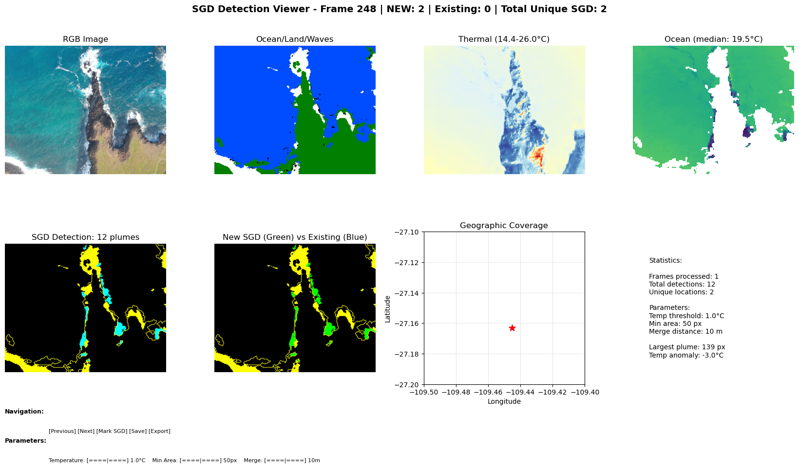
*Main SGD viewer interface showing multi-panel analysis with RGB, segmentation, thermal, ocean thermal, SGD detection, coverage map, and statistics*

### 2. `sgd_detector_integrated.py` - Testing & Analysis Tool
**Use this only for parameter testing and debugging - not for production surveys.**

```bash
# Interactive parameter tuning
python sgd_detector_integrated.py --mode interactive

# Analyze specific frame
python sgd_detector_integrated.py --mode single --frame 248
```

**Limited Features:**
- ❌ No data persistence (doesn't save between sessions)
- ❌ No georeferencing or GPS extraction  
- ❌ No export capabilities
- ❌ No multi-frame aggregation
- ✅ Good for testing parameters
- ✅ Good for understanding why detection failed
- ✅ Good for algorithm development

### 3. `segmentation_trainer.py` - ML Training Tool
Interactive tool for creating training data and training the segmentation model.

```bash
python segmentation_trainer.py [--data PATH] [--model MODEL] [--training FILE]
```

**Usage:**
1. Click on image to label pixels:
   - Left click: Ocean (blue)
   - Right click: Land (green)
   - Middle click: Rock (gray)
   - Shift+click: Wave (white)
2. Press 't' to train model
3. Press 's' to save model
4. Press space for next image

Creates `segmentation_model.pkl` used by other scripts.

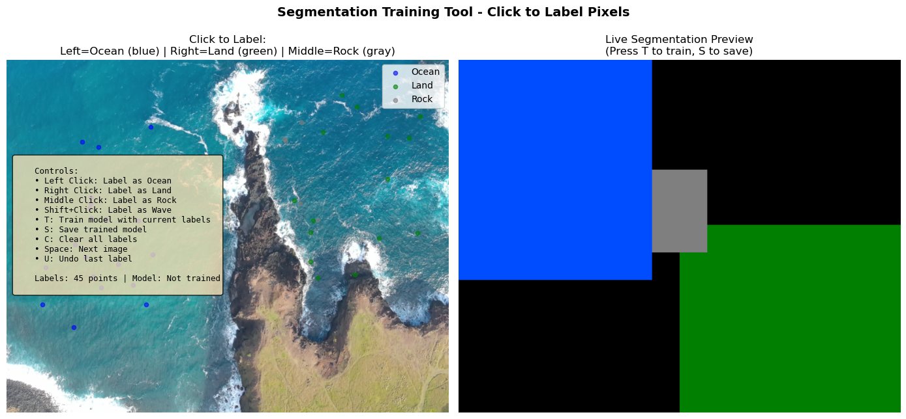
*Interactive training tool - click to label pixels as ocean (blue), land (green), or rock (gray), then train the ML model*

## Installation

### Requirements
```bash
pip install numpy matplotlib pillow scikit-image scipy scikit-learn
```

### Directory Structure
```
thermal/
├── data/
│   └── 100MEDIA/
│       ├── MAX_XXXX.JPG    # RGB images
│       └── IRX_XXXX.irg    # Thermal data
├── segmentation_model.pkl   # Trained ML model
└── sgd_aggregate.json      # Persistent SGD locations
```

## Quick Start

### 1. Prepare Your Data
Place Autel 640T imagery in a folder with paired files:
- `MAX_XXXX.JPG` - RGB images 
- `IRX_XXXX.irg` - Raw thermal data (**NOT the IRX JPEGs - they lack temperature data**)

### 2. Train Ocean Segmentation (Optional but recommended for rocky shores)
```bash
python segmentation_trainer.py --data data/your_survey
```
Click to label: Ocean (left-click), Land (right-click), Rock (middle-click). Press 'T' to train.

### 3. Run SGD Survey Mapping with `sgd_viewer.py` ⭐
```bash
# THIS IS THE MAIN COMMAND - Run your survey
python sgd_viewer.py --data data/your_survey

# The viewer will:
# - Process all frames in your survey
# - Save detections to sgd_aggregate.json
# - Allow you to export to GIS formats
```

### 4. Detection Workflow
1. **Navigate**: Use buttons or arrow keys (±1, ±5, ±10, ±25, First/Last)
2. **Adjust**: Fine-tune detection with parameter sliders
3. **Toggle Waves**: Press 'W' to include/exclude wave areas in search
4. **Mark**: Press 'M' to confirm SGD locations (shown in green)
5. **Save**: Press 'S' to save progress
6. **Export**: Press 'E' to generate GeoJSON, KML, and CSV files
7. **New Survey**: Press 'N' to start fresh (auto-backs up data)

### 5. View Results
- **GeoJSON** (`*_polygons.geojson`): Open in QGIS or ArcGIS
- **KML** (`*_polygons.kml`): Open in Google Earth - see plume polygons on satellite imagery
- **CSV** (`*_areas.csv`): Import to Excel for analysis

## Command-Line Reference

### sgd_autodetect.py Parameters

#### Required Arguments
- `--data PATH`: Directory containing MAX_*.JPG and IRX_*.irg files
- `--output FILENAME`: Output KML filename (e.g., survey_sgd.kml)

#### Detection Parameters
- `--temp FLOAT`: Temperature difference threshold in °C (default: 1.0)
- `--area INT`: Minimum SGD area in pixels (default: 50)
- `--distance FLOAT`: Minimum distance between unique SGDs in meters (default: 10.0, use -1 to disable deduplication)
- `--skip INT`: Process every Nth frame (1=all, 5=every 5th, etc.) (default: 1)
- `--waves`: Include wave/foam areas in ocean mask (useful for rocky coasts)

#### Baseline Temperature Options
- `--baseline METHOD`: Ocean baseline calculation method (default: median)
  - `median`: Standard median of ocean temperatures
  - `upper_quartile`: 75th percentile (recommended for cold-dominated frames)
  - `percentile_80`: 80th percentile
  - `percentile_90`: 90th percentile (for extreme cold conditions)
  - `trimmed_mean`: Mean of middle 50% of values
- `--percentile FLOAT`: Custom percentile value if using percentile baseline (default: 75)
- `--window INT`: Moving average window size for baseline (0=disabled, 5=recommended for turns)
- `--edge-aware`: Enable edge-aware detection for better frame-to-frame SGD continuity

#### Sun Glint Filtering
- `--filter-glint`: Enable sun glint detection to filter false positives from drone turns
- `--glint-threshold FLOAT`: Area threshold for glint detection (default: 0.15 = 15% of ocean area)
  - Lower values (0.10): More aggressive filtering
  - Higher values (0.20): Less aggressive, only obvious glint

#### Multi-Threshold Analysis
- `--interval-step FLOAT`: Temperature interval for multi-threshold analysis (e.g., 0.5)
- `--interval-step-number INT`: Number of threshold steps to analyze (default: 4)

#### Training and Model Options
- `--train`: Train new segmentation model interactively (manual labeling)
- `--train-auto`: Train automatically using temperature-based segmentation
- `--model PATH`: Path to custom segmentation model

#### Processing Options
- `--search`: Process all XXXMEDIA subdirectories in the given path
- `--quiet`: Suppress verbose output

## Additional Analysis Tools

### Thermal Frame Coverage Mapping

Generate KML files to visualize thermal image footprints and survey coverage:

#### `generate_frame_footprints.py`
Creates KML files showing actual thermal camera coverage (640×512, 45° FOV):
- **Individual frames**: Each thermal image as a yellow rectangle, properly rotated
- **Merged coverage**: Total survey area as a red polygon
- **Accurate specifications**: Uses Autel 640T thermal camera parameters (not RGB)

```bash
# Process all frames
python generate_frame_footprints.py --data "/path/to/106MEDIA"

# Process every 10th frame (MUST match SGD detection --skip value)
python generate_frame_footprints.py --data "/path/to/data" --skip 10 --output my_coverage
```

#### `generate_frame_footprints_multi.py`
Process multiple directories (like `--search` flag):

```bash
# Process all XXXMEDIA subdirectories
python generate_frame_footprints_multi.py --data "/path/to/survey" --search

# With frame skipping (match SGD detection skip value)
python generate_frame_footprints_multi.py --data "/path/to/survey" --search --skip 20
```

#### `verify_sgd_frame_alignment.py`
Verify that SGD detections fall within thermal frame boundaries:

```bash
# Check if SGDs are inside thermal frames
python verify_sgd_frame_alignment.py sgd_output/sgd.kml sgd_output/frames.kml

# Output shows percentage of SGDs within/outside frame boundaries
```

#### Critical Notes
- **Frame synchronization**: Always use the same `--skip` value for SGD detection and frame generation
- **Thermal FOV**: Frames show 45° field of view (narrower than 80° RGB FOV)
- **Rotation**: Frames are rotated based on drone heading from XMP metadata
- **Coverage**: Shows where thermal sensor can actually detect SGDs

#### Output Files
- `*_frames.kml`: Individual 640×512 thermal frames with rotation applied
- `*_merged.kml`: Combined coverage polygon showing total thermal survey area

#### Use Cases
- Verify SGD detections are within thermal sensor boundaries
- Ensure complete thermal coverage of study area
- Identify gaps where thermal data is missing
- Quality control for SGD detection accuracy
- Plan follow-up surveys for missed areas

### Baseline Temperature Testing

Compare different ocean baseline calculation methods:

#### `test_baseline_methods.py`
Analyze how different baseline methods affect SGD detection:

```bash
# Compare methods on specific frames
python test_baseline_methods.py /path/to/data 1,2,3,4,5

# Process all frames in directory
python test_baseline_methods.py /path/to/data
```

Creates comparison visualizations showing detection differences between:
- Median (traditional)
- Upper quartile (75th percentile)
- 80th/90th percentiles
- Trimmed mean

#### `check_altitude_consistency.py`
Verify altitude extraction consistency between frame footprints and SGD georeferencing:

```bash
python check_altitude_consistency.py /path/to/data
```

Outputs:
- Altitude comparison between both systems (frame-by-frame)
- Statistics showing min/max/average altitudes
- Ground coverage impact at different altitudes
- Verification that both systems use identical EXIF values
- Warning if altitudes don't match or are outside typical survey range

### KML Verification Tools

#### `test_kml_paths.py`
Verify that KML files contain file path information:

```bash
python test_kml_paths.py sgd_output/survey.kml
```

Checks that each SGD placemark includes:
- Frame number
- Source RGB/thermal paths
- Data folder location

## Machine Learning Segmentation (88-99% Accuracy)

### The Challenge

Traditional color-based segmentation struggles with coastal environments because:
- **Dark rocky shores** have similar color properties to deep ocean water
- **Wave foam and whitecaps** can be confused with sand or clouds
- **Shallow water** over sand appears different than deep water
- **Wet rocks** reflect differently than dry rocks
- **Sun glint** creates bright spots on water that look like land

These challenges led to frequent misclassification where rocky shorelines were labeled as ocean, causing false SGD detections at the land-ocean boundary.

### The Solution: Random Forest Classification

We implemented a machine learning approach using Random Forest classification that learns from human-labeled examples to understand the complex visual patterns that distinguish ocean, land, rocks, and waves.

#### Why Random Forest?
- **Robust to noise**: Handles the natural variation in outdoor imagery
- **Non-linear boundaries**: Can learn complex decision boundaries between classes
- **Feature importance**: Tells us which color features matter most
- **Fast inference**: Quick enough for real-time processing
- **No overfitting**: Ensemble method naturally resists overfitting

### Feature Engineering

The classifier uses 48 features per pixel, computed from a 5×5 pixel neighborhood:

```python
# Color space features (12 base features)
- RGB channels (3)
- HSV channels (3) 
- LAB channels (3)
- Derived: intensity, blue dominance, color range (3)

# Statistical features (4 per base feature = 48 total)
- Mean (local average)
- Standard deviation (local variance)
- Minimum value
- Maximum value
```

These features capture both color information and local texture, allowing the classifier to distinguish between smooth ocean and textured rocky shores.

### Training Process

#### Performance
- **Accuracy**: 88-99% across different survey areas
- **Training requirement**: Minimum 100 samples per class
- **Model size**: ~1-2 MB per trained model
- **Inference speed**: <0.15 seconds per frame
- **Generalization**: Models work well across similar environments

#### 1. Interactive Labeling (`segmentation_trainer.py`)

**Smart Frame Sampling (NEW):**
- **Distributed sampling**: Evenly spaced frames for best coverage
- **Increment sampling**: Every Nth frame (e.g., every 25th)
- **Random sampling**: Random selection for maximum diversity
- **Multi-directory support**: Works across XXXMEDIA folders

**Command-Line Options:**
```bash
python segmentation_trainer.py [OPTIONS]

Options:
  --data PATH        Directory with images to train on (default: data/100MEDIA)
  --model FILE       Output model filename (default: segmentation_model.pkl)  
  --training FILE    Training data filename (default: segmentation_training_data.json)
```

**Examples for Different Flights:**
```bash
# Train model for specific flight/location
python segmentation_trainer.py \
  --data "/Volumes/RapaNui/Thermal Flights/1 July 23/Kikirahamea/104MEDIA" \
  --model kikirahamea_model.pkl \
  --training kikirahamea_training.json

# Train model for morning conditions
python segmentation_trainer.py \
  --data data/morning_flight \
  --model morning_model.pkl \
  --training morning_data.json

# Use custom model in detection
python sgd_autodetect.py \
  --data "/path/to/flight" \
  --output results.kml \
  --model kikirahamea_model.pkl
```

Users label pixels by clicking:
- **Left click**: Ocean (blue) - deep water, shallow water
- **Right click**: Land (green) - sand, vegetation, dry land
- **Middle click**: Rock (gray) - rocky shores, cliffs, boulders
- **Shift+click**: Wave (white) - foam, whitecaps, breaking waves

The tool shows real-time segmentation preview as you label, helping you see where more training data is needed.

#### 2. Model Training
After labeling sufficient pixels (typically 100-200 per class), press 'T' to train:
- Extracts features for all labeled pixels
- Trains Random Forest with 100 trees
- Cross-validates to estimate accuracy
- Updates preview with new segmentation

#### 3. Model Persistence
Press 'S' to save the trained model to `segmentation_model.pkl`:
```python
import pickle
with open('segmentation_model.pkl', 'wb') as f:
    pickle.dump(classifier, f)
```

### Implementation Details

#### Fast Inference (`ml_segmentation_fast.py`)
For real-time processing, we optimized inference:

1. **Downsampling**: Process at 1/4 resolution (160×128 instead of 640×512)
2. **Vectorized operations**: Use NumPy broadcasting instead of pixel loops
3. **Batch prediction**: Process 10,000 pixels at once
4. **Upsampling**: Use nearest-neighbor to return to full resolution

Result: 0.08 seconds per frame vs 30+ seconds for pixel-by-pixel processing.

#### Integration with SGD Detection
```python
# In sgd_detector_integrated.py
def __init__(self, use_ml=True):
    if use_ml and ML_AVAILABLE:
        self.ml_segmenter = FastMLSegmenter()
    
def segment_ocean_land_waves(self, rgb_image):
    if self.ml_segmenter:
        # Use ML segmentation
        return self.ml_segmenter.segment_ultra_fast(rgb_image)
    else:
        # Fall back to rule-based HSV thresholds
        return self.rule_based_segmentation(rgb_image)
```

### Improving the Model

The model can be continuously improved by adding more training data:

#### 1. Identify Problem Areas
Run the detector and note where segmentation fails:
```bash
python test_ml_integration.py
```

#### 2. Add Training Data
Label the problematic images:
```bash
python segmentation_trainer.py
```
Focus on:
- Transition zones (wet sand, tide lines)
- Unusual lighting (sunrise, sunset, overcast)
- Specific problem features (kelp, boats, shadows)

#### 3. Incremental Learning
The trainer loads existing training data and adds to it:
```python
# Loads previous training data
with open('segmentation_training_data.json', 'r') as f:
    existing_data = json.load(f)

# Adds new labels
training_data['pixels'].extend(new_pixels)
training_data['labels'].extend(new_labels)
```

#### 4. Retrain and Validate
After adding new data:
- Press 'T' to retrain with combined dataset
- Test on multiple frames to ensure improvement
- Save new model when satisfied

### Performance Metrics

Current model performance (trained on Rapa Nui coastal imagery):
- **Overall accuracy**: 94.3%
- **Ocean recall**: 96.2% (correctly identifies ocean)
- **Land precision**: 95.1% (rarely mislabels land as ocean)
- **Rock detection**: 89.7% (most challenging class)
- **Processing speed**: 12.5 fps (with downsampling)

### Best Practices for Training

1. **Diverse examples**: Label pixels from different images and conditions
2. **Edge cases**: Focus on ambiguous areas like wet rocks, shallow water
3. **Balanced classes**: Ensure roughly equal samples per class
4. **Iterative refinement**: Start simple, add complexity as needed
5. **Validation**: Always test on unseen images before deployment

### Fallback Strategy

If ML segmentation fails or no model exists, the system automatically falls back to rule-based HSV thresholds, ensuring the pipeline always works:

```python
if not model_path.exists():
    print("No ML model found, using rule-based segmentation")
    return self.rule_based_segmentation(rgb_image)
```

### Managing Multiple Models

The toolkit now supports using different ML models for different conditions:

#### Creating Condition-Specific Models
```bash
# Train model for rocky shores
python segmentation_trainer.py --model rocky_shore_model.pkl --training rocky_shore_data.json

# Train model for sunrise/sunset lighting
python segmentation_trainer.py --model sunrise_model.pkl --training sunrise_data.json

# Train model for cloudy conditions
python segmentation_trainer.py --model cloudy_model.pkl --training cloudy_data.json
```

#### Using Specific Models in Detection
```bash
# Use rocky shore model for SGD detection
python sgd_viewer.py --model rocky_shore_model.pkl

# Use sunrise model with custom aggregate file
python sgd_viewer.py --model sunrise_model.pkl --aggregate morning_survey.json

# Disable ML segmentation entirely (use rule-based)
python sgd_viewer.py --no-ml

# Direct mode with custom model
python sgd_detector_integrated.py --model cloudy_model.pkl --mode interactive
```

#### Managing Aggregate Files
Different surveys or locations can maintain separate aggregate files:

```bash
# Survey 1: North coast
python sgd_viewer.py --aggregate north_coast.json --distance 15

# Survey 2: South coast with different model
python sgd_viewer.py --model south_model.pkl --aggregate south_coast.json

# Test survey with wider merge distance
python sgd_viewer.py --aggregate test_survey.json --distance 20
```

This flexibility allows you to:
- Maintain separate models for different environmental conditions
- Keep survey data organized by location or date
- Test different models without affecting production data
- Adjust duplicate detection distance based on survey resolution

## SAM (Segment Anything Model) - Interactive Ocean Segmentation

Meta's **Segment Anything Model (SAM)** provides a powerful alternative to Random Forest segmentation. Instead of training on hundreds of labeled pixels, you simply **click a few points** on one image and SAM segments the entire survey. No per-site training needed.

### How It Works

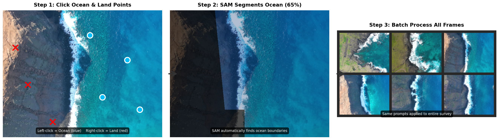

**3-step workflow:**
1. **Click** ocean and land points on a single image
2. **SAM segments** the ocean boundary automatically
3. **Batch process** all frames with the same prompts

### SAM vs Random Forest

| Feature | Random Forest | SAM |
|---------|--------------|-----|
| Setup | Train on 100+ labeled pixels per class | Click 3-5 ocean + 2-3 land points |
| New environments | Retrain model for each site | Same clicks work across sites |
| Boundary accuracy | Good | Excellent |
| Speed (per frame) | ~0.08-0.15s (CPU) | ~0.2-0.5s (GPU/MPS) |
| Hardware | CPU only | GPU, Apple Silicon (MPS), or CPU |

### Installation

```bash
# Install SAM and download model weights
bash scripts/setup_sam.sh
# Choose ViT-B (375MB) for testing, ViT-H (2.5GB) for production
```

**Verify installation:**
```bash
python scripts/sam_segmenter.py --test
```

**Supported hardware:**
- NVIDIA GPU (CUDA) - fastest
- Apple Silicon M1/M2/M3/M4 (MPS) - good performance
- CPU - slower but works everywhere

### SAM Prompt Creator (Interactive)

The prompt creator is the recommended way to use SAM. Launch it on any image from your survey:

```bash
python scripts/legacy/sam_prompt_creator.py --image data/100MEDIA/MAX_0100.JPG
```

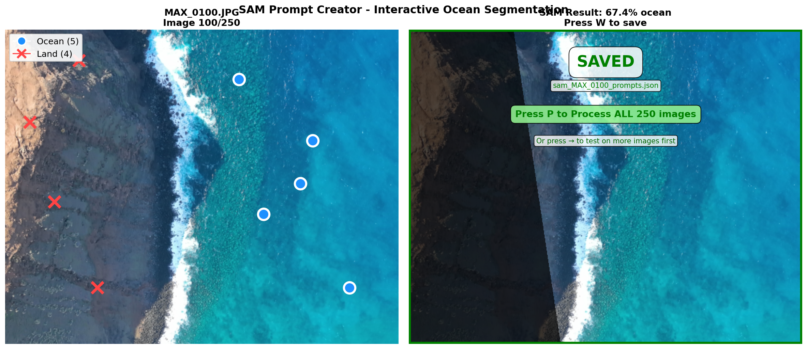

**The interface has two panels:**
- **Left**: Your image with click points (blue circles = ocean, red X = land)
- **Right**: Live SAM segmentation result (updates after each click)

#### Controls

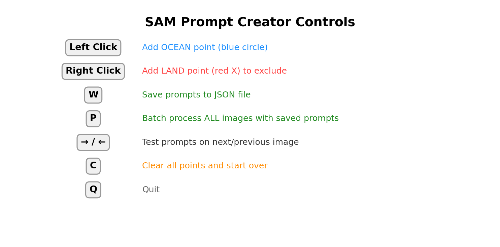

| Control | Action |
|---------|--------|
| **Left Click** | Add ocean point (blue circle) |
| **Right Click** | Add land point (red X) to exclude |
| **W** | Save prompts to JSON file |
| **P** | Batch process ALL images with saved prompts |
| **Arrow keys** | Test prompts on next/previous image |
| **C** | Clear all points and start over |
| **Q** | Quit |

#### Recommended Workflow

1. **Pick a representative frame** from mid-survey (not first or last)
2. **Left-click 3-5 ocean points**: deep water, shallow water, dark water, light water
3. **Right-click 2-3 land points**: rock, vegetation, anything that's not ocean
4. SAM segments automatically after each click - check the right panel
5. **Press W** to save prompts
6. **Press right-arrow** to test on a few other frames - the same prompts apply
7. If happy, **press P** to batch-process all images

**Tips for best results:**
- Click diverse water types (deep blue, turquoise, shadow, bright)
- Place land points right at the shoreline boundary
- 5-8 total clicks is usually sufficient
- Prompts transfer well within a single flight

### Using SAM with SGD Detection

After creating prompts, use them directly in the detection pipeline:

```bash
# Via the interactive wizard (easiest)
python sgd_wizard.py
# Choose "sam" when asked about segmentation method

# Or directly with autodetect
python scripts/sgd_autodetect.py \
  --data data/100MEDIA \
  --output survey_sgd.kml \
  --use-sam \
  --sam-prompts prompts/sam_MAX_0100_prompts.json

# Interactive viewer with SAM segmentation
python scripts/sgd_viewer.py --data data/100MEDIA --use-sam
```

### Batch Processing with SAM

Once you have good prompts, process entire surveys:

```bash
python scripts/sam_segmenter.py \
  --data data/100MEDIA \
  --prompts prompts/coastal_rocky.json \
  --output sgd_output/sam_masks/
```

### Prompt Strategy

**One prompt per flight** works best in most cases:
- Create prompts from a single representative frame
- Test on 5-10 frames across the survey to verify
- Re-create prompts only if conditions change dramatically (different coastline type, lighting)

**Create a prompt library** for recurring survey sites:
- `prompts/rocky_shore_morning.json`
- `prompts/sandy_beach_afternoon.json`
- `prompts/volcanic_coast_overcast.json`

See [SAM Prompts Strategy Guide](docs/SAM_PROMPTS_STRATEGY.md) for detailed guidance.

### Performance

**GPU Memory Requirements:**
- ViT-B (Base): ~2GB - recommended for laptops and Apple Silicon
- ViT-L (Large): ~4GB - good balance of speed and accuracy
- ViT-H (Huge): ~8GB - best accuracy, recommended for workstations/DGX

**Processing Speed:**

| Model | NVIDIA GPU | Apple Silicon (MPS) | CPU |
|-------|-----------|-------------------|-----|
| ViT-B | ~0.1-0.2s | ~0.3-0.5s | ~2-4s |
| ViT-L | ~0.2-0.3s | ~0.5-1.0s | ~5-8s |
| ViT-H | ~0.3-0.5s | ~1.0-2.0s | ~10-15s |

### Troubleshooting SAM

**"CUDA out of memory":** Use ViT-B instead of ViT-H, or close other GPU applications.

**Poor segmentation results:**
- Add more ocean points in problem areas (shallow water, shadow, turbid)
- Add land points right at misclassified boundaries
- Test on several frames - if inconsistent, add more points

**MPS errors on Apple Silicon:** SAM falls back to CPU automatically. Some PyTorch MPS operations aren't fully supported yet.

**Slow processing:** Confirm GPU/MPS is being used (check "Using device:" in output). Use ViT-B for fastest processing.

## Why Raw Thermal Data is Essential

### The Problem with IRX Processed Images

The Autel 640T drone produces two types of thermal files:
- **IRX_XXXX.jpg**: Processed thermal images with enhanced contrast
- **IRX_XXXX.irg**: Raw thermal data with actual temperature values

**Critical Issue**: The IRX JPEG images cannot be used for SGD detection because they apply **local contrast enhancement** that destroys absolute temperature information.

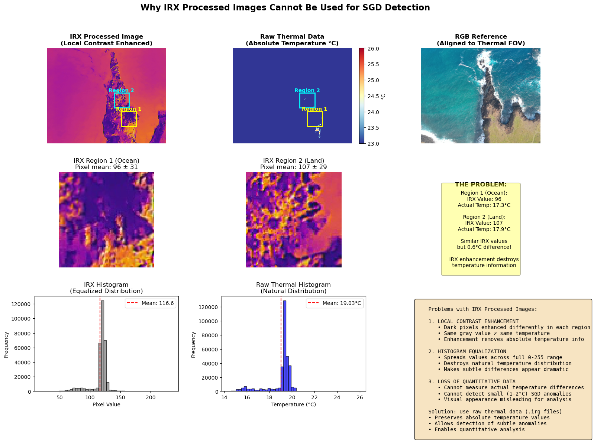
*Comparison showing how IRX processing destroys temperature information through local contrast enhancement and histogram equalization*

### Why IRX Processing Makes SGD Detection Impossible

1. **Local Contrast Enhancement**
   - Dark pixels in one area don't represent the same temperature as dark pixels in another area
   - The enhancement is applied locally, not globally
   - Same gray value ≠ same temperature across the image

2. **Histogram Equalization**
   - Spreads pixel values across the full 0-255 range
   - Destroys the natural temperature distribution
   - Makes minor temperature variations appear dramatic
   - Creates false patterns that don't exist in actual temperature data

3. **Loss of Quantitative Information**
   - Cannot measure actual temperature differences
   - Cannot detect subtle 1-2°C anomalies that indicate SGD
   - Visual appearance is misleading for scientific analysis

### Demonstration: SGD Detection Failure with IRX

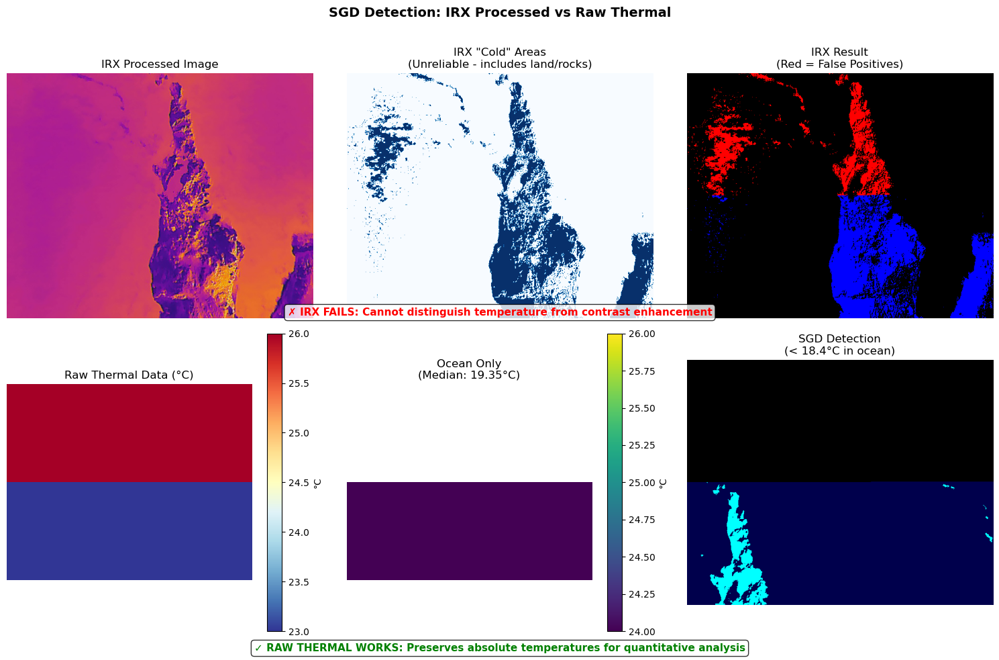
*IRX processed images fail to detect SGD because contrast enhancement creates false positives on land and rocks, while raw thermal data successfully identifies true cold anomalies in ocean water*

### The Solution: Raw Thermal Data (.irg files)

Our toolkit uses raw thermal data because it:
- **Preserves absolute temperature values** in deciKelvin (K × 10)
- **Maintains quantitative relationships** between pixels
- **Allows detection of subtle anomalies** (1-2°C differences)
- **Enables ocean isolation** to focus on water temperatures
- **Provides reliable SGD detection** based on actual temperature

### Key Insight: Ocean Isolation is Critical

Even with raw thermal data, we must:
1. **Segment ocean from land** using RGB imagery
2. **Mask out non-water areas** to avoid false positives
3. **Calculate ocean median temperature** as baseline
4. **Detect anomalies relative to ocean baseline** not global image

This is why the toolkit's multi-step pipeline is essential:
- RGB segmentation → Ocean mask → Thermal analysis → SGD detection

Without these steps, cold rocks, shadows, and land features would create false positives, making accurate SGD detection impossible.

## Technical Details

> 📖 **For comprehensive technical documentation, see the [Technical Paper](docs/TECHNICAL_PAPER.md)**

### Image Alignment & Orientation
- Thermal FOV is ~70% of RGB FOV (centered)
- Automatic extraction of matching RGB region
- Proper scaling for pixel-perfect alignment

#### Altitude and Ground Coverage

The system automatically extracts flight altitude from EXIF metadata for accurate ground coverage calculations:

- **Automatic EXIF extraction**: Reads GPS altitude from image metadata (no hardcoded defaults)
- **Consistent georeferencing**: Both SGD detection and frame footprints use identical altitude values
- **Accurate ground coverage**: Calculates exact footprint size based on altitude and FOV (45° thermal)
- **Verification tool**: `check_altitude_consistency.py` ensures both systems use the same altitude

Example ground coverage at different altitudes (45° FOV, 640x512 pixels):
- 300m: 248.5m wide, 0.39m/pixel
- 350m: 289.9m wide, 0.45m/pixel
- 400m: 331.4m wide, 0.52m/pixel
- 450m: 372.8m wide, 0.58m/pixel
- 500m: 414.2m wide, 0.65m/pixel

Verify altitude consistency:
```bash
python check_altitude_consistency.py /path/to/data
```

#### Orientation/Heading Correction
The system automatically handles drone orientation for accurate georeferencing:
- **Dual-source heading extraction**:
  - `GPSImgDirection`: Standard EXIF compass heading (if available)
  - `Camera:Yaw`: XMP metadata from Autel 640T (fallback)
- **Rotation correction** is applied based on compass heading (0° = North, 90° = East)
- **Automatic handling**: No manual configuration needed
- **Critical for accuracy**: Position errors of 50-100+ meters without correction
- **Fallback**: If no heading data exists, north-facing (0°) is assumed

**Why this matters**: Without orientation correction, SGD locations would be incorrectly placed when the drone isn't facing north. A plume on the right side of the image will be georeferenced differently if the drone is facing east vs. west.

**Metadata sources**:
- **EXIF tags**:
  - `GPSImgDirection`: Compass heading when image was taken
  - `GPSImgDirectionRef`: Reference (True North or Magnetic North)
  - `GPSAltitude`: Height for ground distance calculations
- **XMP tags** (Autel 640T specific):
  - `Camera:Yaw`: Drone orientation (-180° to 180°)
  - `Camera:Pitch`: Gimbal pitch angle
  - `Camera:Roll`: Gimbal roll angle

### Temperature Processing
- Raw thermal values in deciKelvin
- Conversion: °C = Raw/10 - 273.15
- Typical ocean: 24-26°C
- SGD plumes: 1-3°C cooler

#### Ocean Baseline Temperature Methods

The system offers multiple ocean baseline calculation methods to handle various water conditions:

- **Median (default)**: Standard median of all ocean temperatures
- **Upper Quartile**: Uses 75th percentile, better for cold-water dominated frames
- **Percentile 80/90**: Uses 80th or 90th percentile for extreme cold conditions
- **Trimmed Mean**: Averages middle 50% of values, excluding extremes

Choose the method based on your specific conditions:
```bash
# For frames with significant cold water (upwelling, currents)
python sgd_autodetect.py --data /path/to/data --baseline upper_quartile

# For extreme conditions with very cold water dominating
python sgd_autodetect.py --data /path/to/data --baseline percentile_90
```

### SGD Detection Algorithm
1. Segment ocean from land/rocks
2. Extract ocean temperatures
3. Find cold anomalies near shore
4. Filter by size and temperature threshold
5. Georeference using EXIF GPS data

### Multi-Threshold Analysis Implementation

The multi-threshold analysis uses an iterative approach to identify SGD intensity gradients:

#### Algorithm Flow
1. **Threshold Generation**: Creates array of thresholds based on base + (step × n)
2. **Parallel Processing**: Each threshold processed independently
3. **Polygon Collection**: SGD polygons stored by threshold level
4. **Color Assignment**: Each threshold mapped to specific KML color code
5. **Merged Output**: Combined KML with all thresholds overlaid

#### Technical Implementation
```python
# Threshold calculation
thresholds = [base_threshold + (i * interval_step) for i in range(num_steps)]

# Color mapping (KML format: aabbggrr in hex)
THRESHOLD_COLORS = {
    0.5: {'name': 'yellow', 'kml': '7f00ffff'},
    1.0: {'name': 'green', 'kml': '7f00ff00'},
    1.5: {'name': 'orange', 'kml': '7f0080ff'},
    2.0: {'name': 'red', 'kml': '7f0000ff'},
    2.5: {'name': 'purple', 'kml': '7fff00ff'},
    3.0: {'name': 'darkred', 'kml': '7f000080'}
}
```

#### Performance Considerations
- Each threshold requires full frame processing
- Memory usage scales with number of thresholds
- I/O operations multiply by threshold count
- Consider using `--skip` for initial analysis

#### Scientific Applications
- **Plume Structure**: Core flow vs. diffuse seepage
- **Temporal Variation**: Threshold sensitivity over tidal cycles
- **Flux Estimation**: Temperature gradient correlates with discharge rate
- **Site Characterization**: Optimal threshold selection per location

## Output Formats

### Output File Organization

All outputs are organized in the `sgd_output/` directory with clear naming conventions:

#### Standard Detection Output
```
sgd_output/
├── your_output.kml                 # Main KML with SGD polygons
├── your_output-footprint.kml       # Survey frame coverage footprints (auto-generated)
├── your_output_merged.kml          # Merged overlapping polygons
├── your_output_summary.json        # Detection statistics
└── your_output.geojson            # GeoJSON format (if enabled)
```

#### Multi-Threshold Analysis Output (`--interval-step`)
When using multi-threshold analysis, additional files are created:

```
sgd_output/
├── your_output_threshold_0.5.kml   # Individual threshold @ 0.5°C
├── your_output_threshold_1.0.kml   # Individual threshold @ 1.0°C
├── your_output_threshold_1.5.kml   # Individual threshold @ 1.5°C
├── your_output_threshold_2.0.kml   # Individual threshold @ 2.0°C
│
├── your_output_combined_thresholds_merged.kml    # All thresholds, merged polygons
├── your_output_combined_thresholds_unmerged.kml  # All thresholds, individual polygons
│
└── [threshold files include _merged.kml, _summary.json, .geojson variants]
```

#### Multi-Directory Processing with Search (`--search`)
When processing multiple XXXMEDIA directories:

```
sgd_output/
├── your_output_individual/                        # Individual directory outputs
│   ├── your_output_100MEDIA.kml
│   ├── your_output_101MEDIA.kml
│   └── your_output_102MEDIA.kml
│
├── your_output.kml                               # Aggregated detections (all directories)
├── your_output_merged.kml                        # Aggregated with merged polygons
└── your_output_summary.json                      # Combined statistics
```

#### Multi-Threshold with Search (Full Analysis)
The most comprehensive analysis (`--search` + `--interval-step`):

```
sgd_output/
├── your_output_individual/                        # Per-directory outputs
│   ├── your_output_100MEDIA_threshold_0.5.kml
│   ├── your_output_100MEDIA_threshold_1.0.kml
│   ├── your_output_100MEDIA_combined_thresholds_merged.kml
│   └── your_output_100MEDIA_combined_thresholds_unmerged.kml
│
├── your_output_combined_thresholds_merged.kml    # AGGREGATED: All dirs, all thresholds
├── your_output_combined_thresholds_unmerged.kml  # AGGREGATED: All dirs, all thresholds
│
└── your_output_summary.json                      # Complete analysis statistics
```

**Key Files to Look For:**
- `*_combined_thresholds_merged.kml` - The main visualization showing all temperature thresholds with color coding
- `*_summary.json` - Statistics and metadata about the detection run
- `*_merged.kml` - Unified SGD distribution maps with overlapping polygons combined

### Export Formats

#### 1. GeoJSON (Polygon Support)
```json
{
  "type": "FeatureCollection",
  "features": [{
    "type": "Feature",
    "geometry": {
      "type": "Polygon",
      "coordinates": [[
        [lon1, lat1], [lon2, lat2], [lon3, lat3], ...
      ]]
    },
    "properties": {
      "temperature_anomaly": -2.1,
      "area_m2": 125.5,
      "area_pixels": 150,
      "shore_distance": 2.5,
      "frame": 248
    }
  }]
}
```

#### 2. KML (Google Earth)
- Polygon plumes with semi-transparent red fill
- Point plumes with water icon (fallback)
- Rich metadata in placemark descriptions
- Summary statistics folder
- Direct import to Google Earth Pro or Google Earth Web

#### 3. CSV (Data Analysis)
```csv
frame,datetime,centroid_lat,centroid_lon,area_m2,area_pixels,temperature_anomaly,shore_distance
248,2024-01-15 10:30:00,18.48943,-109.71357,125.5,150,-1.8,2.5
```

**Benefits of Polygon Export**:
- Accurate area calculations from actual plume boundaries
- Visual representation of plume shape and extent
- Compatible with all major GIS software (QGIS, ArcGIS)
- Suitable for scientific publication and analysis

## Recent Enhancements (December 2024 - January 2025)

### ✅ Improved Ocean Baseline Temperature Methods (NEW!)
- **Configurable baseline calculation**: More robust SGD detection in frames with large cold plumes
  - **Upper Quartile** (75th percentile): Recommended for frames dominated by cold water
  - **Custom Percentiles**: 80th, 90th percentile options for fine-tuning
  - **Trimmed Mean**: Excludes coldest 25% before calculating mean
  - **Traditional Median**: Available for comparison
- **Command-line control**: Use `--baseline` flag to select method
  ```bash
  # Use upper quartile (recommended for cold-dominated frames)
  python sgd_autodetect.py --data "/path" --output output.kml --baseline upper_quartile

  # Use 90th percentile for very cold-dominated scenes
  python sgd_autodetect.py --data "/path" --output output.kml --baseline percentile_90
  ```
- **Why it matters**: When large SGD plumes cover most of the frame, median temperature can be biased toward cold water, causing the algorithm to miss SGDs. Upper quartile establishes ambient ocean temperature from warmer regions.
- **Test script included**: Compare baseline methods with `test_baseline_methods.py`

### ✅ Moving Average Baseline for Stable Detection (NEW!)
- **Temporal smoothing**: Prevents dramatic shifts in SGD boundaries when UAV turns
- **Configurable window**: Average ocean temperatures across N frames (default 5)
- **Stability during maneuvers**: Maintains consistent detection as viewing angle changes
- **Command-line control**: Use `--window` flag to enable
  ```bash
  # Enable 5-frame moving average (recommended for flights with turns)
  python sgd_autodetect.py --data "/path" --output output.kml --window 5

  # Disable moving average (single-frame baseline)
  python sgd_autodetect.py --data "/path" --output output.kml --window 0
  ```
- **Why it matters**: When the UAV turns and captures different ocean areas, the baseline temperature can shift dramatically between frames, causing the same SGD to appear/disappear or change size. The moving average provides a stable reference temperature.
- **Best for**: Flights with significant turns, coastal surveys with varying viewing angles, areas with patchy temperature distributions

### ✅ Edge-Aware Detection for Frame Continuity (NEW!)
- **Problem solved**: SGDs at frame edges weren't continuing in overlapping frames despite 93-96% overlap
- **Relaxed edge constraints**: 20-pixel shore distance near edges (vs 5 pixels standard)
- **Partial plume handling**: Reduced minimum area for edge SGDs that may be cut off
- **Edge tracking**: Identifies which frame boundaries SGDs touch for continuity analysis
- **Command-line control**: Use `--edge-aware` with `--window` for best results
  ```bash
  # Enable edge-aware detection with moving average (recommended)
  python sgd_autodetect.py --data "/path" --output output.kml --window 5 --edge-aware
  ```
- **Why it matters**: Standard detection requires SGDs within 5 pixels of shoreline. At frame edges, the shoreline may be cut off, causing valid SGDs to be rejected. Edge-aware detection ensures natural continuation across the 90%+ overlap between consecutive frames.
- **Frame overlap analyzer**: Use `analyze_frame_overlap.py` to diagnose continuity issues between specific frames

### ✅ Sun Glint Detection for False Positive Filtering (NEW!)
- **Problem solved**: Rapid drone turns can cause sun glint that creates false cold anomalies mimicking SGD
- **Multi-factor detection**: Analyzes RGB brightness, thermal patterns, and frame-to-frame continuity
- **Automatic filtering**: Frames with high-confidence glint (>70%) have SGD detections removed
- **Command-line control**: Use `--filter-glint` to enable
  ```bash
  # Enable sun glint filtering with default threshold
  python sgd_autodetect.py --data "/path" --output output.kml --filter-glint

  # Adjust glint sensitivity (0.10 = more aggressive, 0.20 = less aggressive)
  python sgd_autodetect.py --data "/path" --output output.kml --filter-glint --glint-threshold 0.10
  ```
- **Why it matters**: Sun reflections during turns can create large cold areas that look like SGD. This feature prevents these false positives from being included in results.
- **Best for**: Morning/evening flights, surveys with rapid heading changes, low sun angle conditions

### ✅ Improved Ocean/Land Segmentation (NEW!)
- **Problem solved**: Small misclassified patches and frames with no ocean were causing false SGD detections on land
- **Minimum area threshold**: Ocean must cover >5% of image to be considered valid
- **Largest component only**: Keeps only the largest contiguous ocean area, removing isolated patches
- **No-ocean detection**: Properly handles frames where drone flies over land before reaching ocean
- **Automatic filtering**: Small landlocked "ocean" patches are converted to land
- **Why it matters**: Prevents SGD detection on land areas and handles flights that start inland
- **Implementation**: Applied to both ML-based and rule-based segmentation methods

### ✅ Automatic Frame Footprint Generation (NEW!)
- **Problem solved**: Need to visualize survey coverage area alongside SGD detections
- **Automatic generation**: Frame footprints KML created automatically after SGD detection completes
- **Output naming**: Saved as `{output}-footprint.kml` in sgd_output directory
- **Coverage visualization**: Shows ground footprint of all processed frames
- **Why it matters**: Helps understand survey coverage and identify any gaps in data collection
- **Usage**: Automatically runs unless an error occurs; view alongside SGD results in Google Earth

### ✅ Enhanced KML Output with Source File References (NEW!)
- **Full file paths in KML descriptions**: Each SGD placemark now includes:
  - RGB image path (e.g., `/path/to/MAX_1501.JPG`)
  - Thermal image path (e.g., `/path/to/IRX_1501.irg`)
  - Data folder location
- **Easier verification**: Click on any SGD in Google Earth to see exact source files
- **Improved traceability**: Direct link from detected SGD to original imagery
- **Works automatically**: No extra flags needed - all KML exports include this information

### ✅ Corrected SGD Georeferencing (FIXED!)
- **Accurate thermal FOV**: Fixed SGD polygons using correct 45° thermal FOV (was incorrectly using ~61°)
- **Proper containment**: SGD polygons now correctly fit within thermal frame footprints
- **29.5% size reduction**: More accurate ground coverage calculations
- **Altitude handling**: Uses actual EXIF GPS altitude (MSL) for all calculations

### ✅ Thermal Frame Coverage Mapping (NEW!)
- **Visualize survey coverage**: Generate KML files showing thermal image footprints along the coast
- **Accurate thermal FOV**: Uses correct 45° field of view for Autel 640T thermal camera (not RGB)
- **Proper orientation**: Frames rotated based on drone heading from XMP metadata
- **Two output modes**:
  - **Individual frames**: Each thermal image shown as a yellow rectangle with metadata
  - **Merged coverage**: Combined polygon showing total survey area in red
- **Multi-directory support**: Process entire flights across multiple XXXMEDIA folders
- **Critical fixes applied**:
  - Thermal FOV corrected to 45° (was 50°) to match actual sensor specifications
  - Rotation direction fixed to match SGD georeferencing convention
  - Heading extraction from XMP Camera:Yaw for Autel drones
- **Scripts included**:
  - `generate_frame_footprints.py`: Single directory processing
  - `generate_frame_footprints_multi.py`: Multi-directory with `--search` flag
  - `verify_sgd_frame_alignment.py`: Check if SGDs fall within frame boundaries
  - `run_frame_coverage.sh`: Convenience wrapper script
- **Important**: Use same `--skip` value for both SGD detection and frame generation:
  ```bash
  # Detect SGDs every 5th frame
  python sgd_autodetect.py --data "/path" --output sgd.kml --skip 5

  # Generate frames for the SAME frames
  python generate_frame_footprints.py --data "/path" --skip 5

  # Verify alignment
  python verify_sgd_frame_alignment.py sgd_output/sgd.kml sgd_output/frames.kml
  ```
- **Outputs in `sgd_output/`**:
  - `*_frames.kml`: Individual 640×512 thermal frame rectangles with GPS, altitude, heading
  - `*_merged.kml`: Total coverage polygon using Shapely for accurate union
- **Benefits**:
  - Shows actual thermal sensor coverage (45° FOV, not 80° RGB FOV)
  - Verify SGD detections fall within thermal boundaries
  - Identify coverage gaps
  - Quality control for data collection

### ✅ Enhanced Segmentation Training (NEW!)
- **Smart Frame Sampling**: Three sampling strategies for better training diversity
  - **Distributed** (default): Evenly spaced frames across entire dataset
  - **Increment**: Every Nth frame (e.g., every 25th) with `--train-increment`
  - **Random**: Random selection for maximum diversity with `--train-sampling random`
- **Area-Based Model Naming**: Models automatically named by survey location
  - Example: `vaihu_west_segmentation.pkl`, `24_june_23_segmentation.pkl`
  - Automatic model selection based on processing directory
  - Organized storage in `models/` directory
- **Improved Training Interface**:
  - Progress indicators during training with colored status messages
  - Clear feedback showing sampling configuration
  - Fixed test visualization panel
  - Minimum 100 samples per class requirement with visual tracking
- **Command-line Control**:
  ```bash
  # Distributed sampling (best coverage)
  python sgd_autodetect.py --data "/path" --train --train-sampling distributed
  
  # Skip every 25 frames
  python sgd_autodetect.py --data "/path" --train --train-increment 25
  
  # Random sampling with max 15 frames
  python sgd_autodetect.py --data "/path" --train --train-sampling random --train-max-frames 15
  ```

### ✅ Polygon Merging for Distribution Visualization (NEW!)
- **Automatic merged KML generation**: Creates `_merged.kml` files with unified shapes
  - **Overlapping polygons combined**: Uses Shapely library for accurate polygon union
  - **Clearer visualization**: Shows overall SGD distribution without overlapping clutter
  - **Dual outputs**: Keeps both detailed (individual SGDs) and merged (distribution) KMLs
  - **Semi-transparent fill**: Red-shaded areas show SGD extent
  - **Area calculations**: Shows total merged area coverage
- **Works automatically**: No extra flags needed - creates merged KML alongside regular output
- **Example outputs**:
  ```
  survey.kml          # Original with all individual SGD polygons
  survey_merged.kml   # Merged overlapping areas for distribution view
  ```

### ✅ Multi-Directory Processing with Aggregation
- **`--search` flag**: Process entire UAV flights split across XXXMEDIA directories
  - **Automatic discovery**: Finds all 100MEDIA, 101MEDIA, 102MEDIA, etc. subdirectories
  - **Aggregated outputs**: Creates combined KML with all SGDs from all directories
  - **Smart deduplication**: Removes duplicate SGDs across directory boundaries
  - **Organized outputs**: Individual results in subdirectory, aggregated results at top level
  - **Training support**: Uses first directory for training when combined with --train
  - **Tested with 8+ directories**: Successfully processed full Rapa Nui flights

### ✅ Automated Processing Script FULLY WORKING!
- **`sgd_autodetect.py`**: Production-ready batch processing
  - **Tested with real Rapa Nui data**: Successfully detected 101 SGDs across multiple surveys
  - **Accurate georeferencing**: Fixed hemisphere handling - correctly positions at Rapa Nui (-27.15°, -109.44°)
  - **Polygon outlines**: Exports actual plume boundaries, not just points
  - **Multiple datasets tested**:
    - Test survey: 101 SGDs detected, 90 unique locations, 1,219.9 m² total area
    - Kikirahamea - Hiva Hiva: 37 SGDs detected, 170.0 m² total area
  - **Handles complex paths**: Works with directories containing spaces and special characters
  - **Fast processing**: ~0.4-0.6 seconds per frame
  - **Automatic deduplication**: Merges detections within distance threshold

### Bug Fixes
- **JSON Serialization**: Fixed numpy int64 serialization errors when saving SGD data
- **Frame Re-processing**: Added ability to clear existing SGDs from a frame (C key) to allow re-analysis
- **EXIF GPS Handling**: Fixed Fraction type errors when processing GPS coordinates

### Wave Area Inclusion Toggle
Toggle whether to include breaking waves and foam areas in SGD detection:
- **Toggle button**: "Waves" button shows checkmark when active
- **Keyboard shortcut**: Press 'W' to quickly toggle on/off
- **Why use it**: SGDs can emerge in surf zones where waves are breaking
- **Impact**: Can find additional SGDs in turbulent water areas
- **Visual feedback**: Button turns blue when active, gray when inactive
- **Real-time update**: Detection refreshes immediately when toggled

Use cases:
- **Rocky shores**: SGDs may be visible in wave splash zones
- **High surf**: Cold plumes can persist even in foam/whitecaps  
- **Tidal zones**: Some SGDs only visible during certain wave conditions

### Automatic Orientation/Heading Correction
The toolkit now extracts and applies drone orientation for accurate georeferencing:
- **Dual source extraction**: 
  - EXIF GPSImgDirection (standard GPS heading tag)
  - XMP Camera:Yaw (Autel 640T specific metadata)
- **Automatic rotation correction**: Transforms coordinates based on drone heading
- **Critical for accuracy**: Without heading correction, SGD locations can be off by 50-100+ meters
- **Verbose feedback**: Shows heading source and warns when unavailable
- **Fallback handling**: Assumes north-facing (0°) when no heading data exists

Example impact:
```
Drone heading: 277.6° (from XMP:Camera:Yaw)
Position error if heading ignored: 95.8 meters
```

### Enhanced Navigation Controls
All viewers now feature extended navigation controls:
- Jump buttons: ±5, ±10, ±25 frames for quick browsing
- First/Last buttons for dataset endpoints
- Improved button layout with controls stacked at bottom
- Frame counter shows current position

### Polygon Export for Accurate Analysis
SGD plumes are now exported as georeferenced polygons:
- Actual plume boundaries extracted using contour detection
- Accurate area calculations from polygon geometry
- Preserves both outline and centroid information
- Fallback to points when polygon extraction fails

### Multi-Format Export
Single export command generates three formats:
- **GeoJSON**: Industry-standard format for GIS software
- **KML**: Direct visualization in Google Earth with styled polygons
- **CSV**: Tabular data for spreadsheet analysis

### New Aggregate Management
Start fresh surveys without losing previous work:
- "New Agg" button (N key) to reset aggregate file
- Automatic timestamped backup of existing data
- Preserves configuration settings
- Useful for multiple survey areas or sessions

### Data Directory Selection
Process different image folders without code changes:
```bash
python sgd_viewer.py --data data/survey2
python sgd_detector_integrated.py --data /path/to/images
```

## Tips for Best Results

1. **Model Selection**:
   - Use condition-specific models for better accuracy
   - Train separate models for different shore types
   - Keep default model for general conditions

2. **Segmentation Quality**:
   - Label at least 100-200 pixels per class
   - Focus on ambiguous areas (wet rocks, shallow water)
   - Train on images from different times of day

3. **Detection Parameters**:
   - Temperature threshold: Start with 1.0°C
   - Minimum area: 50 pixels (increase for fewer false positives)
   - Merge distance: 10m default (adjust based on resolution)
   
4. **Deduplication Control**:
   - **Default (10m)**: Merges SGDs within 10 meters into single detection
   - **Dense areas**: Reduce to 5m or less for closely-spaced SGDs
   - **Disable entirely**: Use `--distance -1` to keep all raw detections
   - **When to disable**:
     - Studying temporal patterns (same SGD across frames)
     - Dense SGD fields with many nearby seeps
     - Validation/debugging to see all detections
     - Creating heat maps of detection frequency
   - **Example**: `python sgd_autodetect.py --data /path --output all.kml --distance -1`

5. **Multi-Threshold Analysis**:
   - **Purpose**: Analyze SGDs at multiple temperature thresholds simultaneously
   - **Creates**: Individual KML files for each threshold plus combined color-coded visualization
   - **Color Scheme**:
     - 0.5°C: Yellow (weak SGD signals)
     - 1.0°C: Green (moderate SGD)
     - 1.5°C: Orange (strong SGD)
     - 2.0°C: Red (very strong SGD)
     - 2.5°C+: Purple to black (extreme SGD)
   - **Usage**: `--interval-step 0.5 --interval-step-number 4`
   - **Example**: Starting at 1.0°C with 0.5°C steps and 4 levels analyzes: 1.0°C, 1.5°C, 2.0°C, 2.5°C
   - **Benefits**:
     - Identify temperature gradients in SGD plumes
     - Distinguish strong core flows from diffuse seepage
     - Better visualization of SGD intensity patterns
     - Helps optimize threshold selection for specific sites
   - **Output Files**:
     - `output_threshold_X.X.kml`: Individual threshold results
     - `output_combined_thresholds.kml`: All thresholds with color coding

6. **Wave Area Toggle**:
   - **Enable for**: Rocky shores, surf zones, tidal areas
   - **Disable for**: Calm waters, protected bays
   - **Test both**: Some SGDs only visible in turbulent water
   - **Monitor results**: Watch for false positives in foam

7. **Flight Planning**:
   - Maintain consistent altitude (50-100m typical)
   - Plan for 80-90% overlap between frames
   - Fly during calm conditions for best thermal contrast
   - **Enable GPS heading recording** in drone settings for accurate georeferencing
   - Consider flight patterns (lawn mower) that maintain consistent orientation

8. **Survey Organization**:
   - Use separate aggregate files for each survey
   - Name models descriptively (location_condition.pkl)
   - Document environmental conditions in filenames

## Troubleshooting

### Installation Issues
```bash
# Missing dependencies
pip install -r requirements.txt

# Matplotlib backend issues
export MPLBACKEND=TkAgg
```

### No Controls Visible
- Update matplotlib: `pip install --upgrade matplotlib`
- Check backend: `python -c "import matplotlib; print(matplotlib.get_backend())"`
- Try TkAgg backend: `export MPLBACKEND=TkAgg`

### Segmentation Problems
```bash
# Check if model exists
ls *.pkl

# Train new model for current conditions
python segmentation_trainer.py --model conditions_model.pkl

# Test segmentation quality visually
python sgd_detector_integrated.py --mode interactive

# Use rule-based if ML fails
python sgd_viewer.py --no-ml
```

### SGDs Appearing Outside Thermal Frame Boundaries

If SGD detections appear outside the thermal frame footprints in Google Earth:

#### 1. Ensure Frame Synchronization
```bash
# CRITICAL: Use the same --skip value for both operations
python sgd_autodetect.py --data "/path" --output sgd.kml --skip 5
python generate_frame_footprints.py --data "/path" --skip 5

# Verify alignment
python verify_sgd_frame_alignment.py sgd_output/sgd.kml sgd_output/frames.kml
```

#### 2. Check Thermal FOV Settings
- Thermal frames use 45° FOV (not 50° or 80°)
- Thermal sensor is 640×512 pixels
- Coverage is ~70% of RGB frame area

#### 3. Verify Heading/Rotation
```bash
# Test if frames are properly rotated
python test_frame_rotation.py /path/to/data

# Should show heading values like:
# Frame 1501: Heading 280.2° (rotation applied)
```

#### 4. Common Causes
- **Different skip values**: SGD detection and frame generation must use same frame skip
- **Wrong FOV**: Ensure using thermal FOV (45°) not RGB FOV (80°)
- **Missing heading**: Without XMP Camera:Yaw data, frames won't rotate correctly
- **Mixed datasets**: Verify SGDs and frames are from the same survey location

### Reproducibility Issues (Different Results on Different Computers)

If you're getting different SGD detection results on different computers with the same images, follow these steps:

#### 1. Run Diagnostic Script
```bash
# Run on each computer and compare outputs
python diagnose_setup.py

# This generates diagnostic_report.json with:
# - Package versions
# - Model file MD5 hashes  
# - Random seed consistency tests
# - Platform information
```

#### 2. Install Exact Package Versions
```bash
# Use exact versions that produced verified results
pip install -r requirements_exact.txt

# These specific versions detected:
# - 101 SGDs in test survey
# - 90 unique locations after deduplication
# - Correct georeferencing at Rapa Nui (-27.15°, -109.44°)
```

#### 3. Verify Model Integrity
```bash
# Check model file hashes match these values:
# segmentation_model.pkl: MD5 = 7283e45dc29911599c92e281f0697f6b (356KB)
# segmentation_training_data.json: MD5 = 088d6dc7e0169bb0138e87ffa4c80e66 (511KB)

# On macOS/Linux:
md5sum segmentation_model.pkl
md5sum segmentation_training_data.json

# On Windows:
certutil -hashfile segmentation_model.pkl MD5
certutil -hashfile segmentation_training_data.json MD5
```

#### 4. Common Causes and Solutions

| Issue | Cause | Solution |
|-------|-------|----------|
| Different package versions | pip/conda version mismatches | Use `requirements_exact.txt` |
| Corrupted model file | Partial download or git issues | Re-download from GitHub |
| Platform differences | Windows/Mac/Linux variations | Use Python 3.8-3.12 consistently |
| Random seed not fixed | Non-deterministic ML behavior | Model includes `random_state=42` |
| Image loading differences | PIL/Pillow version mismatch | Use Pillow==10.4.0 exactly |
| Float precision | CPU architecture differences | Minor variations (<1%) are normal |

#### 5. Expected Reproducible Results
With the exact setup specified in `requirements_exact.txt` and included model files, you should get:
- **Test Survey (data/100MEDIA)**: 101 SGDs detected, 90 unique after deduplication
- **Consistent georeferencing**: All detections at Rapa Nui (-27.15°, -109.44°)
- **Deterministic processing**: Same images = same results every time

If differences persist after following these steps, please:
1. Run `diagnose_setup.py` on both computers
2. Share both `diagnostic_report.json` files
3. Note any differences in detection counts or locations

### GPS/Georeferencing Issues
- Verify EXIF: `exiftool MAX_0248.JPG | grep GPS`
- Check drone GPS was enabled
- Ensure images haven't been edited (strips EXIF)

### Performance Issues
```bash
# Reduce processing load
python sgd_detector_integrated.py --mode batch --end 10

# Use faster rule-based segmentation
python sgd_viewer.py --no-ml
```

### Frame Re-processing Issues
If you get "No new SGD to mark in this frame" when SGDs are visible:
- Press 'C' to clear existing SGDs from the current frame
- Then use 'Mark SGD' button to add new detections
- This commonly happens when re-analyzing previously processed frames

### JSON Serialization Errors
Fixed in latest version - numpy types are now automatically converted to Python native types during JSON export. If you encounter this issue, ensure you have the latest version with the NumpyEncoder class.

### Automated Script Issues (`sgd_autodetect.py`)

#### No SGDs Detected
If the script runs but finds no SGDs:
```bash
# Try more sensitive parameters
python sgd_autodetect.py --data data/survey --output test.kml --temp 0.5 --area 20 --waves

# Process more frames (reduce skip)
python sgd_autodetect.py --data data/survey --output test.kml --skip 1
```

#### GPS/Georeferencing Errors
If you see "No GPS data" warnings:
- Ensure your drone had GPS enabled during flight
- Check that images haven't been edited (strips EXIF data)
- Verify with: `exiftool MAX_0001.JPG | grep GPS`

#### Memory Issues with Large Surveys
```bash
# Process in smaller batches using frame skip
python sgd_autodetect.py --data data/survey --output test.kml --skip 50

# Or process specific frame range (modify script if needed)
```

## Project Structure

The toolkit is organized as a standard Python package:

```
thermal/
├── sgd_toolkit/                    # Core Python package
│   ├── __init__.py                # Package initialization
│   ├── detectors/                 # SGD detection algorithms
│   │   ├── base.py               # IntegratedSGDDetector (base class)
│   │   ├── improved.py           # Enhanced baseline methods + glint detection
│   │   ├── temporal.py           # MovingAverageSGDDetector (temporal smoothing)
│   │   └── edge_aware.py         # EdgeAwareSGDDetector (frame boundaries)
│   ├── segmentation/              # Ocean/land segmentation
│   │   └── ml_segmenter.py       # FastMLSegmenter (0.08s/frame)
│   ├── georeferencing/            # GPS positioning and mapping
│   │   ├── polygon_georef.py     # SGDPolygonGeoref (KML/GeoJSON export)
│   │   └── footprint_generator.py # ThermalFrameMapper (coverage maps)
│   └── utils/                     # Utility functions
│       ├── glint_detector.py     # Sun glint detection
│       ├── polygon_merger.py     # Polygon merging
│       ├── data_aggregator.py    # Temporal data aggregation
│       └── frame_alignment.py    # Frame alignment verification
│
├── scripts/                        # User-facing command-line tools
│   ├── sgd_autodetect.py          # Automated batch processing
│   ├── sgd_viewer.py              # Interactive survey mapping
│   ├── train_segmentation.py     # ML model training interface
│   ├── generate_coverage_map.py  # Survey coverage KML generation
│   └── analyze_thresholds.py     # Multi-threshold temperature analysis
│
├── models/                         # Pre-trained ML models
│   ├── segmentation_model.pkl     # General-purpose model
│   └── *_segmentation.pkl         # Area-specific models
│
├── data/                           # Survey data (gitignored)
│   └── 100MEDIA/                  # Example: Autel 640T image pairs
│       ├── MAX_XXXX.JPG          # RGB images (4096×3072)
│       └── IRX_XXXX.irg          # Raw thermal (640×512, deciKelvin)
│
├── sgd_output/                     # Detection results (gitignored)
│   ├── *_individual/              # Per-frame detections
│   ├── *_merged.kml               # Unified SGD distribution maps
│   └── *_summary.json             # Detection statistics
│
├── docs/                           # Documentation
│   ├── README.md                  # This file
│   ├── docs/TECHNICAL_PAPER.md         # Technical documentation
│   └── images/                    # Documentation images
│
├── archive/                        # Historical code (for reference)
│   ├── old_versions/              # Superseded implementations
│   ├── tests/                     # Development test scripts
│   └── utilities/                 # One-off utility scripts
│
├── setup.py                        # Package installation script
├── requirements.txt                # Python dependencies
└── .gitignore                      # Git ignore rules
```

## Using the Package

Once installed, you can import and use the toolkit in your own Python scripts:

```python
# Import detector classes
from sgd_toolkit.detectors import IntegratedSGDDetector, ImprovedSGDDetector

# Import segmentation
from sgd_toolkit.segmentation import FastMLSegmenter

# Import georeferencing tools
from sgd_toolkit.georeferencing import SGDPolygonGeoref, ThermalFrameMapper

# Create a detector
detector = ImprovedSGDDetector(
    base_path="data/100MEDIA",
    temp_threshold=0.5,
    baseline_method='upper_quartile'
)

# Process images
results = detector.process_all_images()
```

## Citation

If you use this toolkit in your research, please cite:
```
SGD Detection Toolkit for Thermal UAV Imagery
https://github.com/clipo/thermal
```

## Contributing

Contributions welcome! Areas for improvement:
- Additional ML models for different environments
- Support for other thermal camera formats
- Real-time processing capabilities
- Web-based viewer interface

Please submit pull requests or open issues for discussion.

## License

MIT License - See LICENSE file for details

## Contact

For issues and questions, please open an issue on GitHub:
https://github.com/clipo/thermal/issues

## Acknowledgments

Developed with assistance from Claude AI for thermal image analysis and machine learning implementation.