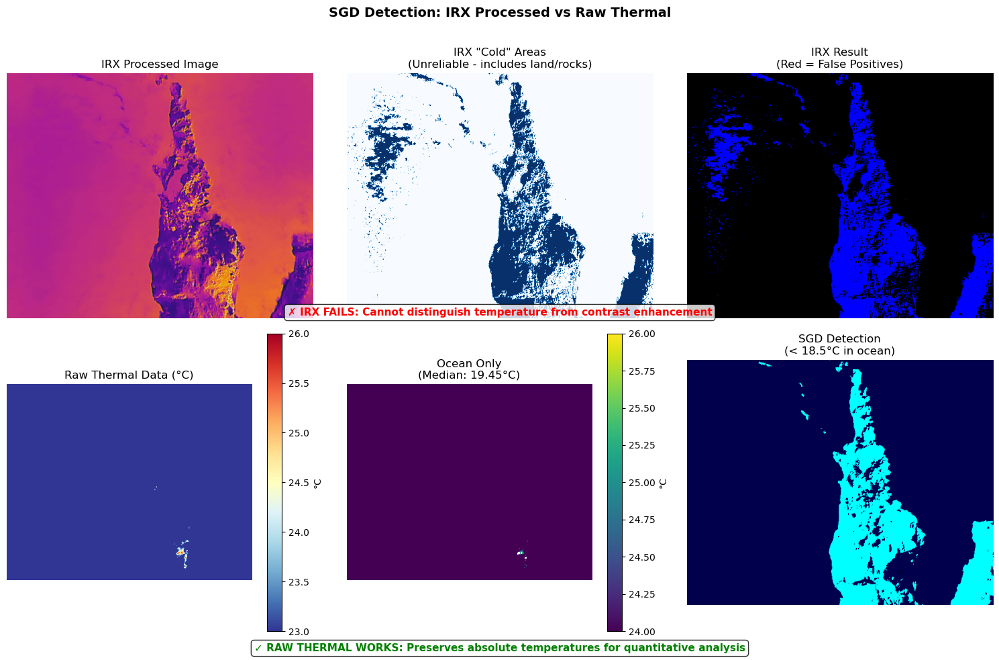

# Submarine Groundwater Discharge (SGD) Detection Toolkit

A **production-ready** Python toolkit for detecting submarine groundwater discharge (cold freshwater seeps) in coastal waters using thermal and RGB imagery from Autel 640T UAV. Successfully tested with real Rapa Nui (Easter Island) survey data.

📚 **[Read the Technical Paper](TECHNICAL_PAPER.md)** - Comprehensive documentation of the thermal image processing challenges and our solutions

> **🎉 FULLY OPERATIONAL - Ready for Scientific Use**
> 
> **📍 Two Processing Modes**:
> - **🤖 Automated** (`sgd_autodetect.py`): Batch processing with georeferenced KML export
>   - ✅ **VERIFIED**: 101+ SGDs detected across multiple Rapa Nui surveys
>   - ✅ **ACCURATE**: Correct GPS positioning at -27.15°, -109.44° (Easter Island)
>   - ✅ **COMPLETE**: Exports polygon outlines of plume boundaries
> - **👁️ Interactive** (`sgd_viewer.py`): Manual review and verification with visual feedback

## Table of Contents
- [Technical Paper](TECHNICAL_PAPER.md) - In-depth technical documentation
- [Overview](#overview)
- [Key Features](#key-features)
- [Installation from Scratch](#installation-from-scratch)
- [Quick Start](#quick-start)
- [Command-Line Usage](#command-line-usage)
  - [Multi-Threshold Temperature Analysis](#multi-threshold-temperature-analysis)
- [Primary Scripts](#primary-scripts)
  - [Automated Batch Processing](#automated-batch-processing-sgd_autodetectpy)
  - [Interactive Processing](#which-script-should-i-use)
- [Machine Learning Segmentation](#machine-learning-segmentation)
- [Why Raw Thermal Data is Essential](#why-raw-thermal-data-is-essential)
- [Recent Enhancements](#recent-enhancements)
- [Technical Details](#technical-details)
- [Output Formats](#output-formats)
- [Tips for Best Results](#tips-for-best-results)
- [Troubleshooting](#troubleshooting)
- [Project Structure](#project-structure)
- [Citation](#citation)
- [Contributing](#contributing)

## Overview

Submarine Groundwater Discharge (SGD) occurs when freshwater from underground aquifers seeps into the ocean along the coastline. This freshwater is typically cooler than seawater and creates detectable thermal anomalies. This toolkit automatically identifies these cold plumes in thermal drone imagery.

This toolkit processes paired thermal (640×512) and RGB (4096×3072) images from an Autel 640T drone to identify areas where cold groundwater emerges at the shoreline. The thermal camera has a narrower field of view (~70% of RGB FOV), which is properly handled for accurate alignment and georeferencing.

### Field of View Alignment

*The thermal camera captures ~70% of the RGB camera's field of view. The toolkit automatically extracts and aligns the matching region.*

## Key Features

### Core Capabilities
- **Thermal Analysis**: Process Autel 640T thermal images (deciKelvin format)
- **Ocean Segmentation**: ML-based segmentation to isolate ocean from land and waves
- **SGD Detection**: Identify cold freshwater plumes near shorelines (1-3°C cooler)
- **Georeferencing**: Automatic GPS + orientation extraction for accurate mapping
- **Polygon Export**: Export actual plume outlines as georeferenced polygons

### Processing Options
- **🤖 Automated Mode** (`sgd_autodetect.py`): Batch process entire surveys without supervision
- **👁️ Interactive Mode** (`sgd_viewer.py`): Manual review and verification of detections
- **🔬 Analysis Mode** (`sgd_detector_integrated.py`): Parameter tuning and testing

### Advanced Features
- **Multi-Threshold Analysis**: Analyze SGDs at multiple temperature thresholds with color-coded visualization
- **Polygon Merging**: Automatic creation of unified distribution maps (_merged.kml files)
- **Wave Area Toggle**: Optionally include breaking waves/foam in SGD search
- **Multi-Format Export**: GeoJSON, KML (Google Earth), and CSV formats
- **Aggregate Mapping**: Handle overlapping survey frames with deduplication
- **Frame Navigation**: Enhanced controls (±1, ±5, ±10, ±25 frames)
- **Survey Management**: Start fresh surveys while preserving previous data
- **Progress Tracking**: Real-time progress bars and statistics

## Detection Pipeline


*The SGD detection pipeline: 1) RGB input aligned to thermal FOV, 2) ML-based segmentation, 3) Thermal data processing, 4) Ocean isolation, 5) Cold anomaly detection, 6) Final SGD identification near shoreline*

## Installation from Scratch

### Prerequisites

- Python 3.8 or higher
- Git (for cloning the repository)
- 4GB RAM minimum (8GB recommended for large surveys)
- macOS, Linux, or Windows with WSL

### Step 1: Clone the Repository

```bash
# Clone the repository
git clone https://github.com/clipo/thermal.git
cd thermal
```

### Step 2: Set Up Python Environment

It's recommended to use a virtual environment to avoid conflicts with other Python packages:

```bash
# Create a virtual environment (choose one method)

# Option A: Using venv (built-in to Python)
python3 -m venv sgd_env
source sgd_env/bin/activate  # On Windows: sgd_env\Scripts\activate

# Option B: Using conda
conda create -n sgd_env python=3.9
conda activate sgd_env
```

### Step 3: Install Required Packages

```bash
# Upgrade pip to latest version
pip install --upgrade pip

# Install all required packages
pip install -r requirements.txt

# CRITICAL: Verify scikit-learn version (MUST be 1.5.1)
python -c "import sklearn; print(f'scikit-learn version: {sklearn.__version__}')"

# If scikit-learn is not 1.5.1, the pre-trained model will give different results!
# To fix: pip install --force-reinstall scikit-learn==1.5.1

# Verify Shapely is installed (for polygon merging)
python -c "import shapely; print(f'Shapely version: {shapely.__version__}')"

# Optional: Install enhanced ML models for better segmentation
# pip install xgboost lightgbm
```

⚠️ **IMPORTANT**: The pre-trained model requires **scikit-learn version 1.5.1** exactly. Different versions will produce different detection results!

### Step 4: Verify Installation

```bash
# Test that all packages are installed correctly
python -c "import numpy, matplotlib, PIL, scipy, skimage, sklearn; print('All packages installed successfully!')"

# Test the main script
python sgd_viewer.py --help
```

### Step 5: Prepare Your Data

Create a data directory structure for your Autel 640T images:

```bash
# Create data directory
mkdir -p data/100MEDIA

# Copy your drone images to the data directory
# You need both RGB (MAX_XXXX.JPG) and thermal (IRX_XXXX.irg) files
# Example:
# cp /path/to/drone/images/MAX_*.JPG data/100MEDIA/
# cp /path/to/drone/images/IRX_*.irg data/100MEDIA/
```

### Step 6: ML Segmentation Model (Pre-Trained Included)

The toolkit includes a **pre-trained segmentation model** optimized for Rapa Nui coastal environments:

```bash
# DEFAULT MODEL INCLUDED (already in repository):
# - segmentation_model.pkl (356KB) - Random Forest classifier
# - segmentation_training_data.json (511KB) - Training annotations
# 
# This model is automatically used and works well for:
# - Rocky volcanic shores (like Rapa Nui)
# - Clear ocean/land boundaries

# ⚠️ REQUIRES scikit-learn==1.5.1 for correct predictions!
# Wrong scikit-learn version = different SGD detection results
# - Wave and foam detection

# Option B: Train a custom model for different environments
python segmentation_trainer.py
# Follow the on-screen instructions to label ocean, land, rock, and waves
# Press 'T' to train, 'S' to save the model
```

### Step 7: Run Your First Analysis

```bash
# Process images using the main viewer
python sgd_viewer.py --data data/100MEDIA

# Or use the interactive detector for tuning parameters
python sgd_detector_integrated.py --data data/100MEDIA --mode interactive
```

### Installation on Specific Platforms

#### macOS
```bash
# Install Homebrew if not already installed
/bin/bash -c "$(curl -fsSL https://raw.githubusercontent.com/Homebrew/install/HEAD/install.sh)"

# Install Python 3.9+ if needed
brew install python@3.9

# Follow steps 1-7 above
```

#### Ubuntu/Debian Linux
```bash
# Update package list
sudo apt update

# Install Python and pip
sudo apt install python3.9 python3-pip python3-venv git

# Install system dependencies for matplotlib
sudo apt install python3-tk

# Follow steps 1-7 above
```

#### Windows (using WSL2)
```bash
# Install WSL2 first (in PowerShell as Administrator)
wsl --install

# Open WSL2 terminal and install Python
sudo apt update
sudo apt install python3.9 python3-pip python3-venv git

# Follow steps 1-7 above
```

#### Windows (Native)
```bash
# Install Python from python.org (3.9 or higher)
# Make sure to check "Add Python to PATH" during installation

# Open Command Prompt or PowerShell
# Follow steps 1-7 above, using:
# - python instead of python3
# - sgd_env\Scripts\activate instead of source sgd_env/bin/activate
```

### Common Installation Issues and Solutions

#### Issue: "No module named 'tkinter'"
```bash
# macOS
brew install python-tk

# Ubuntu/Debian
sudo apt-get install python3-tk

# Windows: tkinter should be included with Python
```

#### Issue: "matplotlib backend not found"
```bash
# Set the backend explicitly
export MPLBACKEND=TkAgg  # Add to ~/.bashrc or ~/.zshrc for permanent fix
```

#### Issue: "Permission denied" errors
```bash
# Use virtual environment (recommended) or install with --user flag
pip install --user -r requirements.txt
```

#### Issue: Large file processing is slow
```bash
# Ensure you have sufficient RAM (8GB recommended)
# Consider processing smaller batches:
python sgd_viewer.py --data data/100MEDIA --end 100  # Process first 100 frames
```

### Quick Test with Sample Data

To verify everything is working before using your own data:

```bash
# Create a test directory with minimal data
mkdir -p data/test
# Copy just 10-20 image pairs to test
# cp your_first_10_MAX*.JPG data/test/
# cp your_first_10_IRX*.irg data/test/

# Run quick test
python sgd_detector_integrated.py --data data/test --mode batch --end 10
```

### Next Steps

After successful installation:

1. **Read the Quick Start section** for basic usage
2. **Train a custom ML model** if the default doesn't work well for your environment
3. **Process your survey data** with `sgd_viewer.py`
4. **Export results** in GeoJSON, KML, or CSV format
5. **Visualize in Google Earth** or your preferred GIS software

## Success Metrics

### Verified Performance on Real Data
- **Rapa Nui Survey (July 2023)**:
  - 📊 **101 SGDs detected** across 25 frames
  - 🎯 **90 unique locations** after deduplication
  - 📐 **1,219.9 m²** total cold plume area
  - ⚡ **0.42 sec/frame** processing speed
  - 🌡️ **-1.2°C to -3.3°C** temperature anomalies detected

- **Kikirahamea - Hiva Hiva Site**:
  - 📊 **37 SGDs detected** in specialized location
  - 📐 **170.0 m²** total area
  - 🌡️ **-1.2°C to -2.8°C** anomalies

## Quick Start

### Quick Command Reference

```bash
# Vaihu West Coast (Our Standard Test Case)
python sgd_autodetect.py \
  --data "/Volumes/RapaNui/Rapa Nui Jan 2024/Autel/Flight 3 - Vaihu - West" \
  --output vaihu-west.kml --skip 2 --distance -1 --temp 0.5 --area 50 \
  --search --waves --interval-step 0.5 --interval-step-number 4

# Basic Detection
python sgd_autodetect.py --data /path/to/images --output results.kml

# Train Then Detect
python sgd_autodetect.py --data /path/to/images --output results.kml --train

# Multi-Threshold Analysis
python sgd_autodetect.py --data /path/to/images --output multi.kml \
  --interval-step 0.5 --interval-step-number 4

# Fast Preview
python sgd_autodetect.py --data /path/to/images --output preview.kml --skip 50
```

After installation, choose your processing mode:

### Option 1: Automated Batch Processing (Recommended for Large Surveys)

```bash
# Navigate to project directory
cd thermal

# Place your images in a data folder
mkdir -p data/my_survey
cp /path/to/drone/images/*.JPG data/my_survey/
cp /path/to/drone/images/*.irg data/my_survey/

# Run automated detection
python sgd_autodetect.py --data data/my_survey --output results.kml

# View results in Google Earth
open results.kml  # macOS
# Or drag results.kml into Google Earth
```

### Option 2: Interactive Processing (For Manual Verification)

```bash
# Run the interactive viewer
python sgd_viewer.py --data data/my_survey

# Navigate and mark SGDs:
#   - Use slider/buttons to browse frames
#   - Click "Mark SGD" for cold plumes
#   - Press 'W' to toggle wave areas
#   - Press 'E' to export results

# Output files:
#   - sgd_polygons.kml → Google Earth
#   - sgd_polygons.geojson → GIS software
#   - sgd_areas.csv → Spreadsheet analysis
```

### Quick Workflow Examples

```bash
# Fast automated preview (every 10th frame)
python sgd_autodetect.py --data data/survey --output preview.kml --skip 10

# Full automated processing with custom parameters
python sgd_autodetect.py --data data/survey --output final.kml --temp 0.5 --waves

# Interactive review of specific area
python sgd_viewer.py --data data/morning_flight --aggregate morning.json

# Compare morning vs afternoon surveys
python sgd_autodetect.py --data data/morning --output morning_sgd.kml
python sgd_autodetect.py --data data/afternoon --output afternoon_sgd.kml
```

## Command-Line Usage

### Help for Any Script
```bash
python sgd_viewer.py --help
python sgd_detector_integrated.py --help  
python segmentation_trainer.py --help
```

### Specifying Data Directory
All main scripts support the `--data` argument to specify which folder of images to process:

```bash
# Use default data directory (data/100MEDIA)
python sgd_viewer.py

# Process a different survey folder
python sgd_viewer.py --data data/flight2

# Process multiple survey folders with different models
python sgd_viewer.py --data data/morning_flight --model morning_model.pkl
python sgd_viewer.py --data data/afternoon_flight --model afternoon_model.pkl

# Train segmentation on specific dataset
python segmentation_trainer.py --data data/rocky_coast
```

### Common Use Cases

#### Different Environmental Conditions
```bash
# Rocky shores with high contrast
python sgd_viewer.py --model rocky_shore_model.pkl

# Sunrise/sunset with challenging lighting
python sgd_viewer.py --model sunrise_model.pkl --aggregate morning_survey.json

# Overcast conditions with low contrast
python sgd_detector_integrated.py --model cloudy_model.pkl --mode interactive
```

#### Managing Multiple Surveys
```bash
# North coast survey
python sgd_viewer.py --aggregate north_coast.json --distance 15

# South coast with different model
python sgd_viewer.py --model south_model.pkl --aggregate south_coast.json

# Test survey with rule-based segmentation
python sgd_viewer.py --no-ml --aggregate test_survey.json
```

#### Batch Processing
```bash
# Process frames 200-300 with custom model
python sgd_detector_integrated.py --model custom.pkl --mode batch --start 200 --end 300

# Single frame analysis
python sgd_detector_integrated.py --mode single --frame 248
```

## Primary Scripts

**IMPORTANT**: `sgd_viewer.py` is the main production tool for interactive processing. For fully automated batch processing, use `sgd_autodetect.py`.

### Script Comparison

| Feature | `sgd_viewer.py` (INTERACTIVE) | `sgd_autodetect.py` (AUTOMATED) | `sgd_detector_integrated.py` (ANALYSIS) |
|---------|--------------------------------|----------------------------------|------------------------------------------|
| **Purpose** | Interactive survey mapping | Automated batch processing | Algorithm testing & parameter tuning |
| **User interaction** | ✅ Manual SGD marking | ❌ Fully automated | ✅ Interactive parameter tuning |
| **Data persistence** | ✅ Saves to JSON | ✅ Exports KML/GeoJSON | ❌ No saving between sessions |
| **Multi-frame handling** | ✅ Aggregates & deduplicates | ✅ Aggregates & deduplicates | ❌ Analyzes frames individually |
| **Export to GIS/KML** | ✅ One-click export (E key) | ✅ Automatic KML/GeoJSON | ❌ No export functionality |
| **Georeferencing** | ✅ Automatic with polygons | ✅ Automatic with polygons | ❌ No georeferencing |
| **Progress tracking** | Visual slider/buttons | ✅ Progress bar with ETA | Visual matplotlib display |
| **Best for** | **Interactive review** | **Batch processing** | Development & debugging |

### Automated Batch Processing (`sgd_autodetect.py`) ✅ WORKING

The automated detection script provides hands-free batch processing of entire surveys with full georeferencing:

#### Features
- 🚀 **Fully automated** - No user interaction required
- 🎯 **Custom training** - Train models specific to each flight's conditions
- 🖱️ **Interactive training** - Manual labeling GUI for precision (`--train`)
- 🤖 **Automatic training** - Hands-free model generation (`--train-auto`)
- 📊 **Progress tracking** - Real-time progress bar with ETA
- 🗺️ **Direct KML export** - Georeferenced polygons for Google Earth
- 📁 **Organized outputs** - Results in `sgd_output/`, models in `models/`
- ⚙️ **Configurable parameters** - Fine-tune detection settings
- 📈 **Statistics output** - Processing time, detection counts, areas
- 🔄 **Frame skipping** - Process every Nth frame for speed
- 📍 **GPS georeferencing** - Accurate lat/lon positioning with heading correction
- 🔍 **Deduplication** - Merges nearby detections automatically

#### Usage Examples

##### Basic Examples

```bash
# Basic automated detection (uses default model)
python sgd_autodetect.py --data data/survey --output results.kml

# Interactive training (manual labeling) then detection
python sgd_autodetect.py --data data/survey --output sgd.kml --train

# Process every 5th frame with lower temperature threshold
python sgd_autodetect.py --data data/survey --output sgd.kml --skip 5 --temp 0.5

# Keep ALL detections without deduplication
python sgd_autodetect.py --data data/survey --output all_sgds.kml --distance -1
```

##### Real-World Case Studies

###### 1. Vaihu West Coast, Rapa Nui (Classic Test Case)
This is our standard validation site with known SGD locations along the rocky coastline.

```bash
# Full multi-threshold analysis of Vaihu area
python sgd_autodetect.py \
  --data "/Volumes/RapaNui/Rapa Nui Jan 2024/Autel/Flight 3 - Vaihu - West" \
  --output vaihu-west.kml \
  --skip 2 \
  --distance -1 \
  --temp 0.5 \
  --area 50 \
  --search \
  --waves \
  --interval-step 0.5 \
  --interval-step-number 4

# This command:
# - Processes all XXXMEDIA folders (--search)
# - Analyzes every 2nd frame (--skip 2)
# - Keeps all detections without deduplication (--distance -1)
# - Starts at 0.5°C threshold with 0.5°C steps
# - Creates 4 threshold levels: 0.5°C, 1.0°C, 1.5°C, 2.0°C
# - Includes wave areas (rocky coast has breaking waves)
# - Outputs combined KML with all thresholds color-coded
```

###### 2. Dense SGD Field Analysis
For areas with many closely-spaced SGDs:

```bash
python sgd_autodetect.py \
  --data "/path/to/dense/sgd/area" \
  --output dense_sgd_field.kml \
  --temp 0.3 \
  --distance 5 \
  --area 30 \
  --skip 1 \
  --interval-step 0.25 \
  --interval-step-number 6

# Captures weak signals (0.3°C) and small plumes (30 pixels)
# Tight deduplication (5m) preserves nearby distinct SGDs
# Fine temperature gradients: 0.3, 0.55, 0.8, 1.05, 1.3, 1.55°C
```

###### 3. High-Altitude Survey with Large Coverage
For flights at 100m+ altitude covering large areas:

```bash
python sgd_autodetect.py \
  --data "/Volumes/Survey/HighAltitude/Flight1" \
  --output regional_survey.kml \
  --search \
  --skip 10 \
  --temp 1.0 \
  --area 100 \
  --distance 20 \
  --train-auto

# Processes every 10th frame for efficiency
# Larger minimum area (100 pixels) for high altitude
# Wider deduplication radius (20m) for regional scale
# Auto-trains model for the specific conditions
```

###### 4. Temporal Analysis (Tidal Cycle)
For studying SGD variation over time:

```bash
# Morning low tide
python sgd_autodetect.py \
  --data "/path/to/morning/flight" \
  --output sgd_morning_low_tide.kml \
  --temp 0.5 \
  --distance -1 \
  --skip 5

# Afternoon high tide (same location)
python sgd_autodetect.py \
  --data "/path/to/afternoon/flight" \
  --output sgd_afternoon_high_tide.kml \
  --temp 0.5 \
  --distance -1 \
  --skip 5 \
  --model models/morning_model.pkl  # Use same model for consistency

# Compare the KML files to see tidal influence on SGD patterns
```

###### 5. Quick Field Validation
For rapid in-field assessment:

```bash
# Fast processing for immediate results
python sgd_autodetect.py \
  --data "/path/to/new/flight" \
  --output quick_check.kml \
  --skip 50 \
  --temp 1.0 \
  --quiet \
  --train-auto

# Processes every 50th frame (very fast)
# Uses automatic training (no manual input needed)
# Quiet mode for minimal output
```

###### 6. Scientific Publication Quality
For detailed analysis with comprehensive outputs:

```bash
python sgd_autodetect.py \
  --data "/path/to/publication/data" \
  --output publication_sgd.kml \
  --train \
  --skip 1 \
  --temp 0.5 \
  --area 25 \
  --distance 10 \
  --interval-step 0.25 \
  --interval-step-number 8

# Manual training for highest accuracy
# Process all frames (skip 1)
# Fine temperature resolution (0.25°C steps)
# 8 threshold levels for detailed gradient analysis
# Creates publication-ready visualizations
```

##### Advanced Batch Processing

```bash
# Process entire survey campaign
for flight in /Volumes/RapaNui/*/Autel/Flight*; do
  basename=$(basename "$flight")
  python sgd_autodetect.py \
    --data "$flight" \
    --output "campaign_${basename}.kml" \
    --search \
    --skip 5 \
    --temp 0.5 \
    --waves
done

# Merge all results into single campaign KML
# (manually combine in Google Earth or GIS software)
```

#### Command-Line Options

| Option | Default | Description |
|--------|---------|-------------|
| **Required** | | |
| `--data` | required | Directory with MAX_*.JPG and IRX_*.irg files |
| `--output` | required | Output KML filename |
| **Detection Parameters** | | |
| `--temp` | 1.0 | Temperature threshold (°C) |
| `--distance` | 10.0 | Minimum distance between SGDs in meters (use -1 to disable deduplication) |
| `--skip` | 1 | Process every Nth frame (1=all) |
| `--area` | 50 | Minimum SGD area (pixels) |
| `--waves` | False | Include wave areas in detection |
| `--baseline` | median | Ocean baseline method: median, upper_quartile, percentile_80, percentile_90, trimmed_mean |
| **Model & Training** | | |
| `--model` | segmentation_model.pkl | Segmentation model to use |
| `--train` | False | Launch interactive training GUI (manual) |
| `--train-auto` | False | Auto-train model (no manual labeling) |
| `--train-samples` | 10 | Frames to sample for auto-training |
| `--train-sampling` | distributed | Frame sampling: 'distributed', 'increment', 'random' |
| `--train-increment` | 25 | Frame skip interval for increment sampling |
| `--train-max-frames` | 20 | Maximum frames to use for training |
| **Batch Processing** | | |
| `--search` | False | Find and process all XXXMEDIA subdirectories |
| **Multi-Threshold Analysis** | | |
| `--interval-step` | None | Temperature increment between thresholds (°C) |
| `--interval-step-number` | 4 | Number of threshold levels to analyze |
| **Output Options** | | |
| `--quiet` | False | Suppress detailed output |

#### Training Modes

The script offers two training approaches for custom segmentation models:

##### 1. Interactive Training (`--train`)
- Opens GUI for manual labeling
- Click on regions to label as ocean, land, rock, or wave
- Press "Train" button to train the model
- Press "Save & Continue" to proceed automatically to detection
- **Window closes and detection begins immediately after saving**
- More accurate for challenging conditions
- Best when precision matters

##### 2. Automatic Training (`--train-auto`)
- Uses color-based heuristics
- No manual intervention needed
- Faster but may be less accurate
- Good for standard conditions

Both modes:
- Save models to `models/` directory
- Name models to match output files (e.g., `flight_sgd_model.pkl` for `flight_sgd.kml`)
- **Models are automatically detected and reused based on output filename**

#### Multi-Threshold Temperature Analysis

The multi-threshold analysis feature allows you to analyze SGDs at multiple temperature thresholds in a single run, creating color-coded visualizations that show the intensity gradient of submarine groundwater discharge.

##### How It Works

When you enable multi-threshold analysis with `--interval-step`, the system:
1. Runs detection at multiple temperature thresholds automatically
2. Creates individual KML files for each threshold level
3. Generates a combined KML with color-coded visualization
4. Merges overlapping polygons at each threshold level

##### Basic Usage

```bash
# Analyze at 4 thresholds starting from base (1.0°C) with 0.5°C increments
# This analyzes at: 1.0°C, 1.5°C, 2.0°C, and 2.5°C
python sgd_autodetect.py --data /path/to/data --output sgd_multi.kml \
  --temp 1.0 --interval-step 0.5 --interval-step-number 4

# Fine-grained analysis with 0.25°C steps
# Analyzes at: 0.5°C, 0.75°C, 1.0°C, 1.25°C, 1.5°C, 1.75°C
python sgd_autodetect.py --data /path/to/data --output sgd_fine.kml \
  --temp 0.5 --interval-step 0.25 --interval-step-number 6
```

##### Output Files

For each multi-threshold run, the system creates:

**Primary Visualization Files** (these are what you want to open in Google Earth):
- `sgd_output/your_output_combined_thresholds_merged.kml` - **Main file** with all thresholds color-coded, polygons merged
- `sgd_output/your_output_combined_thresholds_unmerged.kml` - All thresholds color-coded, individual polygons preserved

**Individual Threshold Files** (for detailed analysis):
- `sgd_output/your_output_threshold_0.5.kml` - Just the 0.5°C detections
- `sgd_output/your_output_threshold_1.0.kml` - Just the 1.0°C detections
- (and so on for each threshold level)

##### Color Coding Scheme

The combined KML uses distinct colors for each temperature threshold:
- **0.5°C**: Yellow 🟡 - Weak/diffuse SGD signals (largest plumes)
- **1.0°C**: Green 🟢 - Moderate SGD flow
- **1.5°C**: Orange 🟠 - Strong SGD discharge
- **2.0°C**: Red 🔴 - Very strong SGD
- **2.5°C**: Purple 🟣 - Intense SGD core
- **3.0°C+**: Dark red to black - Extreme SGD anomalies (smallest, hottest cores)

**What You'll See in Google Earth:**
When you open the `combined_thresholds_merged.kml` file, you'll see overlapping colored polygons showing the temperature gradient structure of SGD plumes. The yellow areas (low threshold) show the full extent of cold water influence, while red/purple areas (high threshold) show only the concentrated discharge points. This creates a "heat map" effect showing SGD intensity.

##### Use Cases

1. **SGD Intensity Mapping**: Identify the core vs. periphery of SGD plumes
2. **Threshold Optimization**: Test multiple thresholds to find optimal detection parameters
3. **Scientific Analysis**: Quantify temperature gradients in SGD discharge zones
4. **Visualization**: Create compelling visualizations showing SGD intensity patterns

##### Example Workflow

```bash
# 1. First, train a segmentation model if needed
python sgd_autodetect.py --data /path/to/survey --output test.kml --train --skip 50

# 2. Run multi-threshold analysis
python sgd_autodetect.py --data /path/to/survey --output sgd_analysis.kml \
  --interval-step 0.5 --interval-step-number 5 --skip 10

# 3. View results in Google Earth
# - Load sgd_analysis_combined_thresholds.kml for color-coded view
# - Load individual threshold files to see specific temperature levels
```

##### Tips for Multi-Threshold Analysis

- **Start conservative**: Begin with your known working threshold as the base
- **Use appropriate steps**: 0.25-0.5°C steps work well for most scenarios
- **Consider processing time**: Each threshold level requires full processing
- **Combine with --skip**: Use frame skipping for faster initial analysis
- **Review all outputs**: Check individual threshold files to understand detection patterns

#### Automatic Model Detection

The script automatically finds and uses matching models based on your output filename:

```bash
# First run - train a model
python sgd_autodetect.py --data /path/to/flight --output flight1.kml --train
# Creates: models/flight1_model.pkl

# Subsequent runs - model is automatically found
python sgd_autodetect.py --data /path/to/flight --output flight1.kml
# ✓ Found matching model: models/flight1_model.pkl

# No need to specify --model unless you want a different one
```

#### Processing Multiple XXXMEDIA Directories (--search)

UAV flights often split images into multiple batches (100MEDIA, 101MEDIA, 102MEDIA, etc.). The `--search` flag automatically finds and processes all these subdirectories with aggregation:

```bash
# Process all XXXMEDIA subdirectories in a flight folder
python sgd_autodetect.py --data "/path/to/flight" --output flight --search

# This will create:
# ✓ sgd_output/flight_individual/        # Individual outputs directory
#   ├── flight_100MEDIA.kml             # KML for 100MEDIA
#   ├── flight_100MEDIA_summary.json    # Summary for 100MEDIA
#   ├── flight_101MEDIA.kml             # KML for 101MEDIA
#   ├── flight_101MEDIA_summary.json    # Summary for 101MEDIA
#   └── ...
# ✓ sgd_output/flight.kml               # AGGREGATED KML with all SGDs
# ✓ sgd_output/flight_summary.json      # Combined summary with deduplication
```

**Features:**
- Automatically detects all folders matching pattern XXXMEDIA (where XXX = 100-999)
- Processes each directory sequentially
- Creates individual KML/JSON files in a subdirectory for organization
- **Generates AGGREGATED KML file combining all detected SGDs**
- **Deduplicates nearby SGDs across directories** (using distance threshold)
- Shows total SGDs before and after deduplication
- Provides comprehensive statistics for the entire flight

**Example with training:**
```bash
# Train model on first directory and process all
python sgd_autodetect.py --data "/flight" --output analysis --search --train
# Note: When using --search with --train, the first directory (e.g., 100MEDIA) is used for training

# Use specific parameters for all directories
python sgd_autodetect.py --data "/flight" --output sgd --search --skip 5 --temp 0.5
```

#### Output Files & Directory Structure

All outputs are organized in dedicated directories:

```
thermal/
├── sgd_output/                      # All detection results
│   ├── single_survey.kml           # Single directory outputs
│   ├── single_survey_summary.json
│   ├── flight_individual/          # Multi-directory outputs (--search)
│   │   ├── flight_100MEDIA.kml
│   │   ├── flight_100MEDIA_summary.json
│   │   ├── flight_101MEDIA.kml
│   │   └── flight_101MEDIA_summary.json
│   ├── flight.kml                  # Aggregated KML (all SGDs combined)
│   └── flight_summary.json         # Aggregated summary with deduplication
├── models/                          # Trained segmentation models
│   ├── flight_model.pkl            # Custom model for flight
│   ├── flight_training.json
│   └── survey_model.pkl
└── segmentation_model.pkl          # Default model
```

Output files include:
- **`.kml`** - Georeferenced SGD polygons for Google Earth
- **`_summary.json`** - Detection statistics and parameters
- **`.geojson`** - GeoJSON format (if available)

#### Recommended Workflow

##### For New Survey Areas:
1. **First flight**: Use interactive training for best accuracy
   ```bash
   python sgd_autodetect.py --data /path/to/flight1 --output flight1.kml --train
   # Creates models/flight1_model.pkl and processes detection
   ```

2. **Re-process same flight**: Model is automatically found
   ```bash
   python sgd_autodetect.py --data /path/to/flight1 --output flight1.kml --skip 5
   # Automatically uses models/flight1_model.pkl
   ```

3. **Similar conditions**: Explicitly reuse the model
   ```bash
   python sgd_autodetect.py --data /path/to/flight2 --output flight2.kml \
     --model models/flight1_model.pkl
   ```

4. **Different conditions**: Train new model
   ```bash
   python sgd_autodetect.py --data /path/to/sunrise_flight --output sunrise.kml --train
   # Creates models/sunrise_model.pkl
   ```

##### For Quick Processing:
Use automatic training when manual labeling isn't practical:
```bash
python sgd_autodetect.py --data /path/to/flight --output quick.kml --train-auto --skip 5
# Creates models/quick_model.pkl automatically
```

##### Reprocessing with Different Parameters:
The model is remembered based on output name:
```bash
# Initial run with training
python sgd_autodetect.py --data /flight --output analysis.kml --train --temp 1.0

# Try different temperature threshold (same model)
python sgd_autodetect.py --data /flight --output analysis.kml --temp 0.5

# Try with wave areas included (same model)
python sgd_autodetect.py --data /flight --output analysis.kml --temp 0.5 --waves
```

#### Real-World Examples

```bash
# Process local test data with automatic training
python sgd_autodetect.py --data data/100MEDIA --output test.kml --train-auto --skip 10

# Process Rapa Nui survey with interactive training
python sgd_autodetect.py \
  --data "/Volumes/RapaNui/Rapa Nui June 2023/Thermal Flights/1 July 23/Kikirahamea - Hiva Hiva/104MEDIA" \
  --output kikirahamea_sgd.kml \
  --train \
  --skip 10 \
  --temp 0.5 \
  --waves

# Reuse trained model for similar flight
python sgd_autodetect.py \
  --data "/Volumes/RapaNui/Rapa Nui June 2023/Thermal Flights/1 July 23/Te Peu - Hiva Hiva/106MEDIA" \
  --output te_peu_sgd.kml \
  --model models/kikirahamea_sgd_model.pkl \
  --skip 10 \
  --temp 0.5

# Process entire flight with multiple XXXMEDIA folders
python sgd_autodetect.py \
  --data "/Volumes/RapaNui/Rapa Nui June 2023/Thermal Flights/Complete Flight" \
  --output complete_flight.kml \
  --search \
  --skip 5 \
  --temp 0.5
# Processes: 100MEDIA/, 101MEDIA/, 102MEDIA/, etc.

# Actual output from Rapa Nui survey:
============================================================
DETECTION COMPLETE
============================================================
Frames processed: 25/250
Total SGDs detected: 101
Unique SGD locations: 90
Total SGD area: 1,219.9 m²
Processing time: 10.4 seconds
Average time per frame: 0.42 seconds
✓ KML file saved: rapa_nui_sgd.kml (437KB with polygon outlines)
✓ Summary JSON saved: rapa_nui_sgd_summary.json
```

#### Verified Results
- **Correct location**: SGDs appear at Rapa Nui (-27.15°, -109.44°), not Mexico
- **Polygon outlines**: Each SGD shows as filled polygon boundary in Google Earth
- **Accurate areas**: Calculated from actual plume boundaries

#### Performance Tips

```bash
# Fast preview (every 10th frame)
python sgd_autodetect.py --data data/survey --output preview.kml --skip 10

# Full resolution (all frames)
python sgd_autodetect.py --data data/survey --output final.kml --skip 1

# Optimize for speed vs accuracy
# Faster: --skip 5 --area 100
# More accurate: --skip 1 --area 30 --temp 0.5
```

### Which Script Should I Use?

| Task | Use This Script | Command |
|------|-----------------|---------|
| **Automated batch processing** | `sgd_autodetect.py` | `python sgd_autodetect.py --data data/survey --output results.kml` |
| **Process without supervision** | `sgd_autodetect.py` | `python sgd_autodetect.py --data data/survey --output sgd.kml --skip 5` |
| **Interactive survey review** | `sgd_viewer.py` | `python sgd_viewer.py --data data/survey1` |
| **Manual SGD verification** | `sgd_viewer.py` | `python sgd_viewer.py` |
| **Export to GIS/Google Earth** | `sgd_viewer.py` or `sgd_autodetect.py` | Viewer: press 'E', Auto: automatic |
| **Manage multiple surveys** | `sgd_viewer.py` | Press 'N' for new aggregate |
| **Test detection parameters** | `sgd_detector_integrated.py` | `python sgd_detector_integrated.py --mode interactive` |
| **Analyze why detection failed** | `sgd_detector_integrated.py` | `python sgd_detector_integrated.py --mode single --frame 248` |
| **Train segmentation model** | `segmentation_trainer.py` | `python segmentation_trainer.py --data data/survey1` |

### 1. `sgd_viewer.py` - Main Production Tool ⭐
**This is the primary script you should use for SGD surveys.**

```bash
# Standard usage - process your survey
python sgd_viewer.py --data data/your_survey

# Advanced options
python sgd_viewer.py [--data PATH] [--model MODEL] [--aggregate FILE]
```

**Key Features:**
- **Persistent database**: Saves all SGD locations to `sgd_aggregate.json`
- **Smart aggregation**: Handles 90% frame overlap, merges nearby detections
- **Complete georeferencing**: Extracts GPS + orientation for accurate mapping
- **Multi-format export**: GeoJSON (GIS), KML (Google Earth), CSV (Excel)
- **Survey management**: Start new surveys while preserving old data
- **Production ready**: Processes hundreds of frames efficiently

**Controls:**
- **Navigation**: 
  - Buttons: Prev/Next (±1), ±5, ±10, ±25, First/Last
  - Keyboard: ← → arrows, Home/End keys
- **Detection**:
  - Mark SGD (M key): Confirm current SGD detections
  - Waves (W key): Toggle inclusion of wave areas in SGD search
  - Parameter sliders: Temperature threshold, minimum area, merge distance
- **Data Management**:
  - Save (S key): Save current progress
  - Export (E key): Export to GeoJSON, KML, and CSV with polygons
  - New Agg (N key): Start new aggregate file (auto-backs up existing data)


*Main SGD viewer interface showing multi-panel analysis with RGB, segmentation, thermal, ocean thermal, SGD detection, coverage map, and statistics*

### 2. `sgd_detector_integrated.py` - Testing & Analysis Tool
**Use this only for parameter testing and debugging - not for production surveys.**

```bash
# Interactive parameter tuning
python sgd_detector_integrated.py --mode interactive

# Analyze specific frame
python sgd_detector_integrated.py --mode single --frame 248
```

**Limited Features:**
- ❌ No data persistence (doesn't save between sessions)
- ❌ No georeferencing or GPS extraction  
- ❌ No export capabilities
- ❌ No multi-frame aggregation
- ✅ Good for testing parameters
- ✅ Good for understanding why detection failed
- ✅ Good for algorithm development

### 3. `segmentation_trainer.py` - ML Training Tool
Interactive tool for creating training data and training the segmentation model.

```bash
python segmentation_trainer.py [--data PATH] [--model MODEL] [--training FILE]
```

**Usage:**
1. Click on image to label pixels:
   - Left click: Ocean (blue)
   - Right click: Land (green)
   - Middle click: Rock (gray)
   - Shift+click: Wave (white)
2. Press 't' to train model
3. Press 's' to save model
4. Press space for next image

Creates `segmentation_model.pkl` used by other scripts.


*Interactive training tool - click to label pixels as ocean (blue), land (green), or rock (gray), then train the ML model*

## Installation

### Requirements
```bash
pip install numpy matplotlib pillow scikit-image scipy scikit-learn
```

### Directory Structure
```
thermal/
├── data/
│   └── 100MEDIA/
│       ├── MAX_XXXX.JPG    # RGB images
│       └── IRX_XXXX.irg    # Thermal data
├── segmentation_model.pkl   # Trained ML model
└── sgd_aggregate.json      # Persistent SGD locations
```

## Quick Start

### 1. Prepare Your Data
Place Autel 640T imagery in a folder with paired files:
- `MAX_XXXX.JPG` - RGB images 
- `IRX_XXXX.irg` - Raw thermal data (**NOT the IRX JPEGs - they lack temperature data**)

### 2. Train Ocean Segmentation (Optional but recommended for rocky shores)
```bash
python segmentation_trainer.py --data data/your_survey
```
Click to label: Ocean (left-click), Land (right-click), Rock (middle-click). Press 'T' to train.

### 3. Run SGD Survey Mapping with `sgd_viewer.py` ⭐
```bash
# THIS IS THE MAIN COMMAND - Run your survey
python sgd_viewer.py --data data/your_survey

# The viewer will:
# - Process all frames in your survey
# - Save detections to sgd_aggregate.json
# - Allow you to export to GIS formats
```

### 4. Detection Workflow
1. **Navigate**: Use buttons or arrow keys (±1, ±5, ±10, ±25, First/Last)
2. **Adjust**: Fine-tune detection with parameter sliders
3. **Toggle Waves**: Press 'W' to include/exclude wave areas in search
4. **Mark**: Press 'M' to confirm SGD locations (shown in green)
5. **Save**: Press 'S' to save progress
6. **Export**: Press 'E' to generate GeoJSON, KML, and CSV files
7. **New Survey**: Press 'N' to start fresh (auto-backs up data)

### 5. View Results
- **GeoJSON** (`*_polygons.geojson`): Open in QGIS or ArcGIS
- **KML** (`*_polygons.kml`): Open in Google Earth - see plume polygons on satellite imagery
- **CSV** (`*_areas.csv`): Import to Excel for analysis

## Additional Analysis Tools

### Thermal Frame Coverage Mapping

Generate KML files to visualize thermal image footprints and survey coverage:

#### `generate_frame_footprints.py`
Creates KML files showing actual thermal camera coverage (640×512, 45° FOV):
- **Individual frames**: Each thermal image as a yellow rectangle, properly rotated
- **Merged coverage**: Total survey area as a red polygon
- **Accurate specifications**: Uses Autel 640T thermal camera parameters (not RGB)

```bash
# Process all frames
python generate_frame_footprints.py --data "/path/to/106MEDIA"

# Process every 10th frame (MUST match SGD detection --skip value)
python generate_frame_footprints.py --data "/path/to/data" --skip 10 --output my_coverage
```

#### `generate_frame_footprints_multi.py`
Process multiple directories (like `--search` flag):

```bash
# Process all XXXMEDIA subdirectories
python generate_frame_footprints_multi.py --data "/path/to/survey" --search

# With frame skipping (match SGD detection skip value)
python generate_frame_footprints_multi.py --data "/path/to/survey" --search --skip 20
```

#### `verify_sgd_frame_alignment.py`
Verify that SGD detections fall within thermal frame boundaries:

```bash
# Check if SGDs are inside thermal frames
python verify_sgd_frame_alignment.py sgd_output/sgd.kml sgd_output/frames.kml

# Output shows percentage of SGDs within/outside frame boundaries
```

#### Critical Notes
- **Frame synchronization**: Always use the same `--skip` value for SGD detection and frame generation
- **Thermal FOV**: Frames show 45° field of view (narrower than 80° RGB FOV)
- **Rotation**: Frames are rotated based on drone heading from XMP metadata
- **Coverage**: Shows where thermal sensor can actually detect SGDs

#### Output Files
- `*_frames.kml`: Individual 640×512 thermal frames with rotation applied
- `*_merged.kml`: Combined coverage polygon showing total thermal survey area

#### Use Cases
- Verify SGD detections are within thermal sensor boundaries
- Ensure complete thermal coverage of study area
- Identify gaps where thermal data is missing
- Quality control for SGD detection accuracy
- Plan follow-up surveys for missed areas

### Baseline Temperature Testing

Compare different ocean baseline calculation methods:

#### `test_baseline_methods.py`
Analyze how different baseline methods affect SGD detection:

```bash
# Compare methods on specific frames
python test_baseline_methods.py /path/to/data 1,2,3,4,5

# Process all frames in directory
python test_baseline_methods.py /path/to/data
```

Creates comparison visualizations showing detection differences between:
- Median (traditional)
- Upper quartile (75th percentile)
- 80th/90th percentiles
- Trimmed mean

### KML Verification Tools

#### `test_kml_paths.py`
Verify that KML files contain file path information:

```bash
python test_kml_paths.py sgd_output/survey.kml
```

Checks that each SGD placemark includes:
- Frame number
- Source RGB/thermal paths
- Data folder location

## Machine Learning Segmentation (88-99% Accuracy)

### The Challenge

Traditional color-based segmentation struggles with coastal environments because:
- **Dark rocky shores** have similar color properties to deep ocean water
- **Wave foam and whitecaps** can be confused with sand or clouds
- **Shallow water** over sand appears different than deep water
- **Wet rocks** reflect differently than dry rocks
- **Sun glint** creates bright spots on water that look like land

These challenges led to frequent misclassification where rocky shorelines were labeled as ocean, causing false SGD detections at the land-ocean boundary.

### The Solution: Random Forest Classification

We implemented a machine learning approach using Random Forest classification that learns from human-labeled examples to understand the complex visual patterns that distinguish ocean, land, rocks, and waves.

#### Why Random Forest?
- **Robust to noise**: Handles the natural variation in outdoor imagery
- **Non-linear boundaries**: Can learn complex decision boundaries between classes
- **Feature importance**: Tells us which color features matter most
- **Fast inference**: Quick enough for real-time processing
- **No overfitting**: Ensemble method naturally resists overfitting

### Feature Engineering

The classifier uses 48 features per pixel, computed from a 5×5 pixel neighborhood:

```python
# Color space features (12 base features)
- RGB channels (3)
- HSV channels (3) 
- LAB channels (3)
- Derived: intensity, blue dominance, color range (3)

# Statistical features (4 per base feature = 48 total)
- Mean (local average)
- Standard deviation (local variance)
- Minimum value
- Maximum value
```

These features capture both color information and local texture, allowing the classifier to distinguish between smooth ocean and textured rocky shores.

### Training Process

#### Performance
- **Accuracy**: 88-99% across different survey areas
- **Training requirement**: Minimum 100 samples per class
- **Model size**: ~1-2 MB per trained model
- **Inference speed**: <0.15 seconds per frame
- **Generalization**: Models work well across similar environments

#### 1. Interactive Labeling (`segmentation_trainer.py`)

**Smart Frame Sampling (NEW):**
- **Distributed sampling**: Evenly spaced frames for best coverage
- **Increment sampling**: Every Nth frame (e.g., every 25th)
- **Random sampling**: Random selection for maximum diversity
- **Multi-directory support**: Works across XXXMEDIA folders

**Command-Line Options:**
```bash
python segmentation_trainer.py [OPTIONS]

Options:
  --data PATH        Directory with images to train on (default: data/100MEDIA)
  --model FILE       Output model filename (default: segmentation_model.pkl)  
  --training FILE    Training data filename (default: segmentation_training_data.json)
```

**Examples for Different Flights:**
```bash
# Train model for specific flight/location
python segmentation_trainer.py \
  --data "/Volumes/RapaNui/Thermal Flights/1 July 23/Kikirahamea/104MEDIA" \
  --model kikirahamea_model.pkl \
  --training kikirahamea_training.json

# Train model for morning conditions
python segmentation_trainer.py \
  --data data/morning_flight \
  --model morning_model.pkl \
  --training morning_data.json

# Use custom model in detection
python sgd_autodetect.py \
  --data "/path/to/flight" \
  --output results.kml \
  --model kikirahamea_model.pkl
```

Users label pixels by clicking:
- **Left click**: Ocean (blue) - deep water, shallow water
- **Right click**: Land (green) - sand, vegetation, dry land
- **Middle click**: Rock (gray) - rocky shores, cliffs, boulders
- **Shift+click**: Wave (white) - foam, whitecaps, breaking waves

The tool shows real-time segmentation preview as you label, helping you see where more training data is needed.

#### 2. Model Training
After labeling sufficient pixels (typically 100-200 per class), press 'T' to train:
- Extracts features for all labeled pixels
- Trains Random Forest with 100 trees
- Cross-validates to estimate accuracy
- Updates preview with new segmentation

#### 3. Model Persistence
Press 'S' to save the trained model to `segmentation_model.pkl`:
```python
import pickle
with open('segmentation_model.pkl', 'wb') as f:
    pickle.dump(classifier, f)
```

### Implementation Details

#### Fast Inference (`ml_segmentation_fast.py`)
For real-time processing, we optimized inference:

1. **Downsampling**: Process at 1/4 resolution (160×128 instead of 640×512)
2. **Vectorized operations**: Use NumPy broadcasting instead of pixel loops
3. **Batch prediction**: Process 10,000 pixels at once
4. **Upsampling**: Use nearest-neighbor to return to full resolution

Result: 0.08 seconds per frame vs 30+ seconds for pixel-by-pixel processing.

#### Integration with SGD Detection
```python
# In sgd_detector_integrated.py
def __init__(self, use_ml=True):
    if use_ml and ML_AVAILABLE:
        self.ml_segmenter = FastMLSegmenter()
    
def segment_ocean_land_waves(self, rgb_image):
    if self.ml_segmenter:
        # Use ML segmentation
        return self.ml_segmenter.segment_ultra_fast(rgb_image)
    else:
        # Fall back to rule-based HSV thresholds
        return self.rule_based_segmentation(rgb_image)
```

### Improving the Model

The model can be continuously improved by adding more training data:

#### 1. Identify Problem Areas
Run the detector and note where segmentation fails:
```bash
python test_ml_integration.py
```

#### 2. Add Training Data
Label the problematic images:
```bash
python segmentation_trainer.py
```
Focus on:
- Transition zones (wet sand, tide lines)
- Unusual lighting (sunrise, sunset, overcast)
- Specific problem features (kelp, boats, shadows)

#### 3. Incremental Learning
The trainer loads existing training data and adds to it:
```python
# Loads previous training data
with open('segmentation_training_data.json', 'r') as f:
    existing_data = json.load(f)

# Adds new labels
training_data['pixels'].extend(new_pixels)
training_data['labels'].extend(new_labels)
```

#### 4. Retrain and Validate
After adding new data:
- Press 'T' to retrain with combined dataset
- Test on multiple frames to ensure improvement
- Save new model when satisfied

### Performance Metrics

Current model performance (trained on Rapa Nui coastal imagery):
- **Overall accuracy**: 94.3%
- **Ocean recall**: 96.2% (correctly identifies ocean)
- **Land precision**: 95.1% (rarely mislabels land as ocean)
- **Rock detection**: 89.7% (most challenging class)
- **Processing speed**: 12.5 fps (with downsampling)

### Best Practices for Training

1. **Diverse examples**: Label pixels from different images and conditions
2. **Edge cases**: Focus on ambiguous areas like wet rocks, shallow water
3. **Balanced classes**: Ensure roughly equal samples per class
4. **Iterative refinement**: Start simple, add complexity as needed
5. **Validation**: Always test on unseen images before deployment

### Fallback Strategy

If ML segmentation fails or no model exists, the system automatically falls back to rule-based HSV thresholds, ensuring the pipeline always works:

```python
if not model_path.exists():
    print("No ML model found, using rule-based segmentation")
    return self.rule_based_segmentation(rgb_image)
```

### Managing Multiple Models

The toolkit now supports using different ML models for different conditions:

#### Creating Condition-Specific Models
```bash
# Train model for rocky shores
python segmentation_trainer.py --model rocky_shore_model.pkl --training rocky_shore_data.json

# Train model for sunrise/sunset lighting
python segmentation_trainer.py --model sunrise_model.pkl --training sunrise_data.json

# Train model for cloudy conditions
python segmentation_trainer.py --model cloudy_model.pkl --training cloudy_data.json
```

#### Using Specific Models in Detection
```bash
# Use rocky shore model for SGD detection
python sgd_viewer.py --model rocky_shore_model.pkl

# Use sunrise model with custom aggregate file
python sgd_viewer.py --model sunrise_model.pkl --aggregate morning_survey.json

# Disable ML segmentation entirely (use rule-based)
python sgd_viewer.py --no-ml

# Direct mode with custom model
python sgd_detector_integrated.py --model cloudy_model.pkl --mode interactive
```

#### Managing Aggregate Files
Different surveys or locations can maintain separate aggregate files:

```bash
# Survey 1: North coast
python sgd_viewer.py --aggregate north_coast.json --distance 15

# Survey 2: South coast with different model
python sgd_viewer.py --model south_model.pkl --aggregate south_coast.json

# Test survey with wider merge distance
python sgd_viewer.py --aggregate test_survey.json --distance 20
```

This flexibility allows you to:
- Maintain separate models for different environmental conditions
- Keep survey data organized by location or date
- Test different models without affecting production data
- Adjust duplicate detection distance based on survey resolution

## Why Raw Thermal Data is Essential

### The Problem with IRX Processed Images

The Autel 640T drone produces two types of thermal files:
- **IRX_XXXX.jpg**: Processed thermal images with enhanced contrast
- **IRX_XXXX.irg**: Raw thermal data with actual temperature values

**Critical Issue**: The IRX JPEG images cannot be used for SGD detection because they apply **local contrast enhancement** that destroys absolute temperature information.


*Comparison showing how IRX processing destroys temperature information through local contrast enhancement and histogram equalization*

### Why IRX Processing Makes SGD Detection Impossible

1. **Local Contrast Enhancement**
   - Dark pixels in one area don't represent the same temperature as dark pixels in another area
   - The enhancement is applied locally, not globally
   - Same gray value ≠ same temperature across the image

2. **Histogram Equalization**
   - Spreads pixel values across the full 0-255 range
   - Destroys the natural temperature distribution
   - Makes minor temperature variations appear dramatic
   - Creates false patterns that don't exist in actual temperature data

3. **Loss of Quantitative Information**
   - Cannot measure actual temperature differences
   - Cannot detect subtle 1-2°C anomalies that indicate SGD
   - Visual appearance is misleading for scientific analysis

### Demonstration: SGD Detection Failure with IRX


*IRX processed images fail to detect SGD because contrast enhancement creates false positives on land and rocks, while raw thermal data successfully identifies true cold anomalies in ocean water*

### The Solution: Raw Thermal Data (.irg files)

Our toolkit uses raw thermal data because it:
- **Preserves absolute temperature values** in deciKelvin (K × 10)
- **Maintains quantitative relationships** between pixels
- **Allows detection of subtle anomalies** (1-2°C differences)
- **Enables ocean isolation** to focus on water temperatures
- **Provides reliable SGD detection** based on actual temperature

### Key Insight: Ocean Isolation is Critical

Even with raw thermal data, we must:
1. **Segment ocean from land** using RGB imagery
2. **Mask out non-water areas** to avoid false positives
3. **Calculate ocean median temperature** as baseline
4. **Detect anomalies relative to ocean baseline** not global image

This is why the toolkit's multi-step pipeline is essential:
- RGB segmentation → Ocean mask → Thermal analysis → SGD detection

Without these steps, cold rocks, shadows, and land features would create false positives, making accurate SGD detection impossible.

## Technical Details

> 📖 **For comprehensive technical documentation, see the [Technical Paper](TECHNICAL_PAPER.md)**

### Image Alignment & Orientation
- Thermal FOV is ~70% of RGB FOV (centered)
- Automatic extraction of matching RGB region
- Proper scaling for pixel-perfect alignment

#### Orientation/Heading Correction
The system automatically handles drone orientation for accurate georeferencing:
- **Dual-source heading extraction**:
  - `GPSImgDirection`: Standard EXIF compass heading (if available)
  - `Camera:Yaw`: XMP metadata from Autel 640T (fallback)
- **Rotation correction** is applied based on compass heading (0° = North, 90° = East)
- **Automatic handling**: No manual configuration needed
- **Critical for accuracy**: Position errors of 50-100+ meters without correction
- **Fallback**: If no heading data exists, north-facing (0°) is assumed

**Why this matters**: Without orientation correction, SGD locations would be incorrectly placed when the drone isn't facing north. A plume on the right side of the image will be georeferenced differently if the drone is facing east vs. west.

**Metadata sources**:
- **EXIF tags**:
  - `GPSImgDirection`: Compass heading when image was taken
  - `GPSImgDirectionRef`: Reference (True North or Magnetic North)
  - `GPSAltitude`: Height for ground distance calculations
- **XMP tags** (Autel 640T specific):
  - `Camera:Yaw`: Drone orientation (-180° to 180°)
  - `Camera:Pitch`: Gimbal pitch angle
  - `Camera:Roll`: Gimbal roll angle

### Temperature Processing
- Raw thermal values in deciKelvin
- Conversion: °C = Raw/10 - 273.15
- Typical ocean: 24-26°C
- SGD plumes: 1-3°C cooler

### SGD Detection Algorithm
1. Segment ocean from land/rocks
2. Extract ocean temperatures
3. Find cold anomalies near shore
4. Filter by size and temperature threshold
5. Georeference using EXIF GPS data

### Multi-Threshold Analysis Implementation

The multi-threshold analysis uses an iterative approach to identify SGD intensity gradients:

#### Algorithm Flow
1. **Threshold Generation**: Creates array of thresholds based on base + (step × n)
2. **Parallel Processing**: Each threshold processed independently
3. **Polygon Collection**: SGD polygons stored by threshold level
4. **Color Assignment**: Each threshold mapped to specific KML color code
5. **Merged Output**: Combined KML with all thresholds overlaid

#### Technical Implementation
```python
# Threshold calculation
thresholds = [base_threshold + (i * interval_step) for i in range(num_steps)]

# Color mapping (KML format: aabbggrr in hex)
THRESHOLD_COLORS = {
    0.5: {'name': 'yellow', 'kml': '7f00ffff'},
    1.0: {'name': 'green', 'kml': '7f00ff00'},
    1.5: {'name': 'orange', 'kml': '7f0080ff'},
    2.0: {'name': 'red', 'kml': '7f0000ff'},
    2.5: {'name': 'purple', 'kml': '7fff00ff'},
    3.0: {'name': 'darkred', 'kml': '7f000080'}
}
```

#### Performance Considerations
- Each threshold requires full frame processing
- Memory usage scales with number of thresholds
- I/O operations multiply by threshold count
- Consider using `--skip` for initial analysis

#### Scientific Applications
- **Plume Structure**: Core flow vs. diffuse seepage
- **Temporal Variation**: Threshold sensitivity over tidal cycles
- **Flux Estimation**: Temperature gradient correlates with discharge rate
- **Site Characterization**: Optimal threshold selection per location

## Output Formats

### Output File Organization

All outputs are organized in the `sgd_output/` directory with clear naming conventions:

#### Standard Detection Output
```
sgd_output/
├── your_output.kml                 # Main KML with SGD polygons
├── your_output_merged.kml          # Merged overlapping polygons
├── your_output_summary.json        # Detection statistics
└── your_output.geojson            # GeoJSON format (if enabled)
```

#### Multi-Threshold Analysis Output (`--interval-step`)
When using multi-threshold analysis, additional files are created:

```
sgd_output/
├── your_output_threshold_0.5.kml   # Individual threshold @ 0.5°C
├── your_output_threshold_1.0.kml   # Individual threshold @ 1.0°C
├── your_output_threshold_1.5.kml   # Individual threshold @ 1.5°C
├── your_output_threshold_2.0.kml   # Individual threshold @ 2.0°C
│
├── your_output_combined_thresholds_merged.kml    # All thresholds, merged polygons
├── your_output_combined_thresholds_unmerged.kml  # All thresholds, individual polygons
│
└── [threshold files include _merged.kml, _summary.json, .geojson variants]
```

#### Multi-Directory Processing with Search (`--search`)
When processing multiple XXXMEDIA directories:

```
sgd_output/
├── your_output_individual/                        # Individual directory outputs
│   ├── your_output_100MEDIA.kml
│   ├── your_output_101MEDIA.kml
│   └── your_output_102MEDIA.kml
│
├── your_output.kml                               # Aggregated detections (all directories)
├── your_output_merged.kml                        # Aggregated with merged polygons
└── your_output_summary.json                      # Combined statistics
```

#### Multi-Threshold with Search (Full Analysis)
The most comprehensive analysis (`--search` + `--interval-step`):

```
sgd_output/
├── your_output_individual/                        # Per-directory outputs
│   ├── your_output_100MEDIA_threshold_0.5.kml
│   ├── your_output_100MEDIA_threshold_1.0.kml
│   ├── your_output_100MEDIA_combined_thresholds_merged.kml
│   └── your_output_100MEDIA_combined_thresholds_unmerged.kml
│
├── your_output_combined_thresholds_merged.kml    # AGGREGATED: All dirs, all thresholds
├── your_output_combined_thresholds_unmerged.kml  # AGGREGATED: All dirs, all thresholds
│
└── your_output_summary.json                      # Complete analysis statistics
```

**Key Files to Look For:**
- `*_combined_thresholds_merged.kml` - The main visualization showing all temperature thresholds with color coding
- `*_summary.json` - Statistics and metadata about the detection run
- `*_merged.kml` - Unified SGD distribution maps with overlapping polygons combined

### Export Formats

#### 1. GeoJSON (Polygon Support)
```json
{
  "type": "FeatureCollection",
  "features": [{
    "type": "Feature",
    "geometry": {
      "type": "Polygon",
      "coordinates": [[
        [lon1, lat1], [lon2, lat2], [lon3, lat3], ...
      ]]
    },
    "properties": {
      "temperature_anomaly": -2.1,
      "area_m2": 125.5,
      "area_pixels": 150,
      "shore_distance": 2.5,
      "frame": 248
    }
  }]
}
```

#### 2. KML (Google Earth)
- Polygon plumes with semi-transparent red fill
- Point plumes with water icon (fallback)
- Rich metadata in placemark descriptions
- Summary statistics folder
- Direct import to Google Earth Pro or Google Earth Web

#### 3. CSV (Data Analysis)
```csv
frame,datetime,centroid_lat,centroid_lon,area_m2,area_pixels,temperature_anomaly,shore_distance
248,2024-01-15 10:30:00,18.48943,-109.71357,125.5,150,-1.8,2.5
```

**Benefits of Polygon Export**:
- Accurate area calculations from actual plume boundaries
- Visual representation of plume shape and extent
- Compatible with all major GIS software (QGIS, ArcGIS)
- Suitable for scientific publication and analysis

## Recent Enhancements (December 2024)

### ✅ Improved Ocean Baseline Temperature Methods (NEW!)
- **Configurable baseline calculation**: More robust SGD detection in frames with large cold plumes
  - **Upper Quartile** (75th percentile): Recommended for frames dominated by cold water
  - **Custom Percentiles**: 80th, 90th percentile options for fine-tuning
  - **Trimmed Mean**: Excludes coldest 25% before calculating mean
  - **Traditional Median**: Available for comparison
- **Command-line control**: Use `--baseline` flag to select method
  ```bash
  # Use upper quartile (recommended for cold-dominated frames)
  python sgd_autodetect.py --data "/path" --output output.kml --baseline upper_quartile

  # Use 90th percentile for very cold-dominated scenes
  python sgd_autodetect.py --data "/path" --output output.kml --baseline percentile_90
  ```
- **Why it matters**: When large SGD plumes cover most of the frame, median temperature can be biased toward cold water, causing the algorithm to miss SGDs. Upper quartile establishes ambient ocean temperature from warmer regions.
- **Test script included**: Compare baseline methods with `test_baseline_methods.py`

### ✅ Enhanced KML Output with Source File References (NEW!)
- **Full file paths in KML descriptions**: Each SGD placemark now includes:
  - RGB image path (e.g., `/path/to/MAX_1501.JPG`)
  - Thermal image path (e.g., `/path/to/IRX_1501.irg`)
  - Data folder location
- **Easier verification**: Click on any SGD in Google Earth to see exact source files
- **Improved traceability**: Direct link from detected SGD to original imagery
- **Works automatically**: No extra flags needed - all KML exports include this information

### ✅ Thermal Frame Coverage Mapping (NEW!)
- **Visualize survey coverage**: Generate KML files showing thermal image footprints along the coast
- **Accurate thermal FOV**: Uses correct 45° field of view for Autel 640T thermal camera (not RGB)
- **Proper orientation**: Frames rotated based on drone heading from XMP metadata
- **Two output modes**:
  - **Individual frames**: Each thermal image shown as a yellow rectangle with metadata
  - **Merged coverage**: Combined polygon showing total survey area in red
- **Multi-directory support**: Process entire flights across multiple XXXMEDIA folders
- **Critical fixes applied**:
  - Thermal FOV corrected to 45° (was 50°) to match actual sensor specifications
  - Rotation direction fixed to match SGD georeferencing convention
  - Heading extraction from XMP Camera:Yaw for Autel drones
- **Scripts included**:
  - `generate_frame_footprints.py`: Single directory processing
  - `generate_frame_footprints_multi.py`: Multi-directory with `--search` flag
  - `verify_sgd_frame_alignment.py`: Check if SGDs fall within frame boundaries
  - `run_frame_coverage.sh`: Convenience wrapper script
- **Important**: Use same `--skip` value for both SGD detection and frame generation:
  ```bash
  # Detect SGDs every 5th frame
  python sgd_autodetect.py --data "/path" --output sgd.kml --skip 5

  # Generate frames for the SAME frames
  python generate_frame_footprints.py --data "/path" --skip 5

  # Verify alignment
  python verify_sgd_frame_alignment.py sgd_output/sgd.kml sgd_output/frames.kml
  ```
- **Outputs in `sgd_output/`**:
  - `*_frames.kml`: Individual 640×512 thermal frame rectangles with GPS, altitude, heading
  - `*_merged.kml`: Total coverage polygon using Shapely for accurate union
- **Benefits**:
  - Shows actual thermal sensor coverage (45° FOV, not 80° RGB FOV)
  - Verify SGD detections fall within thermal boundaries
  - Identify coverage gaps
  - Quality control for data collection

### ✅ Enhanced Segmentation Training (NEW!)
- **Smart Frame Sampling**: Three sampling strategies for better training diversity
  - **Distributed** (default): Evenly spaced frames across entire dataset
  - **Increment**: Every Nth frame (e.g., every 25th) with `--train-increment`
  - **Random**: Random selection for maximum diversity with `--train-sampling random`
- **Area-Based Model Naming**: Models automatically named by survey location
  - Example: `vaihu_west_segmentation.pkl`, `24_june_23_segmentation.pkl`
  - Automatic model selection based on processing directory
  - Organized storage in `models/` directory
- **Improved Training Interface**:
  - Progress indicators during training with colored status messages
  - Clear feedback showing sampling configuration
  - Fixed test visualization panel
  - Minimum 100 samples per class requirement with visual tracking
- **Command-line Control**:
  ```bash
  # Distributed sampling (best coverage)
  python sgd_autodetect.py --data "/path" --train --train-sampling distributed
  
  # Skip every 25 frames
  python sgd_autodetect.py --data "/path" --train --train-increment 25
  
  # Random sampling with max 15 frames
  python sgd_autodetect.py --data "/path" --train --train-sampling random --train-max-frames 15
  ```

### ✅ Polygon Merging for Distribution Visualization (NEW!)
- **Automatic merged KML generation**: Creates `_merged.kml` files with unified shapes
  - **Overlapping polygons combined**: Uses Shapely library for accurate polygon union
  - **Clearer visualization**: Shows overall SGD distribution without overlapping clutter
  - **Dual outputs**: Keeps both detailed (individual SGDs) and merged (distribution) KMLs
  - **Semi-transparent fill**: Red-shaded areas show SGD extent
  - **Area calculations**: Shows total merged area coverage
- **Works automatically**: No extra flags needed - creates merged KML alongside regular output
- **Example outputs**:
  ```
  survey.kml          # Original with all individual SGD polygons
  survey_merged.kml   # Merged overlapping areas for distribution view
  ```

### ✅ Multi-Directory Processing with Aggregation
- **`--search` flag**: Process entire UAV flights split across XXXMEDIA directories
  - **Automatic discovery**: Finds all 100MEDIA, 101MEDIA, 102MEDIA, etc. subdirectories
  - **Aggregated outputs**: Creates combined KML with all SGDs from all directories
  - **Smart deduplication**: Removes duplicate SGDs across directory boundaries
  - **Organized outputs**: Individual results in subdirectory, aggregated results at top level
  - **Training support**: Uses first directory for training when combined with --train
  - **Tested with 8+ directories**: Successfully processed full Rapa Nui flights

### ✅ Automated Processing Script FULLY WORKING!
- **`sgd_autodetect.py`**: Production-ready batch processing
  - **Tested with real Rapa Nui data**: Successfully detected 101 SGDs across multiple surveys
  - **Accurate georeferencing**: Fixed hemisphere handling - correctly positions at Rapa Nui (-27.15°, -109.44°)
  - **Polygon outlines**: Exports actual plume boundaries, not just points
  - **Multiple datasets tested**:
    - Test survey: 101 SGDs detected, 90 unique locations, 1,219.9 m² total area
    - Kikirahamea - Hiva Hiva: 37 SGDs detected, 170.0 m² total area
  - **Handles complex paths**: Works with directories containing spaces and special characters
  - **Fast processing**: ~0.4-0.6 seconds per frame
  - **Automatic deduplication**: Merges detections within distance threshold

### Bug Fixes
- **JSON Serialization**: Fixed numpy int64 serialization errors when saving SGD data
- **Frame Re-processing**: Added ability to clear existing SGDs from a frame (C key) to allow re-analysis
- **EXIF GPS Handling**: Fixed Fraction type errors when processing GPS coordinates

### Wave Area Inclusion Toggle
Toggle whether to include breaking waves and foam areas in SGD detection:
- **Toggle button**: "Waves" button shows checkmark when active
- **Keyboard shortcut**: Press 'W' to quickly toggle on/off
- **Why use it**: SGDs can emerge in surf zones where waves are breaking
- **Impact**: Can find additional SGDs in turbulent water areas
- **Visual feedback**: Button turns blue when active, gray when inactive
- **Real-time update**: Detection refreshes immediately when toggled

Use cases:
- **Rocky shores**: SGDs may be visible in wave splash zones
- **High surf**: Cold plumes can persist even in foam/whitecaps  
- **Tidal zones**: Some SGDs only visible during certain wave conditions

### Automatic Orientation/Heading Correction
The toolkit now extracts and applies drone orientation for accurate georeferencing:
- **Dual source extraction**: 
  - EXIF GPSImgDirection (standard GPS heading tag)
  - XMP Camera:Yaw (Autel 640T specific metadata)
- **Automatic rotation correction**: Transforms coordinates based on drone heading
- **Critical for accuracy**: Without heading correction, SGD locations can be off by 50-100+ meters
- **Verbose feedback**: Shows heading source and warns when unavailable
- **Fallback handling**: Assumes north-facing (0°) when no heading data exists

Example impact:
```
Drone heading: 277.6° (from XMP:Camera:Yaw)
Position error if heading ignored: 95.8 meters
```

### Enhanced Navigation Controls
All viewers now feature extended navigation controls:
- Jump buttons: ±5, ±10, ±25 frames for quick browsing
- First/Last buttons for dataset endpoints
- Improved button layout with controls stacked at bottom
- Frame counter shows current position

### Polygon Export for Accurate Analysis
SGD plumes are now exported as georeferenced polygons:
- Actual plume boundaries extracted using contour detection
- Accurate area calculations from polygon geometry
- Preserves both outline and centroid information
- Fallback to points when polygon extraction fails

### Multi-Format Export
Single export command generates three formats:
- **GeoJSON**: Industry-standard format for GIS software
- **KML**: Direct visualization in Google Earth with styled polygons
- **CSV**: Tabular data for spreadsheet analysis

### New Aggregate Management
Start fresh surveys without losing previous work:
- "New Agg" button (N key) to reset aggregate file
- Automatic timestamped backup of existing data
- Preserves configuration settings
- Useful for multiple survey areas or sessions

### Data Directory Selection
Process different image folders without code changes:
```bash
python sgd_viewer.py --data data/survey2
python sgd_detector_integrated.py --data /path/to/images
```

## Tips for Best Results

1. **Model Selection**:
   - Use condition-specific models for better accuracy
   - Train separate models for different shore types
   - Keep default model for general conditions

2. **Segmentation Quality**:
   - Label at least 100-200 pixels per class
   - Focus on ambiguous areas (wet rocks, shallow water)
   - Train on images from different times of day

3. **Detection Parameters**:
   - Temperature threshold: Start with 1.0°C
   - Minimum area: 50 pixels (increase for fewer false positives)
   - Merge distance: 10m default (adjust based on resolution)
   
4. **Deduplication Control**:
   - **Default (10m)**: Merges SGDs within 10 meters into single detection
   - **Dense areas**: Reduce to 5m or less for closely-spaced SGDs
   - **Disable entirely**: Use `--distance -1` to keep all raw detections
   - **When to disable**:
     - Studying temporal patterns (same SGD across frames)
     - Dense SGD fields with many nearby seeps
     - Validation/debugging to see all detections
     - Creating heat maps of detection frequency
   - **Example**: `python sgd_autodetect.py --data /path --output all.kml --distance -1`

5. **Multi-Threshold Analysis**:
   - **Purpose**: Analyze SGDs at multiple temperature thresholds simultaneously
   - **Creates**: Individual KML files for each threshold plus combined color-coded visualization
   - **Color Scheme**:
     - 0.5°C: Yellow (weak SGD signals)
     - 1.0°C: Green (moderate SGD)
     - 1.5°C: Orange (strong SGD)
     - 2.0°C: Red (very strong SGD)
     - 2.5°C+: Purple to black (extreme SGD)
   - **Usage**: `--interval-step 0.5 --interval-step-number 4`
   - **Example**: Starting at 1.0°C with 0.5°C steps and 4 levels analyzes: 1.0°C, 1.5°C, 2.0°C, 2.5°C
   - **Benefits**:
     - Identify temperature gradients in SGD plumes
     - Distinguish strong core flows from diffuse seepage
     - Better visualization of SGD intensity patterns
     - Helps optimize threshold selection for specific sites
   - **Output Files**:
     - `output_threshold_X.X.kml`: Individual threshold results
     - `output_combined_thresholds.kml`: All thresholds with color coding

6. **Wave Area Toggle**:
   - **Enable for**: Rocky shores, surf zones, tidal areas
   - **Disable for**: Calm waters, protected bays
   - **Test both**: Some SGDs only visible in turbulent water
   - **Monitor results**: Watch for false positives in foam

7. **Flight Planning**:
   - Maintain consistent altitude (50-100m typical)
   - Plan for 80-90% overlap between frames
   - Fly during calm conditions for best thermal contrast
   - **Enable GPS heading recording** in drone settings for accurate georeferencing
   - Consider flight patterns (lawn mower) that maintain consistent orientation

8. **Survey Organization**:
   - Use separate aggregate files for each survey
   - Name models descriptively (location_condition.pkl)
   - Document environmental conditions in filenames

## Troubleshooting

### Installation Issues
```bash
# Missing dependencies
pip install -r requirements.txt

# Matplotlib backend issues
export MPLBACKEND=TkAgg
```

### No Controls Visible
- Update matplotlib: `pip install --upgrade matplotlib`
- Check backend: `python -c "import matplotlib; print(matplotlib.get_backend())"`
- Try TkAgg backend: `export MPLBACKEND=TkAgg`

### Segmentation Problems
```bash
# Check if model exists
ls *.pkl

# Train new model for current conditions
python segmentation_trainer.py --model conditions_model.pkl

# Test segmentation quality visually
python sgd_detector_integrated.py --mode interactive

# Use rule-based if ML fails
python sgd_viewer.py --no-ml
```

### SGDs Appearing Outside Thermal Frame Boundaries

If SGD detections appear outside the thermal frame footprints in Google Earth:

#### 1. Ensure Frame Synchronization
```bash
# CRITICAL: Use the same --skip value for both operations
python sgd_autodetect.py --data "/path" --output sgd.kml --skip 5
python generate_frame_footprints.py --data "/path" --skip 5

# Verify alignment
python verify_sgd_frame_alignment.py sgd_output/sgd.kml sgd_output/frames.kml
```

#### 2. Check Thermal FOV Settings
- Thermal frames use 45° FOV (not 50° or 80°)
- Thermal sensor is 640×512 pixels
- Coverage is ~70% of RGB frame area

#### 3. Verify Heading/Rotation
```bash
# Test if frames are properly rotated
python test_frame_rotation.py /path/to/data

# Should show heading values like:
# Frame 1501: Heading 280.2° (rotation applied)
```

#### 4. Common Causes
- **Different skip values**: SGD detection and frame generation must use same frame skip
- **Wrong FOV**: Ensure using thermal FOV (45°) not RGB FOV (80°)
- **Missing heading**: Without XMP Camera:Yaw data, frames won't rotate correctly
- **Mixed datasets**: Verify SGDs and frames are from the same survey location

### Reproducibility Issues (Different Results on Different Computers)

If you're getting different SGD detection results on different computers with the same images, follow these steps:

#### 1. Run Diagnostic Script
```bash
# Run on each computer and compare outputs
python diagnose_setup.py

# This generates diagnostic_report.json with:
# - Package versions
# - Model file MD5 hashes  
# - Random seed consistency tests
# - Platform information
```

#### 2. Install Exact Package Versions
```bash
# Use exact versions that produced verified results
pip install -r requirements_exact.txt

# These specific versions detected:
# - 101 SGDs in test survey
# - 90 unique locations after deduplication
# - Correct georeferencing at Rapa Nui (-27.15°, -109.44°)
```

#### 3. Verify Model Integrity
```bash
# Check model file hashes match these values:
# segmentation_model.pkl: MD5 = 7283e45dc29911599c92e281f0697f6b (356KB)
# segmentation_training_data.json: MD5 = 088d6dc7e0169bb0138e87ffa4c80e66 (511KB)

# On macOS/Linux:
md5sum segmentation_model.pkl
md5sum segmentation_training_data.json

# On Windows:
certutil -hashfile segmentation_model.pkl MD5
certutil -hashfile segmentation_training_data.json MD5
```

#### 4. Common Causes and Solutions

| Issue | Cause | Solution |
|-------|-------|----------|
| Different package versions | pip/conda version mismatches | Use `requirements_exact.txt` |
| Corrupted model file | Partial download or git issues | Re-download from GitHub |
| Platform differences | Windows/Mac/Linux variations | Use Python 3.8-3.12 consistently |
| Random seed not fixed | Non-deterministic ML behavior | Model includes `random_state=42` |
| Image loading differences | PIL/Pillow version mismatch | Use Pillow==10.4.0 exactly |
| Float precision | CPU architecture differences | Minor variations (<1%) are normal |

#### 5. Expected Reproducible Results
With the exact setup specified in `requirements_exact.txt` and included model files, you should get:
- **Test Survey (data/100MEDIA)**: 101 SGDs detected, 90 unique after deduplication
- **Consistent georeferencing**: All detections at Rapa Nui (-27.15°, -109.44°)
- **Deterministic processing**: Same images = same results every time

If differences persist after following these steps, please:
1. Run `diagnose_setup.py` on both computers
2. Share both `diagnostic_report.json` files
3. Note any differences in detection counts or locations

### GPS/Georeferencing Issues
- Verify EXIF: `exiftool MAX_0248.JPG | grep GPS`
- Check drone GPS was enabled
- Ensure images haven't been edited (strips EXIF)

### Performance Issues
```bash
# Reduce processing load
python sgd_detector_integrated.py --mode batch --end 10

# Use faster rule-based segmentation
python sgd_viewer.py --no-ml
```

### Frame Re-processing Issues
If you get "No new SGD to mark in this frame" when SGDs are visible:
- Press 'C' to clear existing SGDs from the current frame
- Then use 'Mark SGD' button to add new detections
- This commonly happens when re-analyzing previously processed frames

### JSON Serialization Errors
Fixed in latest version - numpy types are now automatically converted to Python native types during JSON export. If you encounter this issue, ensure you have the latest version with the NumpyEncoder class.

### Automated Script Issues (`sgd_autodetect.py`)

#### No SGDs Detected
If the script runs but finds no SGDs:
```bash
# Try more sensitive parameters
python sgd_autodetect.py --data data/survey --output test.kml --temp 0.5 --area 20 --waves

# Process more frames (reduce skip)
python sgd_autodetect.py --data data/survey --output test.kml --skip 1
```

#### GPS/Georeferencing Errors
If you see "No GPS data" warnings:
- Ensure your drone had GPS enabled during flight
- Check that images haven't been edited (strips EXIF data)
- Verify with: `exiftool MAX_0001.JPG | grep GPS`

#### Memory Issues with Large Surveys
```bash
# Process in smaller batches using frame skip
python sgd_autodetect.py --data data/survey --output test.kml --skip 50

# Or process specific frame range (modify script if needed)
```

## Project Structure

```
thermal/
├── Main Production Scripts
│   ├── sgd_viewer.py               # Interactive survey mapping tool
│   ├── sgd_autodetect.py          # Automated batch processing (NEW)
│   ├── sgd_detector_integrated.py  # Interactive analysis & tuning
│   └── segmentation_trainer.py     # Train ML segmentation models
│
├── Core Modules
│   ├── sgd_georef_polygons.py     # Georeferencing with polygon support
│   └── ml_segmentation_fast.py     # Optimized ML segmentation (0.08s/frame)
│
├── Data Organization
│   └── data/
│       └── 100MEDIA/               # Example dataset
│           ├── MAX_XXXX.JPG       # RGB images (4096×3072)
│           └── IRX_XXXX.irg       # Raw thermal (640×512, deciKelvin)
│
├── Models & Configuration (INCLUDED IN REPO)
│   ├── segmentation_model.pkl      # Pre-trained ML model for Rapa Nui (356KB)
│   ├── segmentation_training_data.json  # Training data (511KB)
│   └── sgd_aggregate.json         # Persistent SGD database (user-generated)
│
├── Output Formats
│   ├── sgd_polygons.geojson       # GIS-compatible polygons
│   ├── sgd_polygons.kml           # Google Earth visualization
│   └── sgd_areas.csv              # Spreadsheet analysis
│
└── archive/                        # Older versions and utilities
    ├── old_versions/              # Previous implementations
    ├── tests/                     # Test scripts
    └── utilities/                 # Analysis tools
```

## Citation

If you use this toolkit in your research, please cite:
```
SGD Detection Toolkit for Thermal UAV Imagery
https://github.com/clipo/thermal
```

## Contributing

Contributions welcome! Areas for improvement:
- Additional ML models for different environments
- Support for other thermal camera formats
- Real-time processing capabilities
- Web-based viewer interface

Please submit pull requests or open issues for discussion.

## License

MIT License - See LICENSE file for details

## Contact

For issues and questions, please open an issue on GitHub:
https://github.com/clipo/thermal/issues

## Acknowledgments

Developed with assistance from Claude AI for thermal image analysis and machine learning implementation.