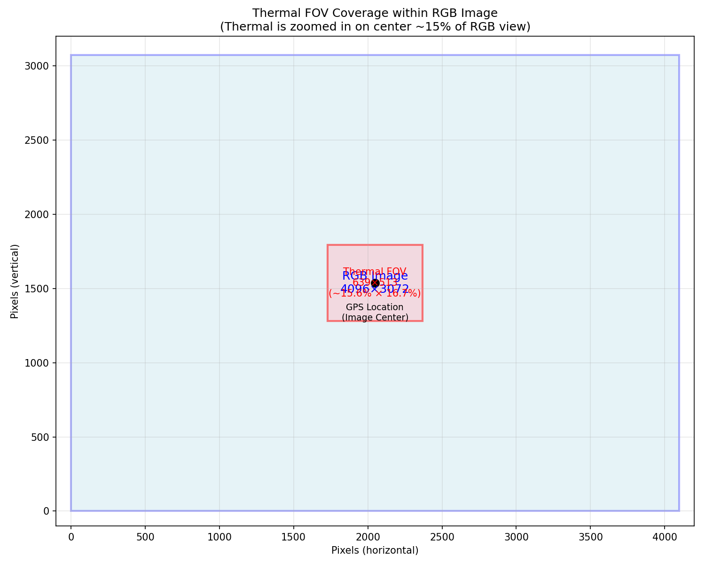
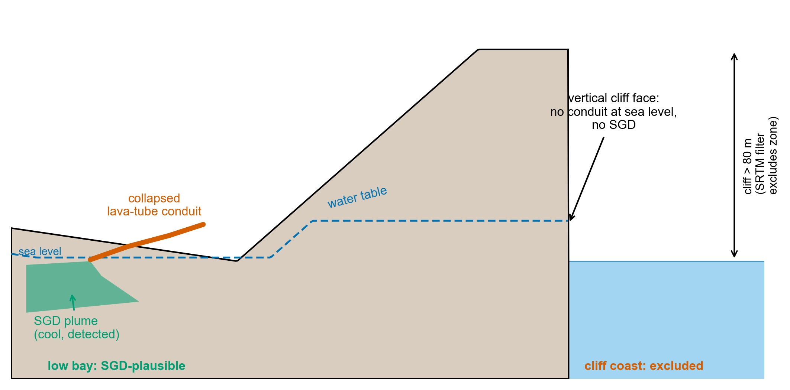
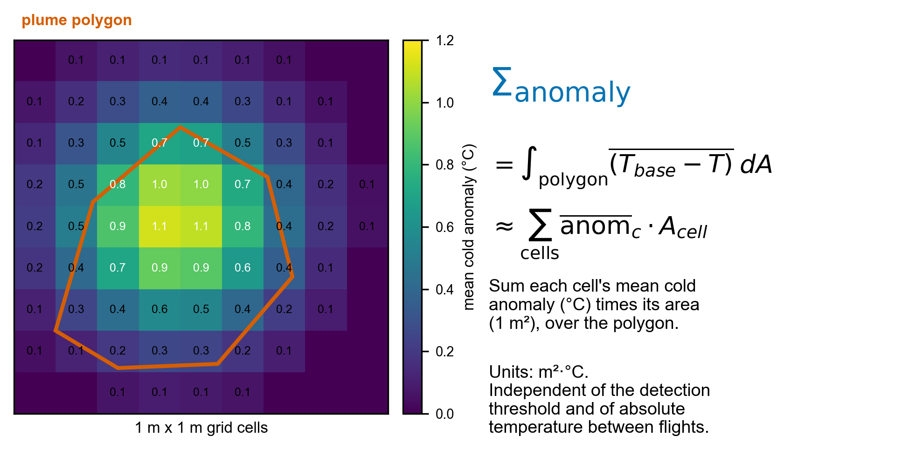

# Mapping Submarine Groundwater Discharge from UAV Thermal Imagery

### A coast-anchored detection pipeline applied island-wide at Rapa Nui (Easter Island)

*Whitepaper. Last revised 2026-06-28.*

---

## 1. Summary

Submarine groundwater discharge (SGD) delivers freshwater, nutrients, and
contaminants from terrestrial aquifers into the coastal ocean. It is
spatially patchy, often concentrated at a few discrete outlets, and easy to
miss with point-sampling surveys. Discharging groundwater is typically 1 to
3 °C cooler than ambient surface seawater, so it leaves a thermal signature
that aerial infrared imaging can resolve.

This whitepaper describes an end-to-end pipeline that turns paired
thermal and RGB imagery from a consumer survey drone into a quantitative,
island-wide map of SGD plumes. The pipeline was developed and validated on
a complete thermal survey of the coast of Rapa Nui. Twenty-nine flights
covering roughly 30,000 paired frames produce per-flight cold-anomaly
rasters, from which a coast-anchored watershed detector extracts discrete
plume polygons. Each polygon carries a documented coastal source point and a
threshold-independent intensity metric, Σ_anomaly, in units of m²·°C.

The canonical product is a set of 415 coast-anchored plumes spanning the
whole island (Figure 1). Each plume is anchored to the shoreline, screened
against an authoritative land/water boundary, and filtered to exclude cliff
coasts where the island's groundwater geology makes SGD physically
implausible. The method is designed to be portable to other volcanic-island
and karst coastlines where SGD emerges through discrete conduits.

**Figure 1.** Island-wide SGD distribution. Coast-anchored SGD plumes
detected across 29 thermal-drone flights of Rapa Nui (June 2023 and
January 2024). Each marker is one plume polygon. Size and color scale with
the polygon's Σ_anomaly (m²·°C of integrated cold-anomaly content). The
full-resolution KML version allows toggling individual flights and
inspecting per-polygon attributes.

---

## 2. The problem

SGD is a globally significant but under-measured part of the hydrological
cycle. Where it occurs, it can dominate the local freshwater and nutrient
budget of a coastal cell, stimulating productivity in some settings and
contributing to eutrophication or contaminant loading in others. On
water-scarce volcanic islands it also represents a direct loss of
freshwater from a limited aquifer, so knowing where and how much groundwater
discharges has practical resource-management value.

The detection problem is fundamentally one of spatial coverage at adequate
resolution. Direct methods such as seepage meters, piezometer transects, and
geochemical tracer surveys are accurate at a point but labor-intensive and
sparse. A field team might survey a few hundred meters of coast over several
days and still step over the discrete outlets between sample stations.
Satellite thermal imagery covers whole coastlines at once, but its pixels
(tens to hundreds of meters) blur all but the largest plumes. Manned thermal
aircraft improve resolution at high cost and limited repeatability.

UAV thermal imaging fills the gap. A small drone with a radiometric thermal
payload resolves the sea surface at roughly 1 m, deploys on demand, and
surveys kilometers of coastline per flight. The remaining difficulty is not
acquisition but processing: turning tens of thousands of overlapping thermal
frames into a clean, quantitative, false-positive-resistant map of discharge
locations. That processing pipeline is the subject of this whitepaper.

---

## 3. Survey and data

The reference survey covers the entire coast of Rapa Nui (27.1°S, 109.4°W).
Flights were flown between June 2023 and January 2024, twenty-nine in total,
spanning the island's bays, inlets, and cliff coasts. Each flight used an
Autel 640T payload that captures a radiometric thermal frame (640 × 512
pixels, calibrated to °C) co-registered with a high-resolution RGB frame
(4096 × 3072 pixels). Flights flew at 80 to 150 m altitude with the camera
nadir-locked, yielding roughly 1 m ground resolution in the thermal band.
Each frame records its GPS position, camera heading, and altitude in EXIF
metadata. The complete survey comprises approximately 30,000 paired frames.

**Figure 2.** A paired frame from the Autel 640T payload. The radiometric
thermal image (left) is calibrated to °C. The co-registered RGB image
(right) is used for ocean/land/wave segmentation and for visual
verification.

The two sensors do not share a field of view. The thermal sensor sees a
narrower scene than the RGB camera, so the two frames must be geometrically
aligned before the RGB segmentation can be applied to thermal pixels.
Figure 3 shows the field-of-view relationship that the alignment step
resolves.

**Figure 3.** Field-of-view relationship between the thermal and RGB
sensors. The thermal frame covers a sub-region of the RGB frame, so the
higher-resolution RGB segmentation is mapped onto the thermal pixels through
a fixed geometric transform.

---

## 4. Pipeline overview

The pipeline proceeds in five stages, from a single frame to an island-wide
plume map:

1. **Per-frame anomaly.** Segment ocean from land and wave classes in each
   frame, then compute each ocean pixel's cold anomaly relative to that
   frame's own warm-water baseline.
2. **Spatial integration.** Project every ocean pixel to geographic
   coordinates and accumulate it onto a fixed 1 m grid, averaging across all
   overlapping frames to suppress transient artifacts.
3. **Authoritative masking.** Replace pixel-level land/water classification
   with an OpenStreetMap coastline mask, and exclude cliff zones using an
   SRTM digital elevation model.
4. **Coast-anchored detection.** Seed a watershed from the shoreline and
   propagate outward through cold water, producing discrete plume polygons,
   each with a documented coastal source.
5. **Quantification and aggregation.** Compute each polygon's
   threshold-independent Σ_anomaly and aggregate per-flight polygons into
   island-wide master products.

**Figure 4.** End-to-end detection pipeline, from a single paired frame
through per-frame anomaly, spatial integration, masking, and coast-anchored
plume extraction.

The sections that follow describe each stage and the design choices that
make the output quantitative and resistant to false positives.

---

## 5. Per-frame thermal anomaly

For each frame the pipeline segments ocean from land and wave classes, then
computes a per-pixel cold anomaly relative to a baseline derived from that
same frame. The baseline is the 75th percentile of ocean-classified pixel
temperatures within the frame, and the anomaly at each pixel is
`max(0, baseline − T_pixel)` in °C.

Anchoring the baseline to each frame is what makes the metric comparable
across an entire multi-season survey. Absolute sea-surface temperature
drifts with time of day, season, atmospheric conditions, and sensor state.
A per-frame relative baseline normalizes out that drift and leaves the local
cold-anomaly signature of a plume against its immediate ambient water. A
plume that is 1 °C below local ambient reads the same whether the flight was
flown on a warm afternoon or a cool morning.

**Figure 5.** Thermal-RGB alignment underpinning the per-frame anomaly.
Ocean segmentation is computed on the aligned RGB frame and applied to the
co-registered thermal pixels, isolating the ocean-only temperature
distribution from which the warm-water baseline is taken.

---

## 6. Spatial integration into anomaly rasters

Each ocean-classified pixel is projected from image space to geographic
coordinates using the camera's GPS position, altitude, heading, and known
field of view, then accumulated onto a fixed 1 m × 1 m latitude/longitude
grid spanning the flight's footprint. Where many frames observe the same
ground cell, their anomalies are averaged: the sum of `max(0, baseline − T)`
over all contributing frames, divided by the cell's observation count.

This multi-frame averaging is the pipeline's primary defense against
single-frame artifacts. Sun glint, a momentary reflection, or single-frame
sensor noise does not recur at the same latitude and longitude across the
many overlapping frames that view a given cell, so it averages toward zero. A
real plume, fixed in geographic space, reinforces across every overlapping
frame and survives. The output of this stage is one integrated cold-anomaly
raster per flight.

---

## 7. Authoritative masks: coastline and cliff zones

Pixel-level ocean classification is imperfect, and the camera projection
assumes flat ground at sea level. Together these can place land thermal,
particularly from vertical cliff faces, at spurious offshore coordinates.
Two authoritative masks correct for this.

**OpenStreetMap coastline.** Rather than rely on per-pixel classification to
decide which grid cells are ocean, the pipeline builds a per-flight water
mask from OpenStreetMap (OSM) coastline data. It fetches the hand-mapped
coastline ways for Rapa Nui through the Overpass API (131 ways, 9,344
nodes), stitches them into a polygon of the island's emergent land surface,
and rasterizes that polygon onto each flight's grid. The OSM coastline is
hand-mapped, defined at mean high water, and free of the per-pixel noise that
affects satellite-image classification. Cells inside the polygon are land,
and cells outside are water.

**SRTM cliff-zone exclusion.** Even with a correct water mask, misprojected
cliff thermal can land on genuine water cells near a cliff base. The pipeline
removes this by deriving a per-flight cliff-zone mask from the NASA SRTM 30 m
digital elevation model. For each grid cell it samples the maximum elevation
within a 100 m radius and flags cells where that maximum exceeds 80 m as
cliff-zone cells, excluded from both plume seeding and watershed
propagation.

This filter is grounded in the island's groundwater geology, not in image
statistics. SGD at Rapa Nui emerges through collapsed lava-tube conduits that
intersect the sea surface at low-elevation bays and inlets. A vertical cliff
face lacks the conduit geometry for freshwater to reach the sea surface even
where the underlying aquifer is continuous. Excluding cliff coasts therefore
removes a class of physically implausible detections rather than discarding
real signal (Figure 6).

**Figure 6.** Why cliff coasts are excluded. At a low bay (left) a collapsed
lava-tube conduit delivers cool groundwater to the sea surface, producing a
detectable SGD plume. At a vertical cliff (right) the aquifer is truncated by
the cliff face with no conduit at sea level, so no plume forms. The SRTM
filter flags cells whose local maximum elevation exceeds 80 m and excludes
them.

---

## 8. Coast-anchored plume detection

Plume polygons are extracted from the integrated anomaly raster by a
coast-anchored watershed segmentation. The coastline is defined as water
cells (in the OSM mask) immediately adjacent to land cells, a one-cell-wide
ring tracing the actual shoreline. Source candidates are water cells within
60 m offshore of that ring, outside cliff zones, with cold anomaly above an
adaptive peak threshold. Candidate sources are reduced to local maxima with a
minimum separation of 30 m. From each seed, the watershed propagates outward
through water cells whose anomaly exceeds an adaptive edge threshold, bounded
at 150 m offshore.

Surviving regions pass three polygon filters: a minimum area of 50 m² (drop
noise), a maximum area of 8,000 m² (drop diffuse coastal cooling), and a
centroid within 75 m of the coastline (drop polygons whose body sits far
offshore). Each surviving polygon is one discrete SGD plume with a documented
coastal source recorded as `source_lat` and `source_lon`.

**Adaptive thresholds.** The peak and edge thresholds are derived per flight
from the cold-anomaly distribution of its own water cells. The peak threshold
is the 95th percentile of water-cell anomalies, clipped to 0.35 to 0.55 °C.
The edge threshold is the larger of the 70th percentile and one-half the peak
threshold, clipped to 0.20 to 0.35 °C. The floor guarantees detection at
subtle sites such as Vaihu Harbor, where peak anomalies run 0.4 to 0.6 °C.
The ceiling prevents a strong-signal flight, or one with residual cliff
contamination, from setting thresholds so high that subtler bays in the same
flight are filtered out.

The pipeline produces three parallel polygon products from the same rasters,
differing in how aggressively they bound a plume:

| Product | Polygons | Description |
|---|---|---|
| Coast-anchored (canonical) | 415 | Discrete plumes, each with a documented coastal source. The product used for quantitative cross-site comparison. |
| Raster watershed | 1,066 | Full plume halos, including the broader cold-water envelope around each core. |
| Detector | 1,789 | Conservative discrete cores from the detector's spatial-coherence requirement. |

**Figure 7.** The three polygon products for the same site. The
coast-anchored product (canonical) anchors each plume to a shoreline source.
The raster product retains the broader cold halo around each core. The
detector product keeps only conservative discrete cores.

---

## 9. Σ_anomaly: a threshold-independent intensity metric

Any fixed anomaly threshold is somewhat arbitrary, and reported plume counts
and areas depend on where that threshold is set. To compare discharge
intensity across sites and seasons without that dependence, each polygon also
carries an integrated metric, Σ_anomaly, defined as the integral of mean cell
anomaly over the polygon footprint, in units of m²·°C. In practice it is the
sum over all cells inside a polygon of the mean per-cell anomaly multiplied by
the cell area (Figure 8).

**Figure 8.** Definition of Σ_anomaly. Each grid cell carries a mean cold
anomaly (°C). Summing that anomaly times the cell area (1 m²) over the plume
polygon yields the integrated cold-anomaly content in m²·°C. The metric is
independent of the detection threshold and of absolute temperature
differences between flights.

Σ_anomaly has three properties that make it the right basis for comparison.
It is robust to the detection threshold, because the integral does not depend
on which cells were labeled SGD or exactly where the polygon boundary fell.
It is robust across flights and seasons, because each flight's per-frame
baseline removes absolute temperature differences. And it captures both the
size and the intensity of a plume in a single number, which a plume count or
a peak temperature alone cannot.

Reported across the whole survey, the master grand-total Σ_anomaly is
8,538,560 m²·°C for the raster product and 1,147,187 m²·°C for the detector
product. The raster total is consistently four to six times the detector
total because raster polygons include the broader cold-water halo that the
detector's spatial-coherence requirement excludes.

---

## 10. Results

The island-wide map (Figure 1) shows SGD concentrated at low-elevation bays
and inlets and largely absent from cliff coasts, the pattern predicted by
lava-tube conduit geology. The strongest flights by integrated Σ_anomaly are
the broad south- and north-coast surveys and the major bay systems. Cliff
flights rank low once the SRTM filter is applied. Four sites illustrate the
range of plume signatures the pipeline resolves.

**Figure 9.** Vaihu (Ahu Vaihu), a textbook SGD reference site on the south
coast. Seven discrete plumes trace the rocky shore and surf zone where
freshwater emerges through collapsed lava-tube outlets. Vaihu is a subtle
site where peak anomalies run only 0.4 to 0.6 °C, recovered because the
adaptive threshold floor keeps detection sensitive there.

**Figure 10.** Hanga Nui at Ahu Tongariki. Discrete plumes in the sheltered
bay below the moai platform, with the bay geometry typical of the island's
SGD-active sites: low-elevation beach and rocks backed by volcanic slopes.

**Figure 11.** Hekii (north coast). Plumes cluster tightly at a
low-elevation north-coast bay with a strong cold-anomaly signal, the
signature of well-developed lava-tube outlets feeding the surf zone. The
flight ranks among the highest by Σ_anomaly.

**Figure 12.** Anakena Bay (Ahu Nau Nau). Coast-anchored plumes at the
iconic sandy beach, with a prominent central plume (peak roughly 1.1 °C below
ambient) and smaller satellite plumes along the beach edge and rocky points.
Total Σ_anomaly is approximately 2,743 m²·°C across the bay.

---

## 11. Validation and limitations

The cliff coasts double as a built-in control. Where the SRTM filter is
applied, spurious cliff-shadow polygons that would otherwise dominate a
cliff flight are suppressed, and the small number of surviving detections sit
at the surf zone immediately offshore of the cliff base. That suppression is
the expected behavior and confirms the geological filter is working. Three
known limitations remain, each logged in the project's living methods
document and prioritized for future iterations.

First, per-frame ocean segmentation uses a rule-based color classifier that
can occasionally misclassify shaded cliff face as ocean. The downstream OSM
water mask and SRTM cliff filter mitigate this, but a learned per-frame
segmenter (planned) would prevent cliff thermal from entering the projection
at all.

Second, the camera footprint projection assumes flat ground at sea level,
which mismaps high-elevation pixels to offshore coordinates. The OSM and SRTM
masks remove most of the resulting artifacts after the fact. A
terrain-aware projection that ray-marches each pixel against the SRTM surface
(planned, longer-term) would fix the problem at its source.

Third, the per-frame 75th-percentile baseline can be biased low when a plume
fills more than about a quarter of a frame, slightly understating very large
plumes. Moving the baseline to the 90th percentile (planned) would improve
robustness for the largest plumes.

These are bounded, well-understood limitations rather than open questions
about whether the method works. The masks and the threshold-independent
metric make the canonical product defensible today, and the planned fixes
target residual edge cases.

---

## 12. Reproducibility

All processing is implemented in Python on the scientific-Python stack
(numpy, scipy, scikit-image, shapely, matplotlib). Coastline geometry is
fetched from OpenStreetMap through the Overpass API. Elevation is NASA SRTM
30 m. Source code, processing scripts, and a living methods document live in
the project repository, with a step-by-step re-run recipe in `docs/REPRODUCE.md`.

Per-flight raw inputs (paired thermal and RGB frames) and per-flight outputs
(anomaly rasters, water masks, cliff-zone masks, polygon GeoJSONs, and
validation figures) are organized by flight identifier for traceability. The
three island-wide master products are distributed as KML for direct
inspection in any geographic viewer:

- `rapa_nui_all_sgd_coastal.kml` (415 coast-anchored plumes, canonical)
- `rapa_nui_all_sgd_sigma_raster.kml` (1,066 raster plumes)
- `rapa_nui_all_sgd_sigma.kml` (1,789 detector polygons)

The method transfers to any coastline where SGD emerges through discrete
conduits at low-elevation shores. The two ingredients it needs beyond the
drone survey are an authoritative coastline (OSM or a digitized shoreline)
and a digital elevation model for cliff exclusion, both freely available for
most of the world.
